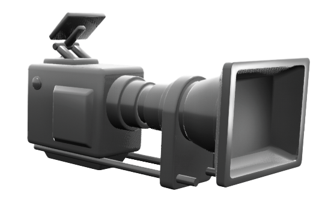

.. _Camera_Library:

********
Cameras
********

.. _cameraDescription:

Description
============

Cameras in the Open Worlds are used for observing the workspace from different
views and capturing image data.
Cameras are considered "actors".
The camera library controls the camera actors.

A camera must be initialized first by spawning the camera in the location
(or attached to the parent actor of choice) in order to use it.

See the :ref:`cameraTutorial` to get a better understanding of using cameras
in Quanser Interactive Labs.

.. _cameraLibrary:

Camera Library
===============

.. autoclass:: qvl.free_camera.QLabsFreeCamera

.. _cameraConstants:

Constants
==========

.. autoattribute:: qvl.free_camera.QLabsFreeCamera.ID_FREE_CAMERA

.. _cameraMemberVars:

Member Variables
=================

.. autoattribute:: qvl.free_camera.QLabsFreeCamera.actorNumber

.. _cameraMethods:

Methods
========

.. automethod:: qvl.free_camera.QLabsFreeCamera.__init__
.. automethod:: qvl.free_camera.QLabsFreeCamera.spawn
.. tip::
    Scale will not affect the camera, but will affect attached children.
.. automethod:: qvl.free_camera.QLabsFreeCamera.spawn_degrees
.. tip::
    Scale will not affect the camera, but will affect attached children.
.. automethod:: qvl.free_camera.QLabsFreeCamera.spawn_id
.. tip::
    Scale will not affect the camera, but will affect attached children.
.. automethod:: qvl.free_camera.QLabsFreeCamera.spawn_id_degrees
.. tip::
    Scale will not affect the camera, but will affect attached children.
.. automethod:: qvl.free_camera.QLabsFreeCamera.spawn_id_and_parent_with_relative_transform
.. automethod:: qvl.free_camera.QLabsFreeCamera.spawn_id_and_parent_with_relative_transform_degrees
.. automethod:: qvl.free_camera.QLabsFreeCamera.possess
.. automethod:: qvl.free_camera.QLabsFreeCamera.set_camera_properties
.. automethod:: qvl.free_camera.QLabsFreeCamera.set_transform
.. automethod:: qvl.free_camera.QLabsFreeCamera.set_transform_degrees
.. automethod:: qvl.free_camera.QLabsFreeCamera.destroy
.. automethod:: qvl.free_camera.QLabsFreeCamera.destroy_all_actors_of_class
.. automethod:: qvl.free_camera.QLabsFreeCamera.ping
.. automethod:: qvl.free_camera.QLabsFreeCamera.get_world_transform
.. automethod:: qvl.free_camera.QLabsFreeCamera.get_world_transform_degrees
.. automethod:: qvl.free_camera.QLabsFreeCamera.set_image_capture_resolution
.. automethod:: qvl.free_camera.QLabsFreeCamera.get_image
.. automethod:: qvl.free_camera.QLabsFreeCamera.parent_with_relative_transform
.. automethod:: qvl.free_camera.QLabsFreeCamera.parent_with_relative_transform_degrees
.. automethod:: qvl.free_camera.QLabsFreeCamera.parent_with_current_world_transform
.. automethod:: qvl.free_camera.QLabsFreeCamera.parent_break

.. _cameraConfigs:

Configurations
===============

There are no configuration options for the camera actor.

.. _cameraConnect:

Connection Points
===================

There are no connection points for the free camera actor.

-------------------------------------------------------------------------------

.. tip::

  There is a few easy steps to initializing a new camera in an environment
  using the interface as well as the code:

  #. Pick a Location for your camera using the :ref:`Coordinate Helper` section.
  #. Copy the location and rotation desired.
  #. Use spawn or spawn_degrees to initialize a new camera. Paste the copied location and rotation into their respective places.

.. _cameraTutorial:

Camera Tutorial
=================

.. tabs::
    .. tab:: Python

        .. dropdown:: Python Tutorial

            Raw to download this tutorial: |camera_tutorial.py|.

            .. |camera_tutorial.py| replace::
                :download:`Camera Tutorial (.py) <../../../tutorials/camera_tutorial.py>`

            .. literalinclude:: ../../../tutorials/camera_tutorial.py
                :language: python
                :linenos:

    .. tab:: Matlab

        .. dropdown:: Matlab Tutorial

            Raw to download this tutorial: |camera_tutorial.m|.

            .. |camera_tutorial.m| replace::
                :download:`Camera Tutorial (.m) <../../../tutorials/camera_tutorial.m>`

            .. literalinclude:: ../../../tutorials/camera_tutorial.m
                :language: Matlab
                :linenos:

.. **See Also:**
