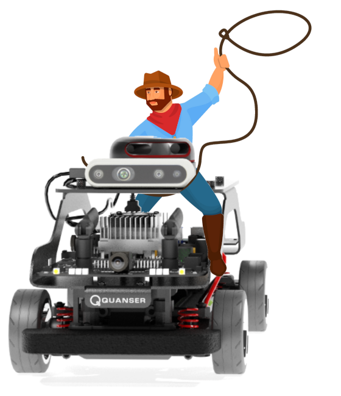

.. _car_library:

Cars
----

.. _carDescription: 

Description
^^^^^^^^^^^

Cars are considered "actors" in the Virtual Self Driving Car Studio.
The car library controls the QCars that are placed in the workspace of the Quanser Interactive Labs.

.. _carlibrary:

Library
^^^^^^^

.. autoclass:: library_qlabs_qcar.QLabsQCar

.. _carConstants:

Constants
^^^^^^^^^
.. autoattribute:: library_qlabs_qcar.QLabsQCar.ID_QCAR
.. autoattribute:: library_qlabs_qcar.QLabsQCar.FCN_QCAR_SET_VELOCITY_AND_REQUEST_STATE
.. autoattribute:: library_qlabs_qcar.QLabsQCar.FCN_QCAR_VELOCITY_STATE_RESPONSE
.. autoattribute:: library_qlabs_qcar.QLabsQCar.FCN_QCAR_SET_TRANSFORM_AND_REQUEST_STATE
.. autoattribute:: library_qlabs_qcar.QLabsQCar.FCN_QCAR_TRANSFORM_STATE_RESPONSE
.. autoattribute:: library_qlabs_qcar.QLabsQCar.FCN_QCAR_POSSESS
.. autoattribute:: library_qlabs_qcar.QLabsQCar.FCN_QCAR_POSSESS_ACK
.. autoattribute:: library_qlabs_qcar.QLabsQCar.FCN_QCAR_CAMERA_DATA_REQUEST
.. autoattribute:: library_qlabs_qcar.QLabsQCar.FCN_QCAR_CAMERA_DATA_RESPONSE
.. autoattribute:: library_qlabs_qcar.QLabsQCar.CAMERA_CSI_RIGHT
.. autoattribute:: library_qlabs_qcar.QLabsQCar.CAMERA_CSI_BACK
.. autoattribute:: library_qlabs_qcar.QLabsQCar.CAMERA_CSI_LEFT
.. autoattribute:: library_qlabs_qcar.QLabsQCar.CAMERA_CSI_FRONT
.. autoattribute:: library_qlabs_qcar.QLabsQCar.CAMERA_RGB
.. autoattribute:: library_qlabs_qcar.QLabsQCar.CAMERA_DEPTH
.. autoattribute:: library_qlabs_qcar.QLabsQCar.CAMERA_OVERHEAD
.. autoattribute:: library_qlabs_qcar.QLabsQCar.CAMERA_TRAILING

.. _carMethods:

Methods
^^^^^^^

.. automethod:: library_qlabs_qcar.QLabsQCar.spawn
.. automethod:: library_qlabs_qcar.QLabsQCar.spawn_degrees
.. automethod:: library_qlabs_qcar.QLabsQCar.set_transform_and_request_state
.. automethod:: library_qlabs_qcar.QLabsQCar.set_transform_and_request_state_degrees
.. automethod:: library_qlabs_qcar.QLabsQCar.set_velocity_and_request_state
.. automethod:: library_qlabs_qcar.QLabsQCar.set_velocity_and_request_state_degrees
.. automethod:: library_qlabs_qcar.QLabsQCar.possess
.. automethod:: library_qlabs_qcar.QLabsQCar.get_image
.. automethod:: library_qlabs_qcar.QLabsQCar.destroy
.. automethod:: library_qlabs_qcar.QLabsQCar.ping
.. automethod:: library_qlabs_qcar.QLabsQCar.get_world_transform
.. automethod:: library_qlabs_qcar.QLabsQCar.get_world_transform_degrees

.. _carConfig:

Configurations
^^^^^^^^^^^^^^

There are no configurations options for the QCar.

.. _carConnect:

Connection Points
^^^^^^^^^^^^^^^^^

.. _carTutorial:

Tutorial
^^^^^^^^

.. dropdown:: Example 1

.. dropdown:: Example 2

.. dropdown:: Example 3

Driving Cars
^^^^^^^^^^^^

**See Also:**
