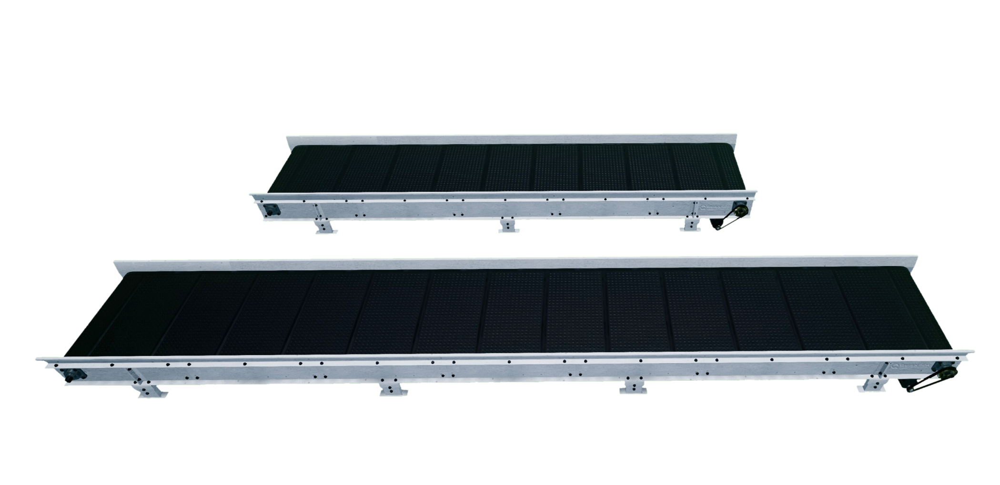

.. _Conveyors:

##########
Conveyors
##########

.. _conveyorDescription:

******************
Description
******************

Conveyors are considered an "actor" in Quanser Interactive Labs Open Worlds.
The conveyor library controls the conveyors available to be placed in
the QLabs environment.
Conveyors can be straight or curved and can be spawned anywhere in the Open Worlds.

See the :ref:`conveyorTutorial` to get a better understanding of using 
conveyors in Quanser Interactive Labs.

.. contents:: Table of Contents
    :backlinks: none
    :depth: 2

-------------------------------------------------------------------------------

.. important::
    All of the office objects have the same methods and member variables. 
    To simplify this documentation, the methods and member variables are documented
    only once, see :ref:`conveyorsShared` and the :ref:`conveyorTutorial`.
    No office object has connection points or different configurations.

******************
Straight Conveyor
******************

.. _straightconveyorlibrary:

Library
========

.. autoclass:: qvl.conveyor_straight.QLabsConveyorStraight

.. _straightconveyorConstants:

Constants
==========

.. autoattribute:: qvl.conveyor_straight.QLabsConveyorStraight.ID_CONVEYOR_STRAIGHT

.. _straightconveyorConfig:

Configurations
===============

A spawned straight conveyor with configuration set to 0 will create a conveyor
of 0.5 m in length. For each number you increase the configuration the length
will increase by .25m. 
For example, a configuration of 3 will create a 1.25m conveyor.
The configuration number accepts whole number between 0 and 20. 

All types of conveyors can be connected to make a setup of your choosing.

-------------------------------------------------------------------------------

****************
Curved Conveyor
****************

.. _curvedconveyorlibrary:

Library
========

.. autoclass:: qvl.conveyor_curved.QLabsConveyorCurved

.. _curvedconveyorConstants:

Constants
==========

.. autoattribute:: qvl.conveyor_curved.QLabsConveyorCurved.ID_CONVEYOR_CURVED

.. _curvedconveyorConfig:

Configurations
===============

By default, the curved conveyor is spawned from the center and has a radius of 0.5m.
When configuration is set to 1, it will create a 15 degree conveyor. 
For each number you increase the configuration the length will increase by 15 degrees. 

For example, a configuration of 3 will create a 45 degree conveyor.
The configuration number accepts whole numbers between 1 and 24. 

Using a configuration number of 24 will create a circular conveyor.

All types of conveyors can be connected to make a setup of your choosing.

-------------------------------------------------------------------------------

.. _conveyorsShared:

******************************
Shared Variables and Methods
******************************

.. contents:: 
    :local:
    :depth: 2
    :backlinks: none

.. _conveyorsVars:

Member Variables
=================

.. autoattribute:: qvl.actor.QLabsActor.actorNumber
    :noindex:

.. _conveyorsMethods:

Methods
=========

.. automethod:: qvl.conveyor_straight.QLabsConveyorStraight.set_speed
.. note:: 
    The `set_speed` method exists in both the straight 
    and curved conveyor classes.

.. _conveyorsParentsMethods:

Parent Class (actor.py) Methods
================================

.. automethod:: qvl.actor.QLabsActor.spawn
    :noindex:
.. automethod:: qvl.actor.QLabsActor.spawn_degrees
    :noindex:
.. automethod:: qvl.actor.QLabsActor.spawn_id
    :noindex:
.. automethod:: qvl.actor.QLabsActor.spawn_id_degrees
    :noindex:
.. automethod:: qvl.actor.QLabsActor.spawn_id_and_parent_with_relative_transform
    :noindex:
.. automethod:: qvl.actor.QLabsActor.spawn_id_and_parent_with_relative_transform_degrees
    :noindex:
.. automethod:: qvl.actor.QLabsActor.destroy
    :noindex:
.. automethod:: qvl.actor.QLabsActor.destroy_all_actors_of_class
    :noindex:
.. automethod:: qvl.actor.QLabsActor.ping
    :noindex:
.. automethod:: qvl.actor.QLabsActor.get_world_transform
    :noindex:
.. automethod:: qvl.actor.QLabsActor.get_world_transform_degrees
    :noindex:
.. automethod:: qvl.actor.QLabsActor.parent_with_relative_transform
    :noindex:
.. automethod:: qvl.actor.QLabsActor.parent_with_relative_transform_degrees
    :noindex:
.. automethod:: qvl.actor.QLabsActor.parent_with_current_world_transform
    :noindex:
.. automethod:: qvl.actor.QLabsActor.parent_break
    :noindex:

Connection Points
==================

There are no connection points for any of these actor classes.

-------------------------------------------------------------------------------

.. _conveyorTutorial:

*********************
Conveyors Tutorial
*********************

.. tabs::
    .. tab:: Python

        .. dropdown:: Python Tutorial

            Raw to download this tutorial: |conveyor_tutorial.py|.

            .. |conveyor_tutorial.py| replace::
                :download:`Conveyor Tutorial (.py) <../../../tutorials/conveyor_tutorial.py>`

            .. literalinclude:: ../../../tutorials/conveyor_tutorial.py
                :language: python
                :linenos:

    .. tab:: Matlab

        .. dropdown:: Matlab Tutorial

            Raw to download this tutorial: |conveyor_tutorial.m|.

            .. |conveyor_tutorial.m| replace::
                :download:`Conveyor Tutorial (.m) <../../../tutorials/conveyor_tutorial.m>`

            .. literalinclude:: ../../../tutorials/conveyor_tutorial.m
                :language: guess
                :linenos:

