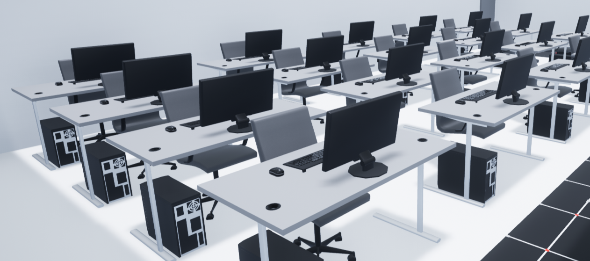
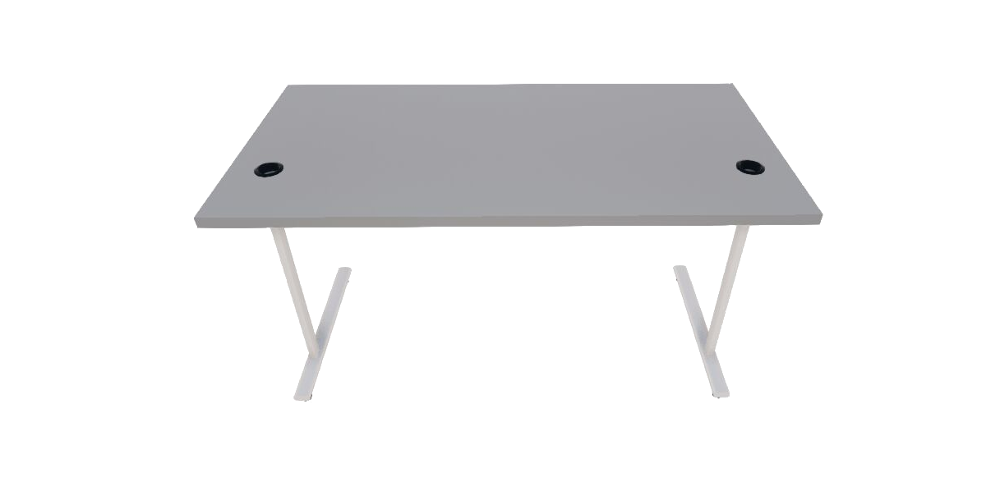
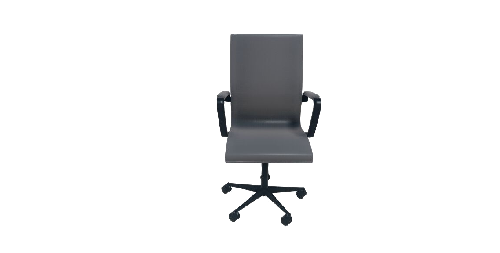
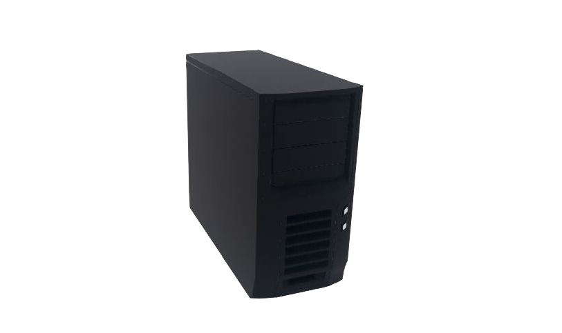
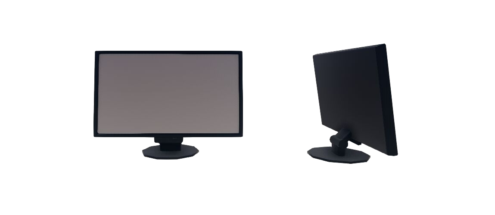
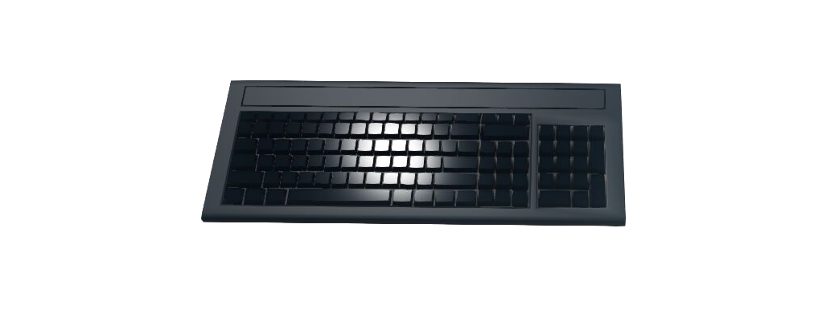

.. _Office_Objects:

#################
Office Objects
#################

.. _officedescription:

******************
Description
******************

Office objects are considered "actors" in Quanser Interactive Labs Open Worlds.
The office objects library controls the office objects available to be placed in
the QLabs environment.
Office objects can be spawned anywhere in the Open Worlds.

See the :ref:`officeTutorial` to get a better understanding of using road
signage in Quanser Interactive Labs.

.. contents:: Table of Contents
    :backlinks: none
    :depth: 2

-------------------------------------------------------------------------------

****************
Desk
****************

.. _desklibrary:

Library
========

.. autoclass:: qvl.desk.QLabsDesk

.. _deskConstants:

Constants
==========

.. autoattribute:: qvl.desk.QLabsDesk.ID_DESK

.. _deskVars:

Member Variables
=================

.. autoattribute:: qvl.desk.QLabsDesk.actorNumber

.. _deskMethods:

Methods
========

.. automethod:: qvl.desk.QLabsDesk.spawn
.. automethod:: qvl.desk.QLabsDesk.spawn_degrees
.. automethod:: qvl.desk.QLabsDesk.spawn_id
.. automethod:: qvl.desk.QLabsDesk.spawn_id_degrees
.. automethod:: qvl.desk.QLabsDesk.spawn_id_and_parent_with_relative_transform
.. automethod:: qvl.desk.QLabsDesk.spawn_id_and_parent_with_relative_transform_degrees
.. automethod:: qvl.desk.QLabsDesk.destroy
.. automethod:: qvl.desk.QLabsDesk.destroy_all_actors_of_class
.. automethod:: qvl.desk.QLabsDesk.ping
.. automethod:: qvl.desk.QLabsDesk.get_world_transform
.. automethod:: qvl.desk.QLabsDesk.get_world_transform_degrees
.. automethod:: qvl.desk.QLabsDesk.parent_with_relative_transform
.. automethod:: qvl.desk.QLabsDesk.parent_with_relative_transform_degrees
.. automethod:: qvl.desk.QLabsDesk.parent_with_current_world_transform
.. automethod:: qvl.desk.QLabsDesk.parent_break

.. _deskConfig:

Configurations
===============

There is only one configuration (0) of the desk actor generated in
QLabs.

.. _deskConnect:

Connection Points
==================

There are no connection points for this actor class.

-------------------------------------------------------------------------------

***********
Chair
***********

.. _chairlibrary:

Library
========

.. autoclass:: qvl.chair.QLabsChair

.. _chairConstants:

Constants
==========

.. autoattribute:: qvl.chair.QLabsChair.ID_CHAIR

.. _chairVars:

Member Variables
==================

.. autoattribute:: qvl.chair.QLabsChair.actorNumber

.. _chairMethods:

Methods
========

.. automethod:: qvl.chair.QLabsChair.spawn
.. automethod:: qvl.chair.QLabsChair.spawn_degrees
.. automethod:: qvl.chair.QLabsChair.spawn_id
.. automethod:: qvl.chair.QLabsChair.spawn_id_degrees
.. automethod:: qvl.chair.QLabsChair.spawn_id_and_parent_with_relative_transform
.. automethod:: qvl.chair.QLabsChair.spawn_id_and_parent_with_relative_transform_degrees
.. automethod:: qvl.chair.QLabsChair.destroy
.. automethod:: qvl.chair.QLabsChair.destroy_all_actors_of_class
.. automethod:: qvl.chair.QLabsChair.ping
.. automethod:: qvl.chair.QLabsChair.get_world_transform
.. automethod:: qvl.chair.QLabsChair.get_world_transform_degrees
.. automethod:: qvl.chair.QLabsChair.parent_with_relative_transform
.. automethod:: qvl.chair.QLabsChair.parent_with_relative_transform_degrees
.. automethod:: qvl.chair.QLabsChair.parent_with_current_world_transform
.. automethod:: qvl.chair.QLabsChair.parent_break

.. _chairConfig:

Configurations
================

There is only one configuration (0) of the chair actor generated in QLabs.

.. _chairConnect:

Connection Points
====================

There are no connection points for this actor class.

-------------------------------------------------------------------------------

***********
Computer
***********

.. _computerlibrary:

Library
========

.. autoclass:: qvl.computer.QLabsComputer

.. _computerConstants:

Constants
==========

.. autoattribute:: qvl.computer.QLabsComputer.ID_COMPUTER

.. _computerVars:

Member Variables
==================

.. autoattribute:: qvl.computer.QLabsComputer.actorNumber

.. _computerMethods:

Methods
========

.. automethod:: qvl.computer.QLabsComputer.spawn
.. automethod:: qvl.computer.QLabsComputer.spawn_degrees
.. automethod:: qvl.computer.QLabsComputer.spawn_id
.. automethod:: qvl.computer.QLabsComputer.spawn_id_degrees
.. automethod:: qvl.computer.QLabsComputer.spawn_id_and_parent_with_relative_transform
.. automethod:: qvl.computer.QLabsComputer.spawn_id_and_parent_with_relative_transform_degrees
.. automethod:: qvl.computer.QLabsComputer.destroy
.. automethod:: qvl.computer.QLabsComputer.destroy_all_actors_of_class
.. automethod:: qvl.computer.QLabsComputer.ping
.. automethod:: qvl.computer.QLabsComputer.get_world_transform
.. automethod:: qvl.computer.QLabsComputer.get_world_transform_degrees
.. automethod:: qvl.computer.QLabsComputer.parent_with_relative_transform
.. automethod:: qvl.computer.QLabsComputer.parent_with_relative_transform_degrees
.. automethod:: qvl.computer.QLabsComputer.parent_with_current_world_transform
.. automethod:: qvl.computer.QLabsComputer.parent_break

.. _computerConfig:

Configurations
===============

There is only one configuration (0) of the computer actor generated in QLabs.

.. _computerConnect:

Connection Points
==================

There are no connection points for this actor class.

-------------------------------------------------------------------------------

*****************
Computer Monitor
*****************

.. _monitorlibrary:

Library
========

.. autoclass:: qvl.computer_monitor.QLabsComputerMonitor

.. _monitorConstants:

Constants
==========

.. autoattribute:: qvl.computer_monitor.QLabsComputerMonitor.ID_COMPUTER_MONITOR

.. _monitorVars:

Member Variables
==================

.. autoattribute:: qvl.computer_monitor.QLabsComputerMonitor.actorNumber

.. _monitorMethods:

Methods
========

.. automethod:: qvl.computer_monitor.QLabsComputerMonitor.spawn
.. automethod:: qvl.computer_monitor.QLabsComputerMonitor.spawn_degrees
.. automethod:: qvl.computer_monitor.QLabsComputerMonitor.spawn_id
.. automethod:: qvl.computer_monitor.QLabsComputerMonitor.spawn_id_degrees
.. automethod:: qvl.computer_monitor.QLabsComputerMonitor.spawn_id_and_parent_with_relative_transform
.. automethod:: qvl.computer_monitor.QLabsComputerMonitor.spawn_id_and_parent_with_relative_transform_degrees
.. automethod:: qvl.computer_monitor.QLabsComputerMonitor.destroy
.. automethod:: qvl.computer_monitor.QLabsComputerMonitor.destroy_all_actors_of_class
.. automethod:: qvl.computer_monitor.QLabsComputerMonitor.ping
.. automethod:: qvl.computer_monitor.QLabsComputerMonitor.get_world_transform
.. automethod:: qvl.computer_monitor.QLabsComputerMonitor.get_world_transform_degrees
.. automethod:: qvl.computer_monitor.QLabsComputerMonitor.parent_with_relative_transform
.. automethod:: qvl.computer_monitor.QLabsComputerMonitor.parent_with_relative_transform_degrees
.. automethod:: qvl.computer_monitor.QLabsComputerMonitor.parent_with_current_world_transform
.. automethod:: qvl.computer_monitor.QLabsComputerMonitor.parent_break

.. _monitorConfig:

Configurations
===============

There is only one configuration (0) of the monitor actor generated in QLabs.

.. _monitorConnect:

Connection Points
==================

There are no connection points for this actor class.

-------------------------------------------------------------------------------

*******************
Computer Keyboard
*******************

.. _keyboardlibrary:

Library
========

.. autoclass:: qvl.computer_keyboard.QLabsComputerKeyboard

.. _keyboardConstants:

Constants
==========

.. autoattribute:: qvl.computer_keyboard.QLabsComputerKeyboard.ID_COMPUTER_KEYBOARD

.. _keyboardVars:

Member Variables
==================

.. autoattribute:: qvl.computer_keyboard.QLabsComputerKeyboard.actorNumber

.. _keyboardMethods:

Methods
========

.. automethod:: qvl.computer_keyboard.QLabsComputerKeyboard.spawn
.. automethod:: qvl.computer_keyboard.QLabsComputerKeyboard.spawn_degrees
.. automethod:: qvl.computer_keyboard.QLabsComputerKeyboard.spawn_id
.. automethod:: qvl.computer_keyboard.QLabsComputerKeyboard.spawn_id_degrees
.. automethod:: qvl.computer_keyboard.QLabsComputerKeyboard.spawn_id_and_parent_with_relative_transform
.. automethod:: qvl.computer_keyboard.QLabsComputerKeyboard.spawn_id_and_parent_with_relative_transform_degrees
.. automethod:: qvl.computer_keyboard.QLabsComputerKeyboard.destroy
.. automethod:: qvl.computer_keyboard.QLabsComputerKeyboard.destroy_all_actors_of_class
.. automethod:: qvl.computer_keyboard.QLabsComputerKeyboard.ping
.. automethod:: qvl.computer_keyboard.QLabsComputerKeyboard.get_world_transform
.. automethod:: qvl.computer_keyboard.QLabsComputerKeyboard.get_world_transform_degrees
.. automethod:: qvl.computer_keyboard.QLabsComputerKeyboard.parent_with_relative_transform
.. automethod:: qvl.computer_keyboard.QLabsComputerKeyboard.parent_with_relative_transform_degrees
.. automethod:: qvl.computer_keyboard.QLabsComputerKeyboard.parent_with_current_world_transform
.. automethod:: qvl.computer_keyboard.QLabsComputerKeyboard.parent_break

.. _keyboardConfig:

Configurations
===============

There is only one configuration (0) of the keyboard actor generated in QLabs.

.. _keyboardConnect:

Connection Points
==================

There are no connection points for this actor class.

-------------------------------------------------------------------------------

*******************
Computer Mouse
*******************

.. _mouselibrary:

Library
========

.. autoclass:: qvl.computer_mouse.QLabsComputerMouse

.. _mouseConstants:

Constants
==========

.. autoattribute:: qvl.computer_mouse.QLabsComputerMouse.ID_COMPUTER_MOUSE

.. _mouseVars:

Member Variables
==================

.. autoattribute:: qvl.computer_mouse.QLabsComputerMouse.actorNumber

.. _mouseMethods:

Methods
========

.. automethod:: qvl.computer_mouse.QLabsComputerMouse.spawn
.. automethod:: qvl.computer_mouse.QLabsComputerMouse.spawn_degrees
.. automethod:: qvl.computer_mouse.QLabsComputerMouse.spawn_id
.. automethod:: qvl.computer_mouse.QLabsComputerMouse.spawn_id_degrees
.. automethod:: qvl.computer_mouse.QLabsComputerMouse.spawn_id_and_parent_with_relative_transform
.. automethod:: qvl.computer_mouse.QLabsComputerMouse.spawn_id_and_parent_with_relative_transform_degrees
.. automethod:: qvl.computer_mouse.QLabsComputerMouse.destroy
.. automethod:: qvl.computer_mouse.QLabsComputerMouse.destroy_all_actors_of_class
.. automethod:: qvl.computer_mouse.QLabsComputerMouse.ping
.. automethod:: qvl.computer_mouse.QLabsComputerMouse.get_world_transform
.. automethod:: qvl.computer_mouse.QLabsComputerMouse.get_world_transform_degrees
.. automethod:: qvl.computer_mouse.QLabsComputerMouse.parent_with_relative_transform
.. automethod:: qvl.computer_mouse.QLabsComputerMouse.parent_with_relative_transform_degrees
.. automethod:: qvl.computer_mouse.QLabsComputerMouse.parent_with_current_world_transform
.. automethod:: qvl.computer_mouse.QLabsComputerMouse.parent_break

.. _mouseConfig:

Configurations
===============

There is only one configuration (0) of the mouse actor generated in QLabs.

.. _mouseConnect:

Connection Points
==================

There are no connection points for this actor class.

-------------------------------------------------------------------------------
..
    
.. _officeTutorial:

*************************
Office Objects Tutorial
*************************

.. tabs::
    .. tab:: Python

        .. dropdown:: Python Tutorial

            Raw to download this tutorial: |office_tutorial.py|.

            .. |office_tutorial.py| replace::
                :download:`Office Objects Tutorial (.py) <../../../tutorials/office_tutorial.py>`

            .. literalinclude:: ../../../tutorials/office_tutorial.py
                :language: python
                :linenos:

        .. dropdown:: Python Tutorial Multiple Desks 

            Raw to download this tutorial: |office_tutorial.py|.

            This tutorial uses a function to simplify creating multiple desks set up the same way. 

            .. |office_tutorial2.py| replace::
                :download:`Office Objects Tutorial (.py) <../../../tutorials/office_tutorial2.py>`

            .. literalinclude:: ../../../tutorials/office_tutorial2.py
                :language: python
                :linenos:

    .. tab:: Matlab

        .. dropdown:: Matlab Tutorial

           Coming Soon!
