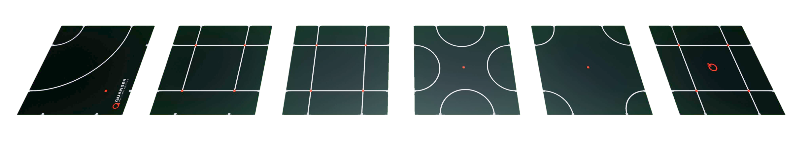

.. _QBotPlatform_Flooring:

*************************
QBot Platform Floor Mats
*************************

.. _qbotPlatformFlooringDescription:

Description
============

The QBot Platform is accompanied by floor mats.  These mats are considered
an "actor" in Quanser Interactive Labs.  These mats are created to help easily
teach line following, path planning and other important warehouse robotics 
skills.

.. _qbotPlatformFlooringLibrary:

Library
========

.. autoclass:: python.qvl.qbot_platform_flooring.QLabsQBotPlatformFlooring

.. _qbotPlatformFlooringConstants:

Constants
==========

.. autoattribute:: python.qvl.qbot_platform_flooring.QLabsQBotPlatformFlooring.ID_FLOORING
.. autoattribute:: python.qvl.qbot_platform_flooring.QLabsQBotPlatformFlooring.FLOORING_QBOT_PLATFORM_0
.. autoattribute:: python.qvl.qbot_platform_flooring.QLabsQBotPlatformFlooring.FLOORING_QBOT_PLATFORM_1
.. autoattribute:: python.qvl.qbot_platform_flooring.QLabsQBotPlatformFlooring.FLOORING_QBOT_PLATFORM_2
.. autoattribute:: python.qvl.qbot_platform_flooring.QLabsQBotPlatformFlooring.FLOORING_QBOT_PLATFORM_3
.. autoattribute:: python.qvl.qbot_platform_flooring.QLabsQBotPlatformFlooring.FLOORING_QBOT_PLATFORM_4
.. autoattribute:: python.qvl.qbot_platform_flooring.QLabsQBotPlatformFlooring.FLOORING_QBOT_PLATFORM_5

.. _qbotPlatformFlooringVars:

Member Variables
=================

.. autoattribute:: python.qvl.qbot_platform_flooring.QLabsQBotPlatformFlooring.actorNumber

.. _qbotPlatformFlooringMethods:

Methods
========

.. automethod:: python.qvl.qbot_platform_flooring.QLabsQBotPlatformFlooring.spawn
.. automethod:: python.qvl.qbot_platform_flooring.QLabsQBotPlatformFlooring.spawn_degrees
.. automethod:: python.qvl.qbot_platform_flooring.QLabsQBotPlatformFlooring.spawn_id
.. automethod:: python.qvl.qbot_platform_flooring.QLabsQBotPlatformFlooring.spawn_id_degrees
.. automethod:: python.qvl.qbot_platform_flooring.QLabsQBotPlatformFlooring.spawn_id_and_parent_with_relative_transform
.. automethod:: python.qvl.qbot_platform_flooring.QLabsQBotPlatformFlooring.spawn_id_and_parent_with_relative_transform_degrees
.. automethod:: python.qvl.qbot_platform_flooring.QLabsQBotPlatformFlooring.destroy
.. automethod:: python.qvl.qbot_platform_flooring.QLabsQBotPlatformFlooring.destroy_all_actors_of_class
.. automethod:: python.qvl.qbot_platform_flooring.QLabsQBotPlatformFlooring.ping
.. automethod:: python.qvl.qbot_platform_flooring.QLabsQBotPlatformFlooring.get_world_transform
.. automethod:: python.qvl.qbot_platform_flooring.QLabsQBotPlatformFlooring.get_world_transform_degrees
.. automethod:: python.qvl.qbot_platform_flooring.QLabsQBotPlatformFlooring.parent_with_relative_transform
.. automethod:: python.qvl.qbot_platform_flooring.QLabsQBotPlatformFlooring.parent_with_relative_transform_degrees
.. automethod:: python.qvl.qbot_platform_flooring.QLabsQBotPlatformFlooring.parent_with_current_world_transform
.. automethod:: python.qvl.qbot_platform_flooring.QLabsQBotPlatformFlooring.parent_break

.. _qbotPlatformFlooringConfig:

Configurations
================
There 6 configurations (0-5) for the QBot Platform flooring class. Each mat is 1.2m x 1.2m.

.. _qbotPlatformFlooringConnect:

Connection Points
==================

There are no connection points for this actor class.
