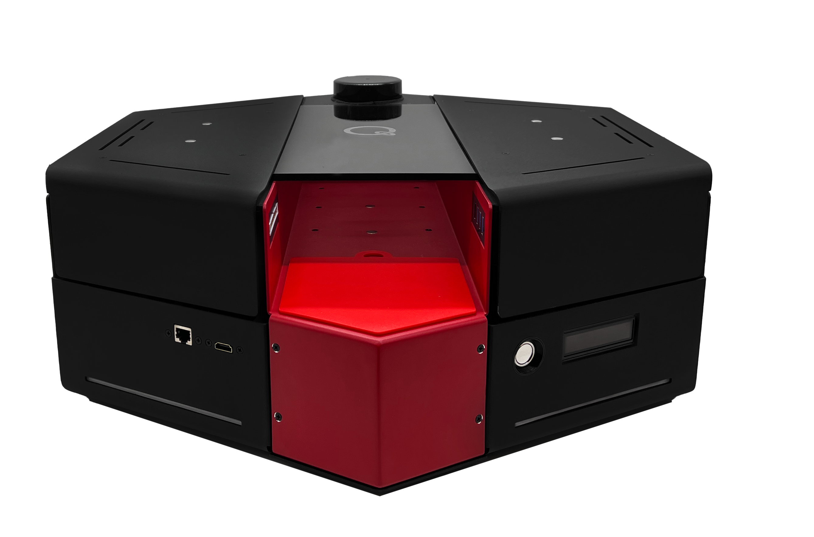
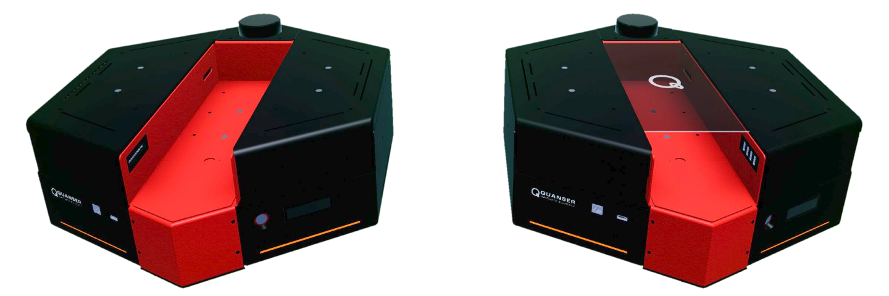
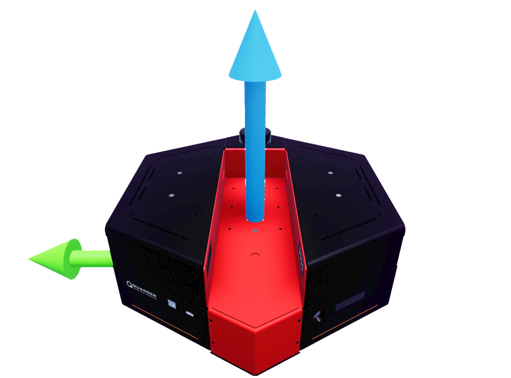
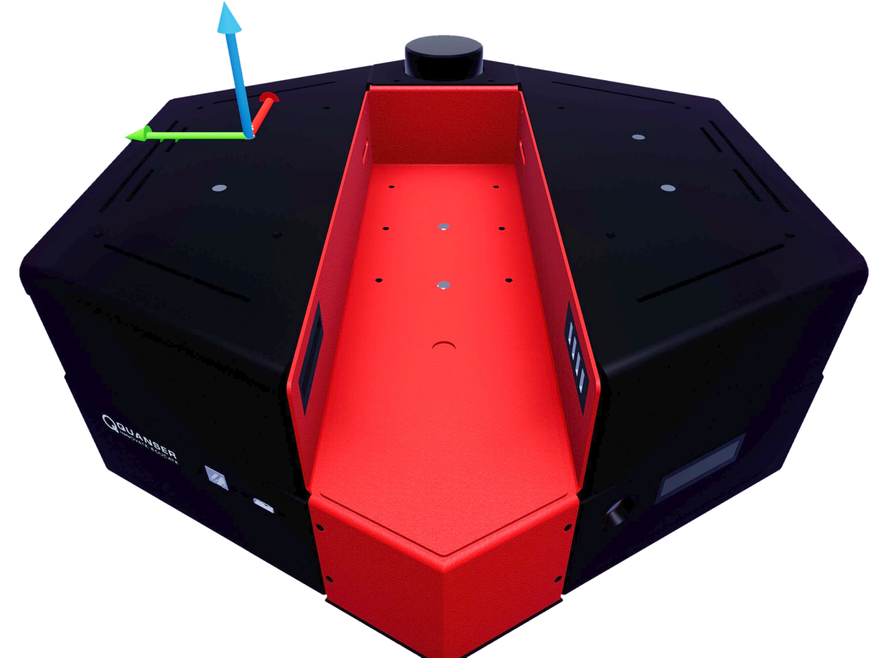
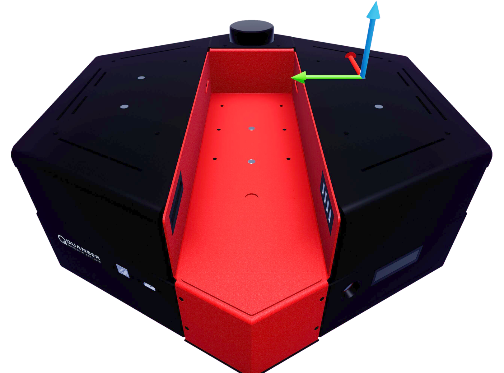
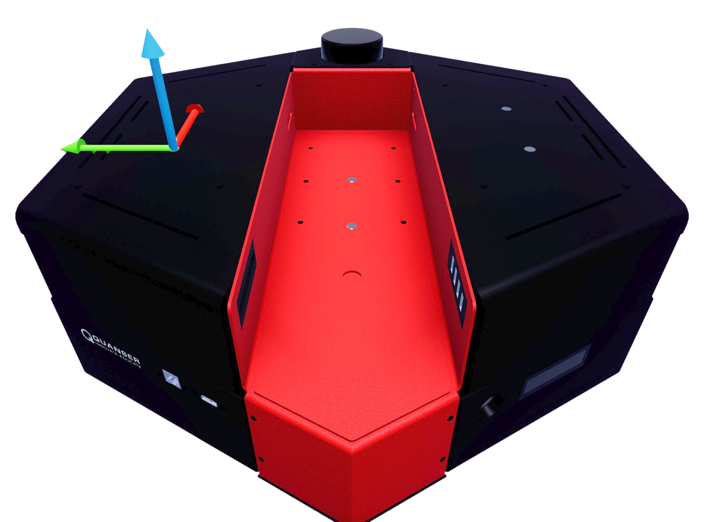
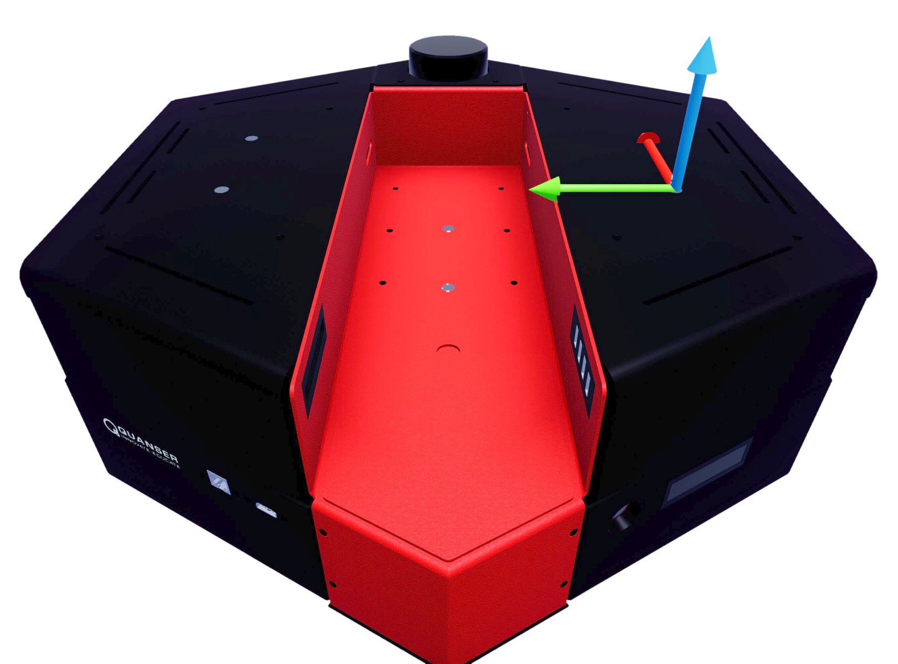
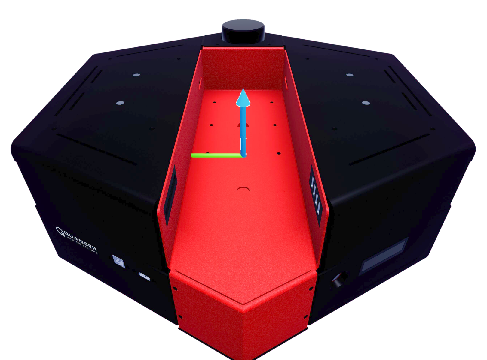
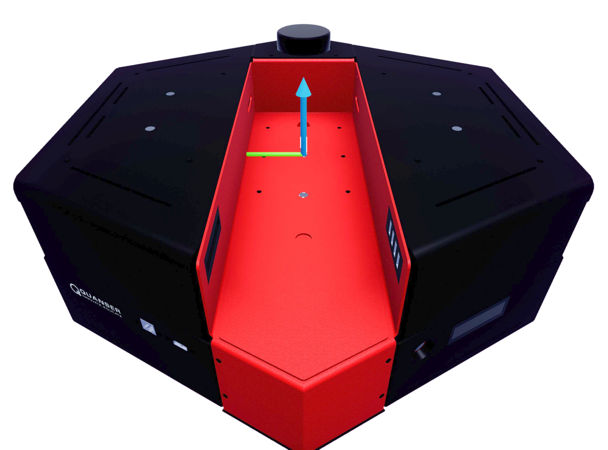
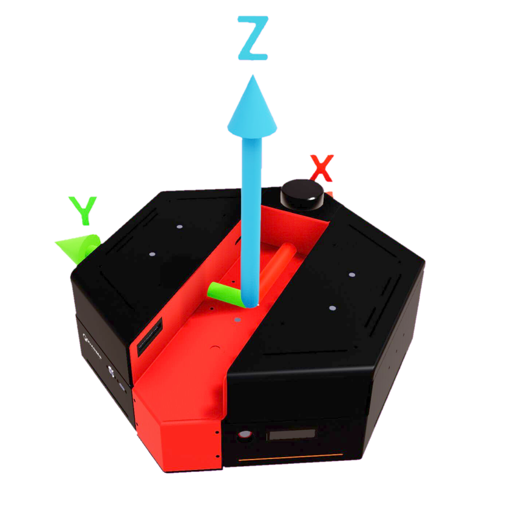

.. _QBotPlatform_Library:

**************
QBot Platform
**************

.. _qbotPlatformDescription:

Description
============

A QBot Platform is considered an "actor" in Quanser Interactive Labs. 
The QBot Platform library can be used to acquire sensor data from the 
virtual environment and control the motion of the robot(s).

.. See the QBot Platform :ref:`qbotPlatformTutorial` to get a better understanding 
.. of using QBot Platform in Quanser Interactive Labs.

.. _qbotPlatformLibrary:

Library
=========

.. autoclass:: qvl.qbot_platform.QLabsQBotPlatform

.. _qbotPlatformConstants:

Constants
==========

.. autoattribute:: qvl.qbot_platform.QLabsQBotPlatform.ID_QBOT_PLATFORM
.. autoattribute:: qvl.qbot_platform.QLabsQBotPlatform.VIEWPOINT_RGB
.. autoattribute:: qvl.qbot_platform.QLabsQBotPlatform.VIEWPOINT_DEPTH
.. autoattribute:: qvl.qbot_platform.QLabsQBotPlatform.VIEWPOINT_DOWNWARD
.. autoattribute:: qvl.qbot_platform.QLabsQBotPlatform.VIEWPOINT_TRAILING
.. autoattribute:: qvl.qbot_platform.QLabsQBotPlatform.CAMERA_RGB
.. autoattribute:: qvl.qbot_platform.QLabsQBotPlatform.CAMERA_DEPTH
.. autoattribute:: qvl.qbot_platform.QLabsQBotPlatform.CAMERA_DOWNWARD

.. _qbotPlatformMemberVars:

Member Variables
==================

.. autoattribute:: qvl.qbot_platform.QLabsQBotPlatform.actorNumber

.. _qbotPlatformMethods:

Methods
========

.. automethod:: qvl.qbot_platform.QLabsQBotPlatform.__init__
.. automethod:: qvl.qbot_platform.QLabsQBotPlatform.spawn
.. automethod:: qvl.qbot_platform.QLabsQBotPlatform.spawn_degrees
.. automethod:: qvl.qbot_platform.QLabsQBotPlatform.spawn_id
.. automethod:: qvl.qbot_platform.QLabsQBotPlatform.spawn_id_degrees
.. automethod:: qvl.qbot_platform.QLabsQBotPlatform.set_transform
.. automethod:: qvl.qbot_platform.QLabsQBotPlatform.set_transform_degrees
.. automethod:: qvl.qbot_platform.QLabsQBotPlatform.command_and_request_state
.. automethod:: qvl.qbot_platform.QLabsQBotPlatform.get_image
.. automethod:: qvl.qbot_platform.QLabsQBotPlatform.get_lidar
.. automethod:: qvl.qbot_platform.QLabsQBotPlatform.possess

.. _qbotPlatformConfig:

Configurations
==============

There are two configurations (0-1) of the QBot Platform actor. Configuration 1 adds a cover
on top to facilitate carrying other dynamic actors.

.. _qbotPlatformConnect:

Connection Points
==================

.. table::
    :widths: 20, 11, 11, 11, 53
    :align: center

    =============================== ====================== ============ ====================================================== ===========
    Image (Click for enlarged view) Reference Frame Number Parent Frame Relative Transform to Parent (Location, Rotation)      Description
    =============================== ====================== ============ ====================================================== ===========
    |conn0|                         0                                                                                          The base frame is located at ground level, centered between the two drive wheels.
    |conn1|                         1                      0            [ 0.0450,0.155,0.190] [0,0,0]                          Front left magnet
    |conn2|                         2                      0            [ 0.0450,-0.155,0.190] [0,0,0]                         Front right magnet
    |conn3|                         3                      0            [-0.0450,0.155,0.190] [0,0,0]                          Back left magnet
    |conn4|                         4                      0            [-0.0450,-0.155,0.190] [0,0,0]                         Back right magnet
    |conn5|                         5                      0            [-0.0465,0,0.110] [0,0,0]                              Back middle magnet
    |conn6|                         6                      0            [ 0.0435,0,0.110] [0,0,0]                              Front middle magnet
    =============================== ====================== ============ ====================================================== ===========

Component Extrinsics
=====================

"Extrinsics" refer to the external relationship of an object with respect to a
specific frame of reference (in this case the body center of the QBot Platform).
Sometimes it's important to know specific distances and orientation of
extrinsic components, for instance, this can be use for obstacle detection and
camera calibration.

You will find a list of the important extrinsics below relative to the actor base frame.

.. table:: 
    :widths: 11, 11, 11, 11
    :align: center

    ============================= ====== ====== ======
    Component                     x (m)  y (m)  z (m)
    ============================= ====== ====== ======
    Geometric center (body frame) 0.000  0.000  0.112
    Left wheel                    0.000  0.195  0.044
    Right wheel                   0.000  -0.195 0.044
    RealSense                     0.261  0.000  0.132
    CSI bottom                    0.000  0.000  0.059
    IMU                           0.000  0.000  0.089
    LIDAR                         0.221  0.000  0.207
    ============================= ====== ====== ======

    QBot Platform geometric base frame centered on the floor between the two wheels.

    QBot Platform geometric center/body frame.

.. Transformation Matrices
.. ************************

    

.. All transformation matrices are built off of the body frame and camera frames
.. for the QBot Platform.

.. To read more about this check out our documentation
    .. todo: update this `here <https://www.quanser.com/products/qbot-platform/>`__ 
    .. by clicking on resources button and looking inside the zip folder for
    .. User Guides/System Hardware.pdf

.. .. image:: ../pictures/qbotplatform_extrinsic_matrices.png
    :scale:  100%
    :align: center

.. _qbotPlatformTutorial:

QBot Platform Tutorial
=======================

.. dropdown:: Example

    Coming Soon!

    .. Raw to download this tutorial: |qbotplatform_tutorial.py|.

    .. .. |qbotplatform_tutorial.py| replace:
        :download:`QBot Platform Tutorial <../../../tutorials/qbotplatform_tutorial.py>`
    
    ..  .. literalinclude:: ../../../tutorials/qbotplatform_tutorial.py
        :language: python
        :linenos:
    

.. **See Also:**
