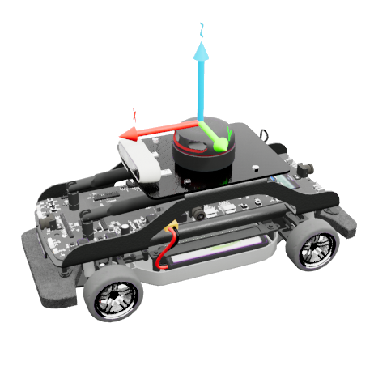

.. _QCar2_Library:

*******
QCar 2
*******

.. _car2Description:

|

Description
=============

QCars are considered "actors" in Quanser Interactive Labs. The QCar library can
be used to acquire sensor data from the virtual environment and controls the
motion of the vehicles.

See the :ref:`QCar2Tutorial` to get a better understanding of using QCars in
Quanser Interactive Labs.

.. _car2Library:

Library
=========

.. autoclass:: qvl.qcar2.QLabsQCar2

.. _car2Constants:

Constants
===========

.. autoattribute:: qvl.qcar2.QLabsQCar2.ID_QCAR

.. note::
    CSI camera resolution is 820x410.

.. autoattribute:: qvl.qcar2.QLabsQCar2.CAMERA_CSI_RIGHT
.. autoattribute:: qvl.qcar2.QLabsQCar2.CAMERA_CSI_BACK
.. autoattribute:: qvl.qcar2.QLabsQCar2.CAMERA_CSI_LEFT
.. autoattribute:: qvl.qcar2.QLabsQCar2.CAMERA_CSI_FRONT

.. note::
    RGB and depth resolution is 640x480.

.. autoattribute:: qvl.qcar2.QLabsQCar2.CAMERA_RGB
.. autoattribute:: qvl.qcar2.QLabsQCar2.CAMERA_DEPTH

.. note::
    Overhead and trailing cameras support user zoom using the mouse wheel.

.. autoattribute:: qvl.qcar2.QLabsQCar2.CAMERA_OVERHEAD
.. autoattribute:: qvl.qcar2.QLabsQCar2.CAMERA_TRAILING

.. _car2MemberVars:

Member Variables
=================

.. autoattribute:: qvl.qcar2.QLabsQCar2.actorNumber

.. _car2Methods:

Methods
=========

.. automethod:: qvl.qcar2.QLabsQCar2.__init__
.. automethod:: qvl.qcar2.QLabsQCar2.spawn
.. automethod:: qvl.qcar2.QLabsQCar2.spawn_degrees
.. automethod:: qvl.qcar2.QLabsQCar2.spawn_id
.. automethod:: qvl.qcar2.QLabsQCar2.spawn_id_degrees
.. automethod:: qvl.qcar2.QLabsQCar2.set_transform_and_request_state
.. automethod:: qvl.qcar2.QLabsQCar2.set_transform_and_request_state_degrees
.. automethod:: qvl.qcar2.QLabsQCar2.set_velocity_and_request_state
.. automethod:: qvl.qcar2.QLabsQCar2.set_velocity_and_request_state_degrees
.. automethod:: qvl.qcar2.QLabsQCar2.possess
.. automethod:: qvl.qcar2.QLabsQCar2.ghost_mode
.. automethod:: qvl.qcar2.QLabsQCar2.set_led_strip_uniform
.. automethod:: qvl.qcar2.QLabsQCar2.set_led_strip_individual
.. automethod:: qvl.qcar2.QLabsQCar2.get_image
.. automethod:: qvl.qcar2.QLabsQCar2.get_lidar
.. automethod:: qvl.qcar2.QLabsQCar2.destroy
.. automethod:: qvl.qcar2.QLabsQCar2.destroy_all_actors_of_class
.. automethod:: qvl.qcar2.QLabsQCar2.ping
.. automethod:: qvl.qcar2.QLabsQCar2.get_world_transform
.. automethod:: qvl.qcar2.QLabsQCar2.get_world_transform_degrees

.. _car2Config:

Configurations
===============

There is only one configuration of the QCar actor.

.. _car2Connect:

Connection Points
==================

.. table::
    :widths: 20, 11, 11, 11, 53
    :align: center

    =============================== ====================== ============ ====================================================== ===========
    Image (Click for enlarged view) Reference Frame Number Parent Frame Relative Transform to Parent (Location, Rotation)      Description
    =============================== ====================== ============ ====================================================== ===========
    |conn0|                         0                                                                                          The base frame is located at ground level, centered between the two rear wheels.
    |conn1|                         1                      0            [ 1.300,0,0] [0,0,0]                                   Centered between the front and rear axles on the ground.
    |conn2|                         2                      0            [ 1.207,0,1.880] [0,0,0]                               Top center of the LIDAR
    =============================== ====================== ============ ====================================================== ===========

Component Extrinsics
=======================

"Extrinsics" refer to the external relationship of an object with respect to a
specific frame of reference (in this case the body center of the QCar).
Sometimes it's important to know specific distances and orientation of
extrinsic components, for instance, this can be use for obstacle detection and
camera calibration.
You will find a list of the important extrinsics below.

Distances From Body Frame
***************************
The body frame is located between the front and rear axles on the ground plane.
Distances of the QCar 2 in its virtual environment are 10 times larger than on the 
physical system so a QCar 2 spawned at a scale of 1 is equivalent size to a full-scale
automobile. A QCar spawned at a scale of 0.1 will be equivalent to the size of a
physical QCar.

The RealSense camera distance is considered from the front face of the camera 
at the location of the RGB sensor.

.. table::
    :widths: 11, 11, 11, 11
    :align: center

    ========== ====== ====== ======
    Component  x (m)  y (m)  z (m)
    ========== ====== ====== ======
    CG          -0.11  0.029 0.814
    Front axle  1.30   0     0.31
    Rear axle  -1.30   0     0.31
    CSI front   1.83   0     1.10
    CSI left    0.12   0.33  1.10
    CSI rear   -1.52   0     1.10
    CSI right   0.12  -0.53  1.10
    IMU         0.11   0     0.89
    RealSense   0.95   0.32  1.72
    RPLIDAR    -0.12  -0     1.93
    ========== ====== ====== ======

|

Transformation Matrices
************************

All transformation matrices are built off of the body frame and sensor frames
for the QCar 2.

To read more about this check out our documentation
`here <https://www.quanser.com/products/self-driving-car-studio/>`__
by clicking on resources button and looking inside the zip folder for
src/user_manuals/qcar2/user_manual_system_hardware.pdf

-------------------------------------------------------------------------------

.. _QCar2Tutorial:

QCar 2 Tutorial
===============

.. tabs::
    .. tab:: Python

        .. dropdown:: Python Tutorial

            Raw to download this tutorial: |qcar2_tutorial.py|.

            .. |qcar2_tutorial.py| replace::
                :download:`QCar 2 Tutorial (.py) <../../../tutorials/qcar2_tutorial.py>`

            .. literalinclude:: ../../../tutorials/qcar2_tutorial.py
                :language: python
                :linenos:

    .. tab:: Matlab

        .. dropdown:: Matlab Tutorial

            Raw to download this tutorial: |qcar2_tutorial.m|.

            .. |qcar2_tutorial.m| replace::
                :download:`QCar 2 Tutorial (.m) <../../../tutorials/qcar2_tutorial.m>`

            .. literalinclude:: ../../../tutorials/qcar2_tutorial.m
                :language: Matlab
                :linenos:
    

.. **See Also:**
