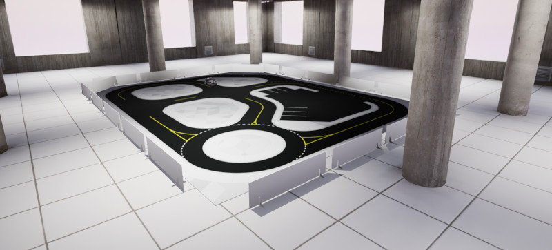

.. _Car_Flooring_Library:

*****************
QCar Floor Mats
*****************

.. _qcarFlooringDescription:

Description
===========

The QCar is accompanied by floor mats.  These tiles are considered
an "actor" in Quanser Interactive Labs.  These tiles are created to help 
students with self-driving car skills.

.. _qcarFlooringLibrary:

Library
=======

.. autoclass:: python.qvl.qcar_flooring.QLabsQCarFlooring

.. _qcarFlooringConstants:

Constants
=========

.. autoattribute:: python.qvl.qcar_flooring.QLabsQCarFlooring.ID_FLOORING
.. autoattribute:: python.qvl.qcar_flooring.QLabsQCarFlooring.FLOORING_QCAR_MAP_LARGE
.. autoattribute:: python.qvl.qcar_flooring.QLabsQCarFlooring.FLOORING_QCAR_MAP_SMALL

.. _qCarFlooringVars:

Member Variables
=================

.. autoattribute:: python.qvl.qcar_flooring.QLabsQCarFlooring.actorNumber

.. _qCarFlooringMethods:

Methods
========

.. automethod:: python.qvl.qcar_flooring.QLabsQCarFlooring.spawn
.. automethod:: python.qvl.qcar_flooring.QLabsQCarFlooring.spawn_degrees
.. automethod:: python.qvl.qcar_flooring.QLabsQCarFlooring.spawn_id
.. automethod:: python.qvl.qcar_flooring.QLabsQCarFlooring.spawn_id_degrees
.. automethod:: python.qvl.qcar_flooring.QLabsQCarFlooring.spawn_id_and_parent_with_relative_transform
.. automethod:: python.qvl.qcar_flooring.QLabsQCarFlooring.spawn_id_and_parent_with_relative_transform_degrees
.. automethod:: python.qvl.qcar_flooring.QLabsQCarFlooring.destroy
.. automethod:: python.qvl.qcar_flooring.QLabsQCarFlooring.destroy_all_actors_of_class
.. automethod:: python.qvl.qcar_flooring.QLabsQCarFlooring.ping
.. automethod:: python.qvl.qcar_flooring.QLabsQCarFlooring.get_world_transform
.. automethod:: python.qvl.qcar_flooring.QLabsQCarFlooring.get_world_transform_degrees
.. automethod:: python.qvl.qcar_flooring.QLabsQCarFlooring.parent_with_relative_transform
.. automethod:: python.qvl.qcar_flooring.QLabsQCarFlooring.parent_with_relative_transform_degrees
.. automethod:: python.qvl.qcar_flooring.QLabsQCarFlooring.parent_with_current_world_transform
.. automethod:: python.qvl.qcar_flooring.QLabsQCarFlooring.parent_break

.. _qCarFlooringConfig:

Configurations
===============

There is only one configuration for the QCar flooring class.

.. _qCarFlooringConnect:

Connection Points
==================

There are no connections points for the person actor.

-------------------------------------------------------------------------------

.. _qcarFlooringTutorial:

QCar Flooring Tutorial
========================

.. tabs::
    .. tab:: Python

        .. dropdown:: Python Tutorial

            Raw to download this tutorial: |qcar_floor_mats_tutorial.py|.

            .. |qcar_floor_mats_tutorial.py| replace::
                :download:`QCar Floor Mats Tutorial (.py) <../../../tutorials/qcar_floor_mats_tutorial.py>`

            .. literalinclude:: ../../../tutorials/qcar_floor_mats_tutorial.py
                :language: python
                :linenos:

    .. tab:: Matlab

        .. dropdown:: Matlab Tutorial

            Raw to download this tutorial: |qcar_floor_mats_tutorial.m|.

            .. |qcar_floor_mats_tutorial.m| replace::
                :download:`QCar Floor Mats Tutorial (.m) <../../../tutorials/qcar_floor_mats_tutorial.m>`

            .. literalinclude:: ../../../tutorials/qcar_floor_mats_tutorial.m
                :language: Matlab
                :linenos:
