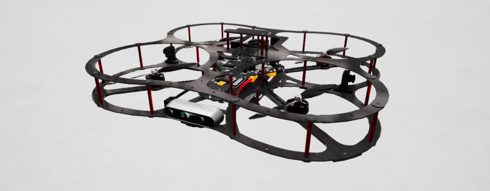

.. _QDrone2_Library:

**********
QDrone 2
**********

.. _drone2Description:

|

Description
=============

QDrones are considered "actors" in Quanser Interactive Labs. The QDrone library can
be used to acquire sensor data from the virtual environment and control the
motion of the drones.

See the :ref:`QDrone2Tutorial` to get a better understanding of using QDrones in
Quanser Interactive Labs.

.. _drone2Library:

Library
=========

.. autoclass:: qvl.qdrone2.QLabsQDrone2

.. _drone2Constants:

Constants
===========

.. autoattribute:: qvl.qdrone2.QLabsQDrone2.ID_QDRONE2

.. note::
    VIEWPOINT constants are for the possess method. CAMERA constants are for the get_image method.

.. autoattribute:: qvl.qdrone2.QLabsQDrone2.VIEWPOINT_CSI_LEFT
.. autoattribute:: qvl.qdrone2.QLabsQDrone2.VIEWPOINT_CSI_BACK
.. autoattribute:: qvl.qdrone2.QLabsQDrone2.VIEWPOINT_CSI_RIGHT
.. autoattribute:: qvl.qdrone2.QLabsQDrone2.VIEWPOINT_RGB
.. autoattribute:: qvl.qdrone2.QLabsQDrone2.VIEWPOINT_DEPTH
.. autoattribute:: qvl.qdrone2.QLabsQDrone2.VIEWPOINT_DOWNWARD
.. autoattribute:: qvl.qdrone2.QLabsQDrone2.VIEWPOINT_OPTICAL_FLOW

.. note::
    Overhead and trailing cameras support user zoom using the mouse wheel.

.. autoattribute:: qvl.qdrone2.QLabsQDrone2.VIEWPOINT_OVERHEAD
.. autoattribute:: qvl.qdrone2.QLabsQDrone2.VIEWPOINT_TRAILING

.. note::
    CSI camera resolution is 820x410.

.. autoattribute:: qvl.qdrone2.QLabsQDrone2.CAMERA_CSI_LEFT
.. autoattribute:: qvl.qdrone2.QLabsQDrone2.CAMERA_CSI_BACK
.. autoattribute:: qvl.qdrone2.QLabsQDrone2.CAMERA_CSI_RIGHT

.. note::
    RGB and depth resolution is 640x480.

.. autoattribute:: qvl.qdrone2.QLabsQDrone2.CAMERA_RGB
.. autoattribute:: qvl.qdrone2.QLabsQDrone2.CAMERA_DEPTH
.. autoattribute:: qvl.qdrone2.QLabsQDrone2.CAMERA_DOWNWARD
.. autoattribute:: qvl.qdrone2.QLabsQDrone2.CAMERA_OPTICAL_FLOW

.. _drone2MemberVars:

Member Variables
=================

.. autoattribute:: qvl.qdrone2.QLabsQDrone2.actorNumber

.. _drone2Methods:

Methods
========

.. automethod:: qvl.qdrone2.QLabsQDrone2.possess
.. automethod:: qvl.qdrone2.QLabsQDrone2.set_velocity_and_request_state
.. automethod:: qvl.qdrone2.QLabsQDrone2.set_velocity_and_request_state_degrees
.. automethod:: qvl.qdrone2.QLabsQDrone2.set_transform_and_dynamics
.. automethod:: qvl.qdrone2.QLabsQDrone2.get_image
.. automethod:: qvl.qdrone2.QLabsQDrone2.set_image_capture_resolution

.. _drone2ParentMethods:

Parent Class (actor.py) Methods
================================

.. automethod:: qvl.qdrone2.QLabsQDrone2.__init__
.. automethod:: qvl.qdrone2.QLabsQDrone2.spawn
.. automethod:: qvl.qdrone2.QLabsQDrone2.spawn_degrees
.. automethod:: qvl.qdrone2.QLabsQDrone2.spawn_id
.. automethod:: qvl.qdrone2.QLabsQDrone2.spawn_id_degrees
.. automethod:: qvl.qdrone2.QLabsQDrone2.destroy
.. automethod:: qvl.qdrone2.QLabsQDrone2.destroy_all_actors_of_class
.. automethod:: qvl.qdrone2.QLabsQDrone2.ping
.. automethod:: qvl.qdrone2.QLabsQDrone2.get_world_transform
.. automethod:: qvl.qdrone2.QLabsQDrone2.get_world_transform_degrees

.. _qdrone2Config:

Configurations
===============

There is only one configuration of the QDrone 2 actor.

.. _QDrone2Tutorial:

QDrone 2 Tutorial
==================

.. tabs::
    .. tab:: Python

        .. dropdown:: Python Tutorial

            Raw to download this tutorial: |qdrone2_tutorial.py|.

            .. |qdrone2_tutorial.py| replace::
                :download:`QDrone 2 Tutorial (.py) <../../../tutorials/qdrone2_tutorial.py>`

            .. literalinclude:: ../../../tutorials/qdrone2_tutorial.py
                :language: python
                :linenos:

    .. tab:: Matlab

        Coming Soon!

        ..
            .. dropdown:: Matlab Tutorial

            Raw to download this tutorial: |qcar2_tutorial.m|.

            .. |qcar2_tutorial.m| replace::
                :download:`QCar 2 Tutorial (.m) <../../../tutorials/qcar2_tutorial.m>`

            .. literalinclude:: ../../../tutorials/qcar2_tutorial.m
                :language: Matlab
                :linenos:

