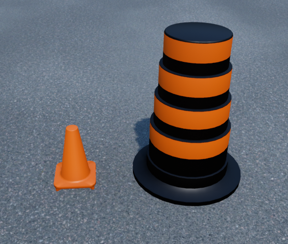

.. _road_signage:

Road Signage
============

.. ----------------------------------------------------------------------------------

Crosswalk
---------

.. _crosswalkDescription: 

Description
^^^^^^^^^^^

.. _crosswalklibrary:

Library
^^^^^^^

.. autoclass:: library_qlabs_crosswalk.QLabsCrosswalk

.. _crosswalkConstants:

Constants
^^^^^^^^^

.. autoattribute:: library_qlabs_crosswalk.QLabsCrosswalk.ID_CROSSWALK

.. _crosswalkMethods:

Methods
^^^^^^^

.. automethod:: library_qlabs_crosswalk.QLabsCrosswalk.spawn_id
.. automethod:: library_qlabs_crosswalk.QLabsCrosswalk.spawn_id_degrees
.. automethod:: library_qlabs_crosswalk.QLabsCrosswalk.destroy
.. automethod:: library_qlabs_crosswalk.QLabsCrosswalk.ping
.. automethod:: library_qlabs_crosswalk.QLabsCrosswalk.get_world_transform

.. _crosswalkConfig:

Configurations
^^^^^^^^^^^^^^

.. image:: ../pictures/crosswalk.png 

.. _crosswalkConnect:

Connection Points
^^^^^^^^^^^^^^^^^

.. _crosswalkTutorial:

Tutorial
^^^^^^^^

.. dropdown:: Example 1

.. dropdown:: Example 2

.. dropdown:: Example 3

.. ----------------------------------------------------------------------------------

Roundabout Sign
---------------

.. _roundaboutDescription: 

Description
^^^^^^^^^^^

.. _roundaboutlibrary:

Library
^^^^^^^

.. autoclass:: library_qlabs_roundabout_sign.QLabsRoundaboutSign

.. _roundaboutConstants:

Constants
^^^^^^^^^

.. autoattribute:: library_qlabs_roundabout_sign.QLabsRoundaboutSign.ID_ROUNDABOUT_SIGN

.. _roundaboutMethods:

Methods
^^^^^^^

.. automethod:: library_qlabs_roundabout_sign.QLabsRoundaboutSign.spawn_id
.. automethod:: library_qlabs_roundabout_sign.QLabsRoundaboutSign.spawn_id_degrees
.. automethod:: library_qlabs_roundabout_sign.QLabsRoundaboutSign.destroy
.. automethod:: library_qlabs_roundabout_sign.QLabsRoundaboutSign.ping
.. automethod:: library_qlabs_roundabout_sign.QLabsRoundaboutSign.get_world_transform

.. _roundaboutConfig:

Configurations
^^^^^^^^^^^^^^

.. _roundaboutConnect:

Connection Points
^^^^^^^^^^^^^^^^^

.. _roundaboutTutorial:

Tutorial
^^^^^^^^

.. dropdown:: Example 1

.. dropdown:: Example 2

.. dropdown:: Example 3

.. ----------------------------------------------------------------------------------

Stop Sign
---------

.. _stopsignDescription: 

Description
^^^^^^^^^^^

.. _stopsignlibrary:

Library
^^^^^^^

.. autoclass:: library_qlabs_stop_sign.QLabsStopSign

.. _stopsignConstants:

Constants
^^^^^^^^^

.. autoattribute:: library_qlabs_stop_sign.QLabsStopSign.ID_STOP_SIGN

.. _stopsignMethods:

Methods
^^^^^^^

.. automethod:: library_qlabs_stop_sign.QLabsStopSign.spawn_id
.. automethod:: library_qlabs_stop_sign.QLabsStopSign.spawn_id_degrees
.. automethod:: library_qlabs_stop_sign.QLabsStopSign.destroy
.. automethod:: library_qlabs_stop_sign.QLabsStopSign.ping
.. automethod:: library_qlabs_stop_sign.QLabsStopSign.get_world_transform

.. _stopsignConfig:

Configurations
^^^^^^^^^^^^^^

.. _stopsignConnect:

Connection Points
^^^^^^^^^^^^^^^^^

.. _stopsignTutorial:

Tutorial
^^^^^^^^

.. dropdown:: Example 1

.. dropdown:: Example 2

.. dropdown:: Example 3

.. ----------------------------------------------------------------------------------

Yield Sign
----------

.. _yieldsignDescription: 

Description
^^^^^^^^^^^

.. _yieldsignlibrary:

Library
^^^^^^^

.. autoclass:: library_qlabs_yield_sign.QLabsYieldSign

.. _yieldsignConstants:

Constants
^^^^^^^^^

.. autoattribute:: library_qlabs_yield_sign.QLabsYieldSign.ID_YIELD_SIGN

.. _yieldsignMethods:

Methods
^^^^^^^

.. automethod:: library_qlabs_yield_sign.QLabsYieldSign.spawn_id
.. automethod:: library_qlabs_yield_sign.QLabsYieldSign.spawn_id_degrees
.. automethod:: library_qlabs_yield_sign.QLabsYieldSign.destroy
.. automethod:: library_qlabs_yield_sign.QLabsYieldSign.ping
.. automethod:: library_qlabs_yield_sign.QLabsYieldSign.get_world_transform

.. _yieldsignConfig:

Configurations
^^^^^^^^^^^^^^

.. _yieldsignConnect:

Connection Points
^^^^^^^^^^^^^^^^^

.. _yieldsignTutorial:

Tutorial
^^^^^^^^

.. dropdown:: Example 1

.. dropdown:: Example 2

.. dropdown:: Example 3

.. ----------------------------------------------------------------------------------

Traffic Cone
------------

.. _trafficconeDescription: 

Description
^^^^^^^^^^^

.. _trafficconelibrary:

Library
^^^^^^^

.. autoclass:: library_qlabs_traffic_cone.QLabsTrafficCone

.. _trafficconeConstants:

Constants
^^^^^^^^^

.. autoattribute:: library_qlabs_traffic_cone.QLabsTrafficCone.ID_TRAFFIC_CONE

.. _trafficconeMethods:

Methods
^^^^^^^

.. automethod:: library_qlabs_traffic_cone.QLabsTrafficCone.spawn_id
.. automethod:: library_qlabs_traffic_cone.QLabsTrafficCone.spawn_id_degrees
.. automethod:: library_qlabs_traffic_cone.QLabsTrafficCone.destroy
.. automethod:: library_qlabs_traffic_cone.QLabsTrafficCone.ping
.. automethod:: library_qlabs_traffic_cone.QLabsTrafficCone.get_world_transform

.. _trafficconeConfig:

Configurations
^^^^^^^^^^^^^^

.. _trafficconeConnect:

Connection Points
^^^^^^^^^^^^^^^^^

.. _trafficconeTutorial:

Tutorial
^^^^^^^^

.. dropdown:: Example 1

.. dropdown:: Example 2

.. dropdown:: Example 3

.. ----------------------------------------------------------------------------------

Traffic Light
-------------

.. _trafficlightDescription: 

Description
^^^^^^^^^^^

.. _trafficlightlibrary:

Library
^^^^^^^

.. autoclass:: library_qlabs_trafficlight.QLabsTrafficLight

.. _trafficlightConstants:

Constants
^^^^^^^^^

.. autoattribute:: library_qlabs_trafficlight.QLabsTrafficLight.ID_TRAFFIC_LIGHT
.. autoattribute:: library_qlabs_trafficlight.QLabsTrafficLight.STATE_RED
.. autoattribute:: library_qlabs_trafficlight.QLabsTrafficLight.STATE_GREEN
.. autoattribute:: library_qlabs_trafficlight.QLabsTrafficLight.STATE_YELLOW

.. _trafficlightMethods:

Methods
^^^^^^^

.. automethod:: library_qlabs_trafficlight.QLabsTrafficLight.spawn_id
.. automethod:: library_qlabs_trafficlight.QLabsTrafficLight.spawn_id_degrees
.. automethod:: library_qlabs_trafficlight.QLabsTrafficLight.set_state

.. _trafficlightConfig:

Configurations
^^^^^^^^^^^^^^

.. _trafficlightConnect:

Connection Points
^^^^^^^^^^^^^^^^^

.. _trafficlightTutorial:

Tutorial
^^^^^^^^

.. dropdown:: Example 1

.. dropdown:: Example 2

.. dropdown:: Example 3
