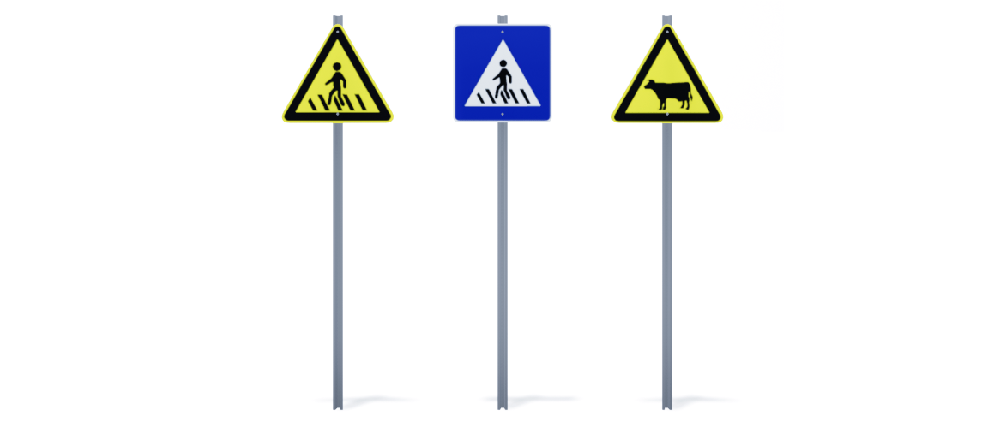
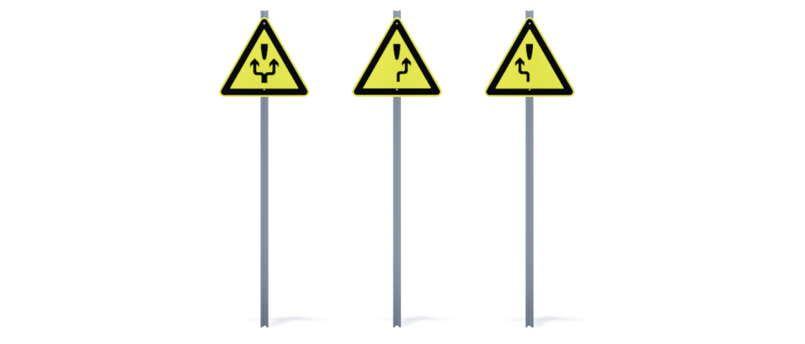
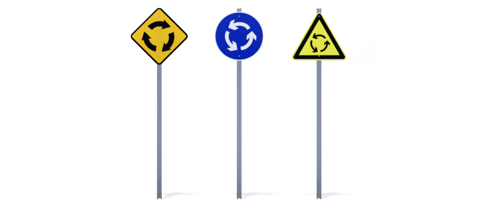
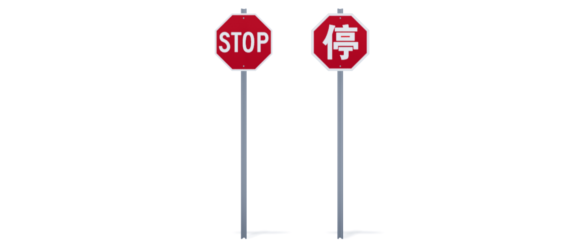
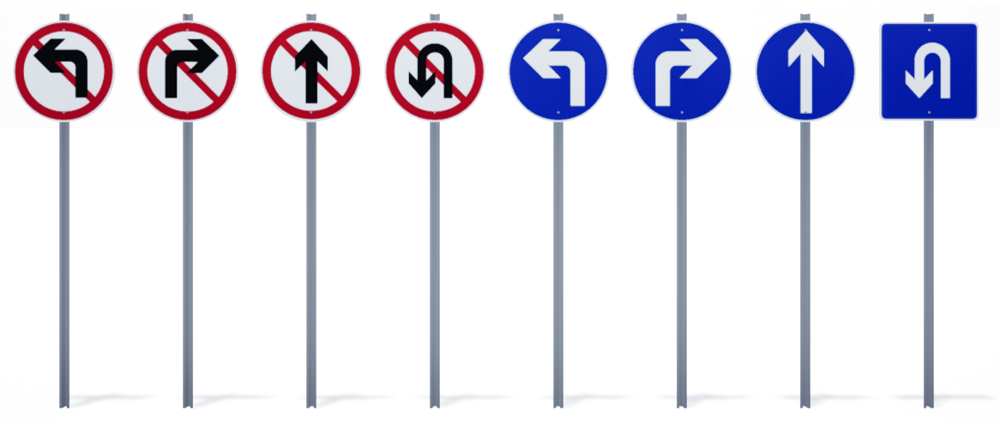
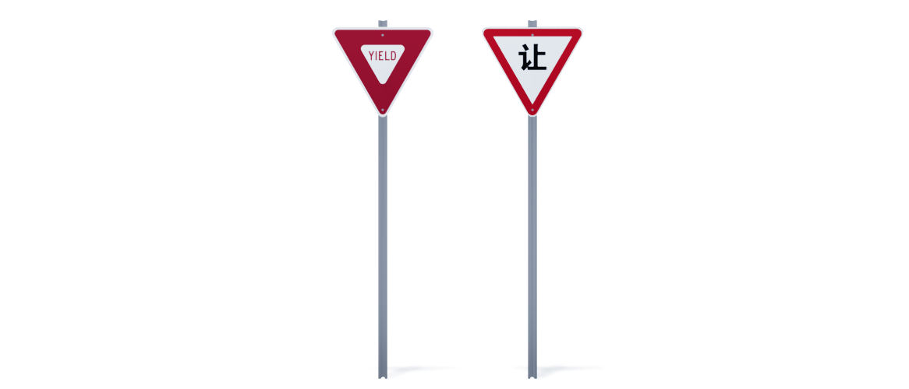

.. _Road_Signage:

#############
Road Signage
#############

.. _roadsignagedescription:

******************
Description
******************

Road signage is considered an "actor" in Quanser Interactive Labs Open Worlds.
The road signage library controls the road signage available to be placed in
the QLabs environment.
Road signage can be spawned anywhere in the Open Worlds.

See the :ref:`roadsignageTutorial` to get a better understanding of using road
signage in Quanser Interactive Labs.

.. contents:: Table of Contents
    :backlinks: none
    :depth: 2

-------------------------------------------------------------------------------

.. important::
    All of the office objects have the same methods and member variables. 
    To simplify this documentation, the methods and member variables are documented
    only once, see :ref:`roadSignsShared` and the :ref:`roadsignageTutorial`.
    No office object has connection points or different configurations.

****************
Crossing Sign
****************

.. _crossinglibrary:

Library
========

.. autoclass:: qvl.crossing_sign.QLabsCrossingSign

.. _crossingConstants:

Constants
==========

.. autoattribute:: qvl.crossing_sign.QLabsCrossingSign.ID_CROSSING_SIGN

Configurations
===============

Crossing signs have 3 configurations (0-2).

-------------------------------------------------------------------------------

****************
Obstacle Sign
****************

.. _obstaclelibrary:

Library
========

.. autoclass:: qvl.obstacle_sign.QLabsObstacleSign

.. _obstacleConstants:

Constants
==========

.. autoattribute:: qvl.obstacle_sign.QLabsObstacleSign.ID_OBSTACLE_SIGN

Configurations
===============

Obstacle signs have 3 configurations (0-2).

-------------------------------------------------------------------------------

****************
Roundabout Sign
****************

.. _roundaboutlibrary:

Library
========

.. autoclass:: qvl.roundabout_sign.QLabsRoundaboutSign

.. _roundaboutConstants:

Constants
==========

.. autoattribute:: qvl.roundabout_sign.QLabsRoundaboutSign.ID_ROUNDABOUT_SIGN

Configurations
===============

Roundabout signs have 3 configurations (0-2).

-------------------------------------------------------------------------------

***********
Speed Sign
***********

.. _speedsignlibrary:

Library
========

.. autoclass:: qvl.speed_sign.QLabsSpeedSign

.. _speedsignConstants:

Constants
==========

.. autoattribute:: qvl.speed_sign.QLabsSpeedSign.ID_SPEED_SIGN

.. _speedsignMethods:

Methods
=========

.. automethod:: qvl.speed_sign.QLabsSpeedSign.set_speed

Configurations
===============

Speed signs only have a single configuration (0).

-------------------------------------------------------------------------------

***********
Stop Sign
***********

.. _stopsignlibrary:

Library
========

.. autoclass:: qvl.stop_sign.QLabsStopSign

.. _stopsignConstants:

Constants
==========

.. autoattribute:: qvl.stop_sign.QLabsStopSign.ID_STOP_SIGN

Configurations
===============

Stop signs have 2 configurations (0-1).

-------------------------------------------------------------------------------

***********
Turn Sign
***********

.. _turnsignlibrary:

Library
========

.. autoclass:: qvl.turn_sign.QLabsTurnSign

.. _turnsignConstants:

Constants
==========

.. autoattribute:: qvl.turn_sign.QLabsStopSign.ID_TURN_SIGN

Configurations
===============

Turn signs have 8 configurations (0-7).

-------------------------------------------------------------------------------

***********
Yield Sign
***********

.. _yieldsignlibrary:

Library
========

.. autoclass:: qvl.yield_sign.QLabsYieldSign

.. _yieldsignConstants:

Constants
==========

.. autoattribute:: qvl.yield_sign.QLabsYieldSign.ID_YIELD_SIGN

Configurations
===============

Yield signs have 2 configurations (0-1).    

-------------------------------------------------------------------------------

.. _roadSignsShared:

******************************
Shared Variables and Methods
******************************

.. _roadSignsVars:

Member Variables
=================

.. autoattribute:: qvl.actor.QLabsActor.actorNumber
    :noindex:

.. _roadSignsMethods:

Parent Class (actor.py) Methods
================================

.. automethod:: qvl.actor.QLabsActor.spawn
    :noindex:
.. automethod:: qvl.actor.QLabsActor.spawn_degrees
    :noindex:
.. automethod:: qvl.actor.QLabsActor.spawn_id
    :noindex:
.. automethod:: qvl.actor.QLabsActor.spawn_id_degrees
    :noindex:
.. automethod:: qvl.actor.QLabsActor.spawn_id_and_parent_with_relative_transform
    :noindex:
.. automethod:: qvl.actor.QLabsActor.spawn_id_and_parent_with_relative_transform_degrees
    :noindex:
.. automethod:: qvl.actor.QLabsActor.destroy
    :noindex:
.. automethod:: qvl.actor.QLabsActor.destroy_all_actors_of_class
    :noindex:
.. automethod:: qvl.actor.QLabsActor.ping
    :noindex:
.. automethod:: qvl.actor.QLabsActor.get_world_transform
    :noindex:
.. automethod:: qvl.actor.QLabsActor.get_world_transform_degrees
    :noindex:
.. automethod:: qvl.actor.QLabsActor.parent_with_relative_transform
    :noindex:
.. automethod:: qvl.actor.QLabsActor.parent_with_relative_transform_degrees
    :noindex:
.. automethod:: qvl.actor.QLabsActor.parent_with_current_world_transform
    :noindex:
.. automethod:: qvl.actor.QLabsActor.parent_break
    :noindex:

Connection Points
==================

Signs do not have any connection points.

-------------------------------------------------------------------------------

.. _roadsignageTutorial:

**********************
Road Signage Tutorial
**********************

.. tabs::
    .. tab:: Python

        .. dropdown:: Python Tutorial

            Raw to download this tutorial: |road_signage_tutorial.py|.

            .. |road_signage_tutorial.py| replace::
                :download:`Road Signage Tutorial (.py) <../../../tutorials/road_signage_tutorial.py>`

            .. literalinclude:: ../../../tutorials/road_signage_tutorial.py
                :language: python
                :linenos:

        .. dropdown:: Complete Road Signage Python Tutorial

            Raw to download this tutorial: |complete_road_signage_tutorial.py|.

            .. |complete_road_signage_tutorial.py| replace::
                :download:`Complete Road Signage Tutorial (.py) <../../../tutorials/complete_road_signage_tutorial.py>`

            .. literalinclude:: ../../../tutorials/complete_road_signage_tutorial.py
                :language: python
                :linenos:

    .. tab:: Matlab

        .. dropdown:: Matlab Tutorial

            Raw to download this tutorial: |road_signage_tutorial.m|.

            .. |road_signage_tutorial.m| replace::
                :download:`Road Signage Tutorial (.m) <../../../tutorials/road_signage_tutorial.m>`

            .. literalinclude:: ../../../tutorials/road_signage_tutorial.m
                :language: Matlab
                :linenos:

        .. dropdown:: Complete Road Signage Matlab Tutorial

            Raw to download this tutorial: |complete_road_signage_tutorial.m|.

            .. |complete_road_signage_tutorial.m| replace::
                :download:`Complete Road Signage Tutorial (.m) <../../../tutorials/complete_road_signage_tutorial.m>`

            .. literalinclude:: ../../../tutorials/complete_road_signage_tutorial.m
                :language: Matlab
                :linenos: