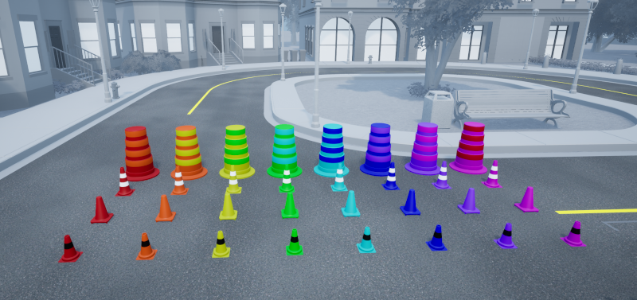
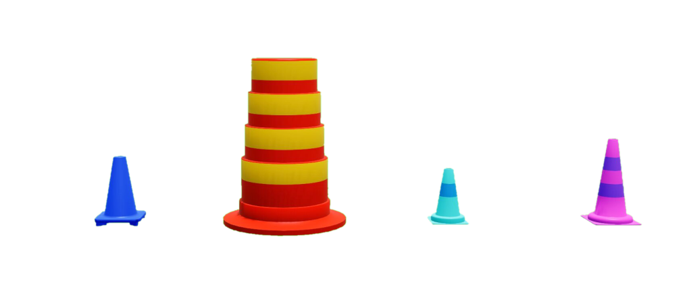

.. _Traffic_Cone:

*****************
Traffic Cone
*****************

|

.. _trafficconedescription:

Description
============

Traffic cones are considered an "actor" in Quanser Interactive Labs Open Worlds.
Traffic cones can be spawned anywhere in the Open Worlds and they only exist
as dynamic actors.

See the :ref:`trafficConeTutorial` to get a better understanding of using traffic
cones in Quanser Interactive Labs.

.. _trafficconelibrary:

Library
========

.. autoclass:: qvl.traffic_cone.QLabsTrafficCone

.. _trafficconeConstants:

Constants
============

.. autoattribute:: qvl.traffic_cone.QLabsTrafficCone.ID_TRAFFIC_CONE

.. _trafficconeVars:

Member Variables
=================

.. autoattribute:: qvl.traffic_cone.QLabsTrafficCone.actorNumber

.. _trafficconeMethods:

Methods
========

.. automethod:: qvl.traffic_cone.QLabsTrafficCone.spawn
.. automethod:: qvl.traffic_cone.QLabsTrafficCone.spawn_degrees
.. automethod:: qvl.traffic_cone.QLabsTrafficCone.spawn_id
.. automethod:: qvl.traffic_cone.QLabsTrafficCone.spawn_id_degrees
.. automethod:: qvl.traffic_cone.QLabsTrafficCone.spawn_id_and_parent_with_relative_transform
.. automethod:: qvl.traffic_cone.QLabsTrafficCone.spawn_id_and_parent_with_relative_transform_degrees
.. automethod:: qvl.traffic_cone.QLabsTrafficCone.destroy
.. automethod:: qvl.traffic_cone.QLabsTrafficCone.destroy_all_actors_of_class
.. automethod:: qvl.traffic_cone.QLabsTrafficCone.ping
.. automethod:: qvl.traffic_cone.QLabsTrafficCone.get_world_transform
.. automethod:: qvl.traffic_cone.QLabsTrafficCone.get_world_transform_degrees
.. automethod:: qvl.traffic_cone.QLabsTrafficCone.parent_with_relative_transform
.. automethod:: qvl.traffic_cone.QLabsTrafficCone.parent_with_relative_transform_degrees
.. automethod:: qvl.traffic_cone.QLabsTrafficCone.parent_with_current_world_transform
.. automethod:: qvl.traffic_cone.QLabsTrafficCone.parent_break
.. automethod:: qvl.traffic_cone.QLabsTrafficCone.set_material_properties

.. _trafficconeConfig:

Configurations
================

There are four configurations (0-3) for the traffic cone actor class generated
in QLabs. For the purpose of the :meth:`set_material_properties <qvl.traffic_cone.QLabsTrafficCone.set_material_properties>` method, configuration 0
has a single material slot (0), and configurations 1-3 have two material slots (0, 1).

.. _trafficconeConnect:

Connection Points
====================

There are no connection points for this actor class.

-------------------------------------------------------------------------------

.. _trafficConeTutorial:

Traffic Cones Tutorial
========================

.. tabs::
    .. tab:: Python

        .. dropdown:: Python Tutorial

            Raw to download this tutorial: |traffic_cones_tutorial.py|.

            .. |traffic_cones_tutorial.py| replace::
                :download:`Traffic Cones Tutorial (.py) <../../../tutorials/traffic_cones_tutorial.py>`

            .. literalinclude:: ../../../tutorials/traffic_cones_tutorial.py
                :language: python
                :linenos:

        .. dropdown:: Complete Road Signage Python Tutorial

            Raw to download this tutorial: |complete_road_signage_tutorial.py|.

            .. |complete_road_signage_tutorial.py| replace::
                :download:`Complete Road Signage Tutorial (.py) <../../../tutorials/complete_road_signage_tutorial.py>`

            .. literalinclude:: ../../../tutorials/complete_road_signage_tutorial.py
                :language: python
                :linenos:

    .. tab:: Matlab

        .. dropdown:: Matlab Tutorial

            Raw to download this tutorial: |traffic_cones_tutorial.m|.

            .. |traffic_cones_tutorial.m| replace::
                :download:`Traffic Cones Tutorial (.m) <../../../tutorials/traffic_cones_tutorial.m>`

            .. literalinclude:: ../../../tutorials/traffic_cones_tutorial.m
                :language: Matlab
                :linenos:

        .. dropdown:: Complete Road Signage Matlab Tutorial

            Raw to download this tutorial: |complete_road_signage_tutorial.m|.

            .. |complete_road_signage_tutorial.m| replace::
                :download:`Complete Road Signage Tutorial (.m) <../../../tutorials/complete_road_signage_tutorial.m>`

            .. literalinclude:: ../../../tutorials/complete_road_signage_tutorial.m
                :language: Matlab
                :linenos:

