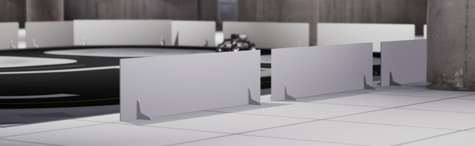

.. _walls_Library:

********
Walls
********

|

.. _wallsDescription:

Description
============

Walls are considered an "actor" in Quanser Interactive Labs Open Worlds.
Walls can be spawned anywhere in the Open Worlds and accompany several 
different products including the QCar Studio and the QBot Platform. The
origin of the wall is at the bottom center. Walls are static by default
but dynamics can be optionally enabled.

.. _wallsLibrary:

Library
=========

.. autoclass:: qvl.walls.QLabsWalls

.. _wallsConstants:

Constants
============

.. autoattribute:: qvl.walls.QLabsWalls.ID_WALL

.. _wallsVars:

Member Variables
==================

.. autoattribute:: qvl.walls.QLabsWalls.actorNumber

.. _wallsMethods:

Methods
=========

.. automethod:: qvl.walls.QLabsWalls.spawn
.. automethod:: qvl.walls.QLabsWalls.spawn_degrees
.. automethod:: qvl.walls.QLabsWalls.spawn_id
.. automethod:: qvl.walls.QLabsWalls.spawn_id_degrees
.. automethod:: qvl.walls.QLabsWalls.spawn_id_and_parent_with_relative_transform
.. automethod:: qvl.walls.QLabsWalls.spawn_id_and_parent_with_relative_transform_degrees
.. automethod:: qvl.walls.QLabsWalls.destroy
.. automethod:: qvl.walls.QLabsWalls.destroy_all_actors_of_class
.. automethod:: qvl.walls.QLabsWalls.ping
.. automethod:: qvl.walls.QLabsWalls.get_world_transform
.. automethod:: qvl.walls.QLabsWalls.get_world_transform_degrees
.. automethod:: qvl.walls.QLabsWalls.parent_with_relative_transform
.. automethod:: qvl.walls.QLabsWalls.parent_with_relative_transform_degrees
.. automethod:: qvl.walls.QLabsWalls.parent_with_current_world_transform
.. automethod:: qvl.walls.QLabsWalls.parent_break
.. automethod:: qvl.walls.QLabsWalls.set_enable_dynamics
.. automethod:: qvl.walls.QLabsWalls.set_enable_collisions
.. automethod:: qvl.walls.QLabsWalls.set_physics_properties
.. automethod:: qvl.walls.QLabsWalls.set_transform
.. automethod:: qvl.walls.QLabsWalls.set_transform_degrees

.. _wallsConfig:

Configurations
===============

There is only one configuration for the walls class.

.. _wallsConnect:

Connection Points
==================

There are no connection points for this actor class.

-------------------------------------------------------------------------------

.. _wallsTutorial:

Walls Tutorial
==============

.. tabs::
    .. tab:: Python

        .. dropdown:: Python Tutorial

            Raw to download this tutorial: |walls_tutorial.py|.

            .. |walls_tutorial.py| replace::
                :download:`Walls Tutorial (.py) <../../../tutorials/walls_tutorial.py>`

            .. literalinclude:: ../../../tutorials/walls_tutorial.py
                :language: python
                :linenos:

        .. dropdown:: Maze

            Raw to download this tutorial: |wall_maze_tutorial.py|.

            .. |wall_maze_tutorial.py| replace::
                :download:`Wall Maze Tutorial (.py) <../../../tutorials/wall_maze_tutorial.py>`

            .. literalinclude:: ../../../tutorials/wall_maze_tutorial.py
                :language: python
                :linenos:                

    .. tab:: Matlab

        .. dropdown:: Matlab Tutorial

            Raw to download this tutorial: |walls_tutorial.m|.

            .. |walls_tutorial.m| replace::
                :download:`Walls Tutorial (.m) <../../../tutorials/walls_tutorial.m>`

            .. literalinclude:: ../../../tutorials/walls_tutorial.m
                :language: Matlab
                :linenos:

        .. dropdown:: Maze

            Raw to download this tutorial: |wall_maze_tutorial.m|.

            .. |wall_maze_tutorial.m| replace::
                :download:`Wall Maze Tutorial (.m) <../../../tutorials/wall_maze_tutorial.m>`

            .. literalinclude:: ../../../tutorials/wall_maze_tutorial.m
                :language: Matlab
                :linenos:		                
		
