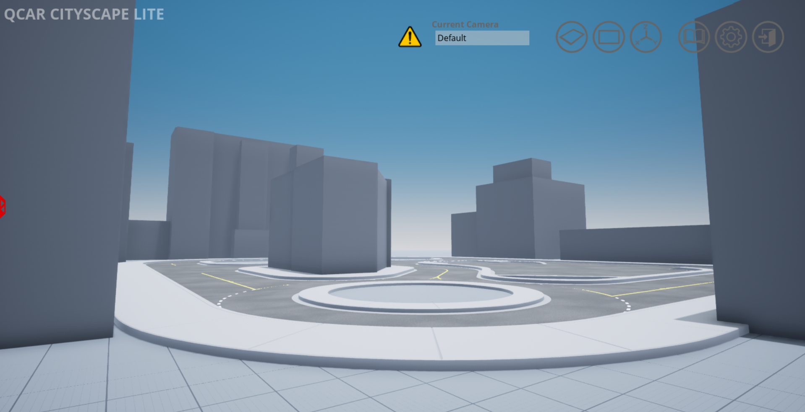
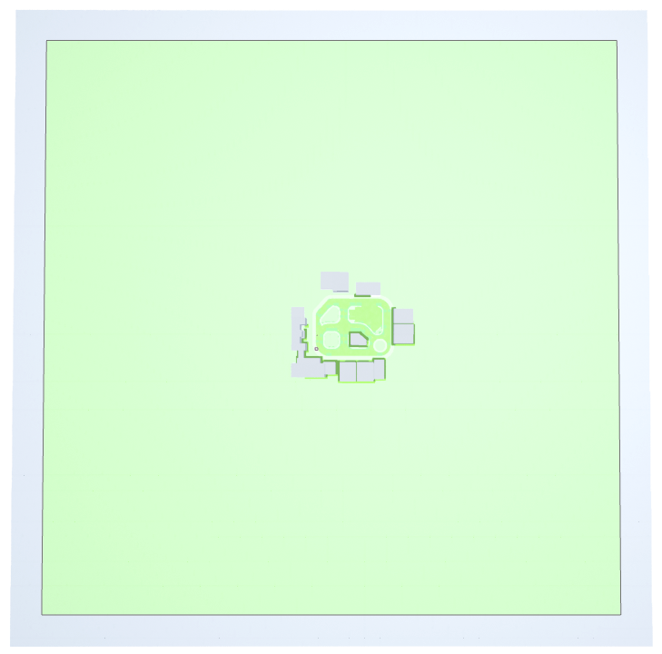

.. _Cityscape_Lite:

**************
Cityscape Lite
**************

Cityscape Lite is a simplified environment for developing and deploying large
scale applications of self-driving.

|

Cityscape Lite World Size
==========================

The world is 500m x 500m (250m in each direction from the origin) with
the ground located at 0m elevation.

Cityscape Lite Navigation Area
================================

The navigation area is the area in which actors supporting path-finding travel can traverse.
In other words an actor can freely walk around in this area unobstructed by
barriers that are part of the Open World.

The outer boundary of the navigation area is 450m x 450m (225m in each
direction from the origin). The entire area is traversable other than
the locations of the buildings.

|

.. note::
    The navigation area only applies to traversable actors such as people,
    animals, etc.

Coordinates of Interest
==========================

The following table will provide you with some coordinates of interest in cityscape lite.

.. note::
    The z coordinate should be modified depending on the location of the actor origin.

.. table::
    :widths: 10, 10, 10, 10, 6, 6, 10, 6, 6, 10
    :align: center

    ================== ======= ======= ======= ======= ======= =========== ========== =========== =========
    Location/ Rotation X       Y       Z       Roll    Pitch   Yaw         Roll (deg) Pitch (deg) Yaw (deg)
    ================== ======= ======= ======= ======= ======= =========== ========== =========== =========
    Open World Origin  0       0       0       0       0       0           0          0           0
    Car Spawn Spot     0       -1.300  0.005   0       0       pi/2        0          0           90
    Road Parking 1     -13.093 -7.572  0.005   0       0       -42*pi/ 180 0          0           -42
    Road Parking 2     -18.078 -2.879  0.005   0       0       -42*pi/ 180 0          0           -42
    Parking Spot 1     -5.987  14.643  0.005   0       0       pi/2        0          0           90
    Parking Spot 2     -8.700  14.643  0.005   0       0       pi/2        0          0           90
    Parking Spot 3     -11.048 14.643  0.005   0       0       pi/2        0          0           90
    Parking Spot 4     3.978   33.322  0.005   0       0       133*pi/ 180 0          0           133
    Parking Spot 5     2.007   31.476  0.005   0       0       133*pi/ 180 0          0           133
    Parking Spot 6     0.04    29.733  0.005   0       0       133*pi/ 180 0          0           133
    ================== ======= ======= ======= ======= ======= =========== ========== =========== =========

Command Line Switch
===================

This workspace can be loaded directly by running QLabs from the command line or terminal by using the arguments ``-loadmodule CityscapeLite``.    