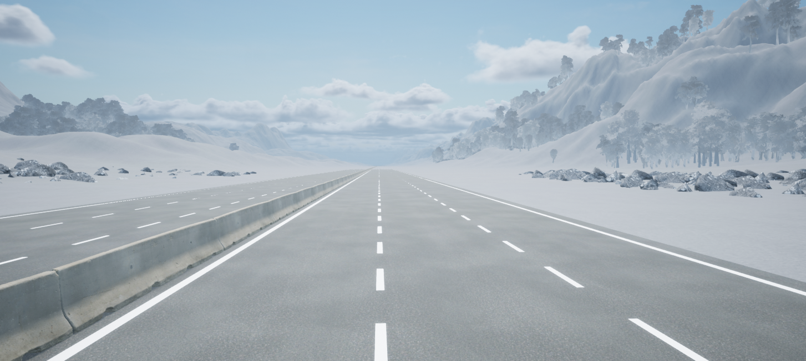
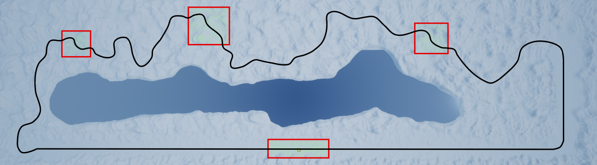

.. _Open_Road:

*********
Open Road
*********

Open Road is massive region with over 50km (31 miles) of multi-lane road with large
straight flat sections and curved sections over varying terrain.

|

Open Road World Size
====================

The world is approximately 10km x 5km complete with time-of-day and weather systems. 
The origin is located in the middle of the straight section of the road at the South end of
the map. Camera shortcuts on the tool bar will move the default camera to each of the four 
sections of the road that contain navigation areas, but the entire loop of road navigable. 
With a map this large, there are numerical considerations to make. At the far corners of the map, 
actors may not spawn precisely where intended. For experiments requiring higher precision, 
it is best to stay within a couple kilometers of the origin.

Open Road Navigation Area
==========================

The navigation area is the area in which actors supporting path-finding travel can traverse.
In other words an actor can freely walk around in this area unobstructed by
barriers that are part of the Open World.

The navigation areas are limited to 4 regions of the map as shown below. The camera shortcuts
are all within these regions. Buildings, trees, rocks, and other obstacles create breaks 
in the navigation area.

|

.. note::
    The navigation area only applies to traversable actors such as people,
    animals, etc.

Common Location Coordinates
==============================

The following table will provide you with some coordinates of interest in the cityscape.

.. note::
    The z coordinate should be modified depending on the location of the actor origin.

.. table::
    :widths: 10, 10, 10, 10, 6, 6, 10, 6, 6, 10
    :align: center

    ===================== ======= ======= ======= ======= ======= =========== ========== =========== =========
    Location/ Rotation    X       Y       Z       Roll    Pitch   Yaw         Roll (deg) Pitch (deg) Yaw (deg)
    ===================== ======= ======= ======= ======= ======= =========== ========== =========== =========
    Open World Origin     0       0       0       0       0       0           0          0           0
    Nav Origin South      0.788   2.415   194.1   0       0       0           0          0           0
    Nav Origin North-West 7481.05 -3569.5 172.9   0       0       0           0          0           0
    Nav Origin North      3005.7  -4165.4 172.9   0       0       0           0          0           0
    Nav Origin North-East -4454.1 -3761.0 172.9   0       0       0           0          0           0
    ===================== ======= ======= ======= ======= ======= =========== ========== =========== =========