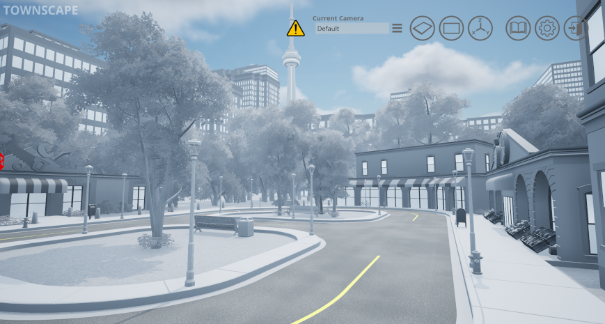
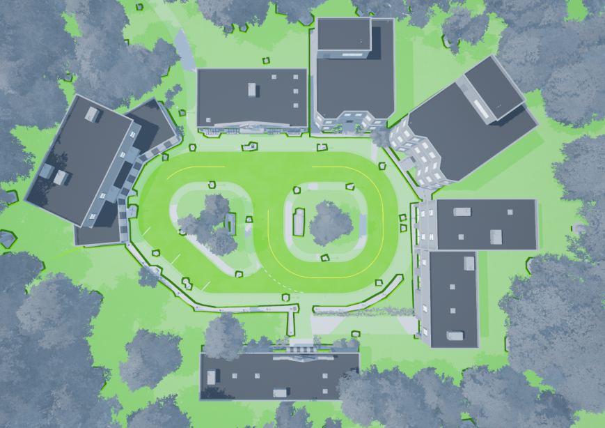

.. _Townscape:

*********
Townscape
*********

Townscape is a rich and dynamic city environment for developing and
deploying applications of self-driving on a smaller scale or as
an alternate environment to the cityscape.

|

Townscape World Size
====================

The world is approximately 500m x 500m (250m in each direction from the
origin) with the ground located at 0m elevation.

Townscape Navigation Area
==========================

The navigation area is the area in which actors supporting path-finding travel can traverse.
In other words an actor can freely walk around in this area unobstructed by
barriers that are part of the Open World.

The outer boundary of the navigation area is 400m x 400m (200m in each
direction from the origin). Buildings, trees, fences, and other obstacles
create breaks in the navigation area.

|

.. note::
    The navigation area only applies to traversable actors such as people,
    animals, etc.

Common Location Coordinates
==============================

The following table will provide you with some coordinates of interest in the townscape.

.. note::
    The z coordinate should be modified depending on the location of the actor origin.

.. table::
    :widths: 10, 10, 10, 10, 6, 6, 10, 6, 6, 10
    :align: center

    ================== ======= ======= ======= ======= ======= =========== ========== =========== =========
    Location/ Rotation X       Y       Z       Roll    Pitch   Yaw         Roll (deg) Pitch (deg) Yaw (deg)
    ================== ======= ======= ======= ======= ======= =========== ========== =========== =========
    Open World Origin  0       0       0       0       0       0           0          0           0
    Car Spawn Spot     0       -1.300  0.005   0       0       pi/2        0          0           90
    Road Parking 1     -13.093 -7.572  0.005   0       0       -42*pi/ 180 0          0           -42
    Road Parking 2     -18.078 -2.879  0.005   0       0       -42*pi/ 180 0          0           -42
    ================== ======= ======= ======= ======= ======= =========== ========== =========== =========

Command Line Switch
===================

This workspace can be loaded directly by running QLabs from the command line or terminal by using the arguments ``-loadmodule Townscape``.    