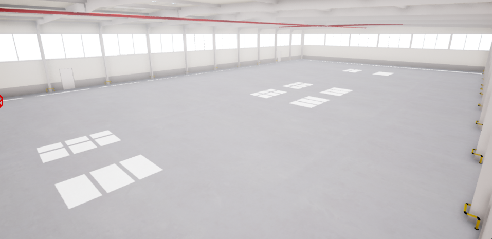
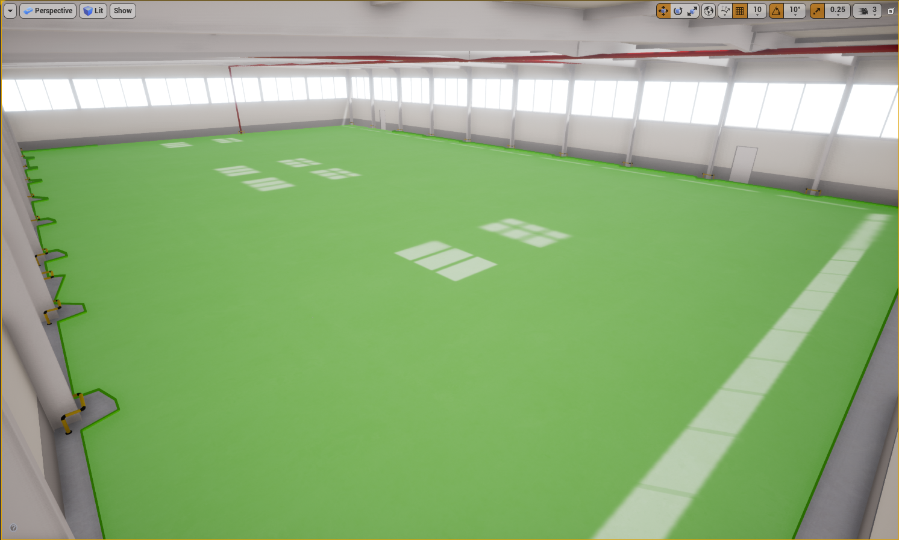

.. _Warehouse:

*********
Warehouse
*********

The Warehouse is designed to mimic a warehouse space. This includes
variations in lighting. Spawnable products can be spawned at a scale of 1 to 1 to 
match the physical devices.  The QCar can be spawned at 1 to 1 or 1/10th scale.

Warehouse World Size
====================

The warehouse is 50m x 30m (+/-25m along x, +/-15m along y) with
the ground located at 0m and the ceiling at 5.5m elevation.

Warehouse Navigation Area
==========================
The navigation area is the area in which an actor can traverse.
In other words an actor can freely walk around in this area unobstructed by
barriers that are part of the Open World.  In the warehouse workspace the
navigation areas covers the full floor of the warehouse.

.. note::
    The navigation area only applies to traversable actors such as people,
    animals, etc.

Warehouse Coordinates of Interest
==================================

The following table will provide you with any coordinates of interest in the studio workspace.

.. note::
    The z coordinate should be modified depending on the location of the actor origin.

.. table::
    :widths: 25, 11, 11, 11
    :align: center

    ================== ======= ======= =======
    Location           X       Y       Z
    ================== ======= ======= =======
    Center of the room 0       0       0
    ================== ======= ======= =======