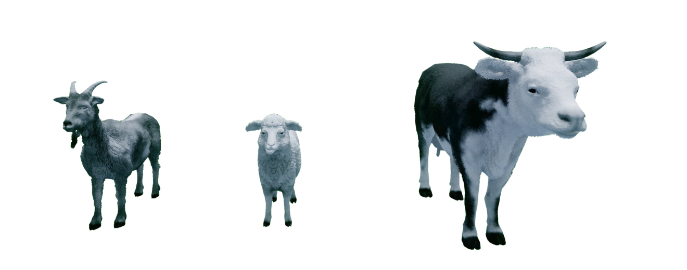

.. _Animal_Library:

Animals
-------

.. _animalDescription:

Description
^^^^^^^^^^^

Animals are considered "actors" in the Open World Workspaces.
The animal library controls the animals placed in Quanser Interactive Labs.

Animal actors can be spawned anywhere in the open worlds, but to use the
move_to methods to allow the people to self-navigate around the environment,
they must originate and travel to a connected valid nav area.

For the best visual animation, it is recommended that you use the speed
constants defining different gait styles. A character will accurately travel
at any specified speed up to 6m/s, but the visual animation may give the
impression of "slipping" at certain speeds outside the recommended values.

.. See the tutorial to get a better understanding of using cameras in the
.. Quanser Interactive Labs.

.. _animalLibrary:

Library
^^^^^^^

.. autoclass:: qvl.animal.QLabsAnimal

.. _animalConstants:

Constants
^^^^^^^^^

.. autoattribute:: qvl.animal.QLabsAnimal.ID_ANIMAL
.. autoattribute:: qvl.animal.QLabsAnimal.GOAT
.. autoattribute:: qvl.animal.QLabsAnimal.SHEEP
.. autoattribute:: qvl.animal.QLabsAnimal.COW
.. autoattribute:: qvl.animal.QLabsAnimal.GOAT_STANDING
.. autoattribute:: qvl.animal.QLabsAnimal.GOAT_WALK
.. autoattribute:: qvl.animal.QLabsAnimal.GOAT_RUN
.. autoattribute:: qvl.animal.QLabsAnimal.SHEEP_STANDING
.. autoattribute:: qvl.animal.QLabsAnimal.SHEEP_WALK
.. autoattribute:: qvl.animal.QLabsAnimal.SHEEP_RUN
.. autoattribute:: qvl.animal.QLabsAnimal.COW_STANDING
.. autoattribute:: qvl.animal.QLabsAnimal.COW_WALK
.. autoattribute:: qvl.animal.QLabsAnimal.COW_RUN

.. _animalMemberVars:

Member Variables
^^^^^^^^^^^^^^^^

.. autoattribute:: qvl.animal.QLabsAnimal.actorNumber

.. _animalMethods:

Methods
^^^^^^^

.. automethod:: qvl.animal.QLabsAnimal.__init__
.. automethod:: qvl.animal.QLabsAnimal.spawn
.. tip::
    The origin of the animal is in the center of the body so by default, it
    will be spawned 1m above the surface of the target.
    An additional vertical offset may be required if the surface is sloped to
    prevent the actor from falling through the world ground surface.
.. tip::
    If you would like to use the `move_to` method, the actor must be spawned in
    a valid nav area.

.. automethod:: qvl.animal.QLabsAnimal.spawn_degrees
.. tip::
    The origin of the animal is in the center of the body so by default, it
    will be spawned 1m above the surface of the target.
    An additional vertical offset may be required if the surface is sloped to
    prevent the actor from falling through the world ground surface.
.. tip::
    If you would like to use the `move_to` method, the actor must be spawned in
    a valid nav area.

.. automethod:: qvl.animal.QLabsAnimal.spawn_id
.. tip::
    The origin of the animal is in the center of the body so by default, it
    will be spawned 1m above the surface of the target.
    An additional vertical offset may be required if the surface is sloped to
    prevent the actor from falling through the world ground surface.
.. tip::
    If you would like to use the `move_to` method, the actor must be spawned in
    a valid nav area.

.. automethod:: qvl.animal.QLabsAnimal.spawn_id_degrees
.. tip::
    The origin of the animal is in the center of the body so by default, it
    will be spawned 1m above the surface of the target.
    An additional vertical offset may be required if the surface is sloped to
    prevent the actor from falling through the world ground surface.
.. tip::
    If you would like to use the `move_to` method, the actor must be spawned
    in a valid nav area.

.. automethod:: qvl.animal.QLabsAnimal.move_to
.. automethod:: qvl.animal.QLabsAnimal.destroy
.. automethod:: qvl.animal.QLabsAnimal.destroy_all_actors_of_class
.. automethod:: qvl.animal.QLabsAnimal.ping
.. automethod:: qvl.animal.QLabsAnimal.get_world_transform
.. automethod:: qvl.animal.QLabsAnimal.get_world_transform_degrees

.. _animalConfig:

Configurations
^^^^^^^^^^^^^^

There are 3 configurations (0-2) for a animal generated in QLabs.

.. _animalConnect:

Connection Points
^^^^^^^^^^^^^^^^^

There are no connection points for the animal actor.

-------------------------------------------------------------------------------

.. _animalTutorial:

Animals Tutorial
^^^^^^^^^^^^^^^^^^

.. tabs::
    .. tab:: Python

        .. dropdown:: Python Tutorial

            Raw to download this tutorial: |animal_tutorial.py|.

            .. |animal_tutorial.py| replace::
                :download:`Animals Tutorial (.py) <../../../tutorials/animals_tutorial.py>`

            .. literalinclude:: ../../../tutorials/animals_tutorial.py
                :language: python
                :linenos:

    .. tab:: Matlab

        .. dropdown:: Matlab Tutorial

            Raw to download this tutorial: |animals_tutorial.m|.

            .. |animals_tutorial.m| replace::
                :download:`Animals Tutorial (.m) <../../../tutorials/animals_tutorial.m>`

            .. literalinclude:: ../../../tutorials/animals_tutorial.m
                :language: Matlab
                :linenos:
