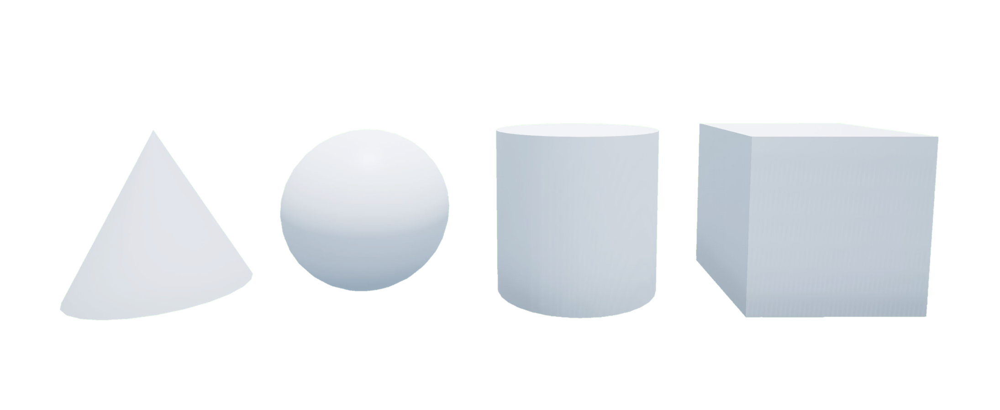

.. _Basic_Shapes:

Basic Shapes
------------

.. _basicshapeDescription:

Description
^^^^^^^^^^^

Basic shapes are building blocks to modify and customize your environment.
All shapes are spawned by default as static objects complete with collision
boundaries which can be useful to create walls and other obstacles.
Dynamics can be enabled and disabled to facilitate dynamic events that are
triggered by actor locations such as the sudden appearance of an obstacle
crossing the path.
The physics properties can also be modified to tune the physics response
depending 9on the number of interacting actors and what they are colliding with
.

Basic shapes include full support for parenting to build long kinematic chains
or simply to group multiple shapes together so they can be moved by
manipulating a single parent actor.

If you are using a large number of dynamic shapes, consider using
:ref:`Widgets` instead.
They have both limitations and additional features, but are more efficient when
spawning large numbers of dynamic actors.

See the :ref:`basicShapeTutorial` to get a better understanding of using people
in Quanser Interactive Labs.

.. _basicshapelibrary:

Library
^^^^^^^

.. autoclass:: qvl.basic_shape.QLabsBasicShape

.. _basicshapeConstants:

Constants
^^^^^^^^^

.. autoattribute:: qvl.basic_shape.QLabsBasicShape.ID_BASIC_SHAPE
.. autoattribute:: qvl.basic_shape.QLabsBasicShape.SHAPE_CUBE
.. autoattribute:: qvl.basic_shape.QLabsBasicShape.SHAPE_CYLINDER
.. autoattribute:: qvl.basic_shape.QLabsBasicShape.SHAPE_SPHERE
.. autoattribute:: qvl.basic_shape.QLabsBasicShape.SHAPE_CONE

.. autoattribute:: qvl.basic_shape.QLabsBasicShape.COMBINE_AVERAGE
.. autoattribute:: qvl.basic_shape.QLabsBasicShape.COMBINE_MIN
.. autoattribute:: qvl.basic_shape.QLabsBasicShape.COMBINE_MULTIPLY
.. autoattribute:: qvl.basic_shape.QLabsBasicShape.COMBINE_MAX

.. _basicshapeMemberVars:

Member Variables
^^^^^^^^^^^^^^^^

.. autoattribute:: qvl.basic_shape.QLabsBasicShape.actorNumber

.. _basicshapeMethods:

Methods
^^^^^^^

.. automethod:: qvl.basic_shape.QLabsBasicShape.__init__
.. automethod:: qvl.basic_shape.QLabsBasicShape.spawn
.. automethod:: qvl.basic_shape.QLabsBasicShape.spawn_degrees
.. automethod:: qvl.basic_shape.QLabsBasicShape.spawn_id
.. automethod:: qvl.basic_shape.QLabsBasicShape.spawn_id_degrees
.. automethod:: qvl.basic_shape.QLabsBasicShape.spawn_id_and_parent_with_relative_transform
.. automethod:: qvl.basic_shape.QLabsBasicShape.spawn_id_and_parent_with_relative_transform_degrees
.. automethod:: qvl.basic_shape.QLabsBasicShape.set_material_properties
.. automethod:: qvl.basic_shape.QLabsBasicShape.get_material_properties
.. automethod:: qvl.basic_shape.QLabsBasicShape.set_enable_dynamics
.. automethod:: qvl.basic_shape.QLabsBasicShape.set_enable_collisions
.. automethod:: qvl.basic_shape.QLabsBasicShape.set_physics_properties
.. automethod:: qvl.basic_shape.QLabsBasicShape.set_transform
.. automethod:: qvl.basic_shape.QLabsBasicShape.set_transform_degrees
.. automethod:: qvl.basic_shape.QLabsBasicShape.spawn_id_box_walls_from_end_points
.. automethod:: qvl.basic_shape.QLabsBasicShape.spawn_id_box_walls_from_center
.. automethod:: qvl.basic_shape.QLabsBasicShape.spawn_id_box_walls_from_center_degrees
.. automethod:: qvl.basic_shape.QLabsBasicShape.destroy
.. automethod:: qvl.basic_shape.QLabsBasicShape.destroy_all_actors_of_class
.. automethod:: qvl.basic_shape.QLabsBasicShape.get_world_transform
.. automethod:: qvl.basic_shape.QLabsBasicShape.get_world_transform_degrees
.. automethod:: qvl.basic_shape.QLabsBasicShape.ping
.. automethod:: qvl.basic_shape.QLabsBasicShape.parent_with_relative_transform
.. automethod:: qvl.basic_shape.QLabsBasicShape.parent_with_relative_transform_degrees
.. automethod:: qvl.basic_shape.QLabsBasicShape.parent_with_current_world_transform
.. automethod:: qvl.basic_shape.QLabsBasicShape.parent_break
.. automethod:: qvl.basic_shape.QLabsBasicShape.set_custom_properties
.. automethod:: qvl.basic_shape.QLabsBasicShape.get_custom_properties

.. _basicshapeConfig:

Configurations
^^^^^^^^^^^^^^
There are 3 configurations (0-3) for the basic shape actor class.
0 - Sphere, 1 - Cylinder, 2 - Square, 3 - Cone

.. _basicshapeConnect:

Connection Points
^^^^^^^^^^^^^^^^^

There are no connection points for this actor class.

.. _basicshapeTutorial:

Basic Shapes Tutorial
^^^^^^^^^^^^^^^^^^^^^

.. dropdown:: Example

    Raw to download this tutorial: |basic_shapes_tutorial.py|.

    .. |basic_shapes_tutorial.py| replace::
        :download:`Basic Shapes Tutorial <../../../tutorials/basic_shapes_tutorial.py>`

    .. literalinclude:: ../../../tutorials/basic_shapes_tutorial.py
        :language: python
        :linenos:

