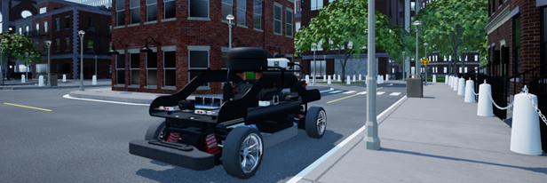
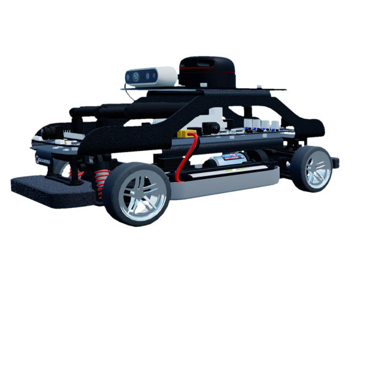
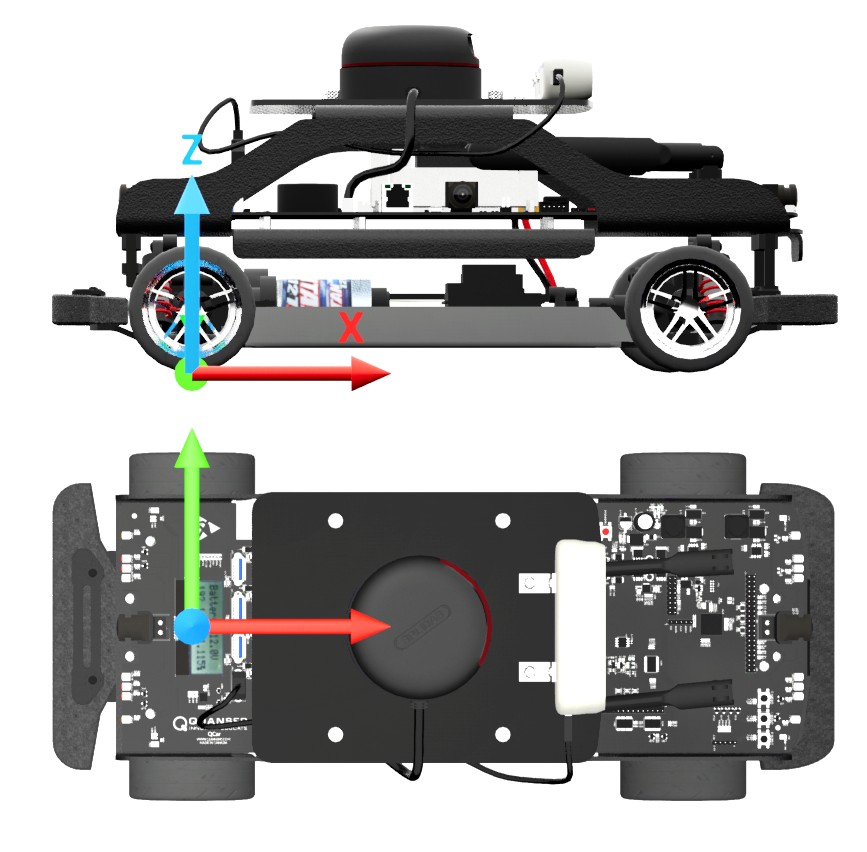
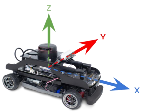
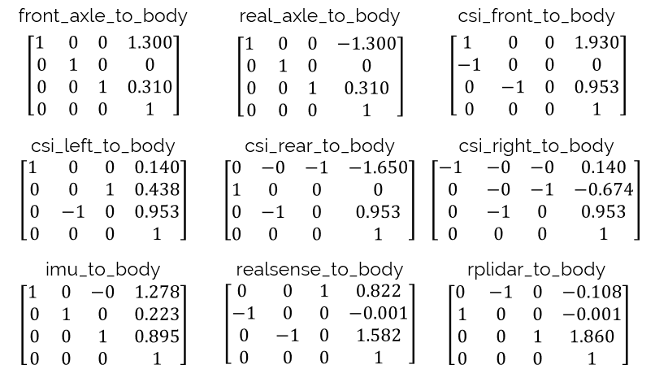

.. _car_library:

QCars
-----

.. _carDescription: 

Description
^^^^^^^^^^^

QCars are considered "actors" in the Virtual Self-Driving Car Studio.
The QCar library can be used to acquire sensor data from the virtual environment and controls the motion of the vehicles.

See the QCar :ref:`carTutorial` to get a better understanding of using QCars in Quanser Interactive Labs.

.. _carLibrary:

Library
^^^^^^^

.. autoclass:: library_qlabs_qcar.QLabsQCar

.. _carConstants:

Constants
^^^^^^^^^

.. autoattribute:: library_qlabs_qcar.QLabsQCar.ID_QCAR
.. autoattribute:: library_qlabs_qcar.QLabsQCar.CAMERA_CSI_RIGHT
.. autoattribute:: library_qlabs_qcar.QLabsQCar.CAMERA_CSI_BACK
.. autoattribute:: library_qlabs_qcar.QLabsQCar.CAMERA_CSI_LEFT
.. autoattribute:: library_qlabs_qcar.QLabsQCar.CAMERA_CSI_FRONT
.. autoattribute:: library_qlabs_qcar.QLabsQCar.CAMERA_RGB
.. autoattribute:: library_qlabs_qcar.QLabsQCar.CAMERA_DEPTH
.. autoattribute:: library_qlabs_qcar.QLabsQCar.CAMERA_OVERHEAD
.. autoattribute:: library_qlabs_qcar.QLabsQCar.CAMERA_TRAILING

.. _carMemberVars:

Member Variables
^^^^^^^^^^^^^^^^

.. autoattribute:: library_qlabs_qcar.QLabsQCar.actorNumber

.. _carMethods:

Methods
^^^^^^^

.. automethod:: library_qlabs_qcar.QLabsQCar.__init__
.. automethod:: library_qlabs_qcar.QLabsQCar.spawn
.. automethod:: library_qlabs_qcar.QLabsQCar.spawn_degrees
.. automethod:: library_qlabs_qcar.QLabsQCar.spawn_id
.. automethod:: library_qlabs_qcar.QLabsQCar.spawn_id_degrees
.. automethod:: library_qlabs_qcar.QLabsQCar.set_transform_and_request_state
.. automethod:: library_qlabs_qcar.QLabsQCar.set_transform_and_request_state_degrees
.. automethod:: library_qlabs_qcar.QLabsQCar.set_velocity_and_request_state
.. automethod:: library_qlabs_qcar.QLabsQCar.set_velocity_and_request_state_degrees
.. automethod:: library_qlabs_qcar.QLabsQCar.possess
.. automethod:: library_qlabs_qcar.QLabsQCar.ghost_mode
.. automethod:: library_qlabs_qcar.QLabsQCar.get_image
.. automethod:: library_qlabs_qcar.QLabsQCar.get_lidar
.. automethod:: library_qlabs_qcar.QLabsQCar.destroy
.. automethod:: library_qlabs_qcar.QLabsQCar.destroy_all_actors_of_class
.. automethod:: library_qlabs_qcar.QLabsQCar.ping
.. automethod:: library_qlabs_qcar.QLabsQCar.get_world_transform
.. automethod:: library_qlabs_qcar.QLabsQCar.get_world_transform_degrees

.. _carConfig:

Configurations
^^^^^^^^^^^^^^

There is only one configuration of the QCar actor. 

.. _carConnect:

Connection Points
^^^^^^^^^^^^^^^^^

.. table::
    :widths: 11, 11, 25, 53
    :align: center

    ====================== ============ ====================================================== ===========
    Reference Frame Number Parent Frame Relative Transform to Parent (Location, Rotation, Deg) Description
    ====================== ============ ====================================================== ===========
    0                                                                                          The base frame is located at ground level, centered between the two rear wheels. This represents the location of the car with no filtering, suspension, or dynamics. Collision detection is connected to this reference frame. 
    1                      0            [0,0,0] [0,0,0]                                        The filtered frame is co-located with connection point 0, but it is a filtered position to simulated the suspension and dynamic effects. All the visual elements and sensors of the QCar are connected to this frame.
    ====================== ============ ====================================================== ===========

Component Extrinsics
^^^^^^^^^^^^^^^^^^^^
"Extrinsics" refer to the external relationship of an object with respect to a specific frame of 
reference (in this case the body center of the QCar). Sometimes it's important to know specific 
distances and orientation of extrinsic components, for instance, this can be use for obstacle 
detection and camera calibration. You will find a list of the important extrinsics below.

Distances From Body Center
""""""""""""""""""""""""""
All distance in QCar's virtual enviroment are 10 times larger then in real life. 
Therefore the distances to important components have been scaled appropriately below:

.. table::
    :widths: 11, 11, 11, 11
    :align: center

    ========== ====== ====== ======
    Component  x (m)  y (m)  z (m)
    ========== ====== ====== ======
    Front axle 1.300  0      0.310                                                                          
    Rear axle  -1.300 0      0.310
    CSI front  -1.930 0      0.953
    CSI left   0.140  0.438  0.953
    CSI rear   -1.650 0      0.953
    CSI right  0.140  -0.674 0.953
    IMU        1.278  0.223  0.895
    RealSense  0.822  0.003  1.582
    RPLIDAR    -0.108 -0.001 1.860                                      
    ========== ====== ====== ======

Transformation Matrices
"""""""""""""""""""""""

All transformation matrices are built off of the body frame and camera frames for the QCar.
To read more about this check out our documentation 
`here <https://www.quanser.com/products/self-driving-car-studio/>`__
by clicking on resources button and looking inside the zip folder for 
User Guides/System Hardware.pdf

.. _carTutorial:

Tutorial
^^^^^^^^

.. dropdown:: Example

    Coming Soon

.. **See Also:**
