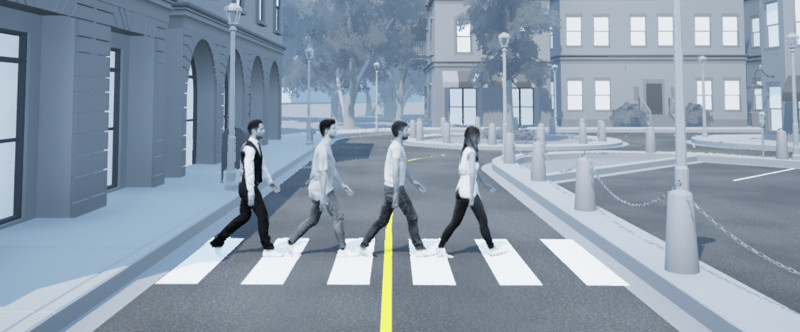
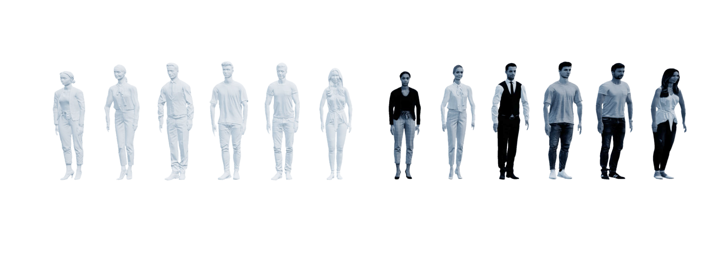

.. _Person_Library:

*********
People
*********

.. _personDescription:

Description
=============

People are considered "actors" in QLabs Open Worlds.
The person library controls the people placed in Workspaces in Quanser
Interactive Labs.

People actors can be spawned anywhere in the Open Worlds, but to use the
move_to methods to allow the people to self-navigate around the environment,
they must originate and travel to a connected valid nav area.

For the best visual animation, it is recommended that you use the speed
constants defining different gait styles. A character will accurately travel
at any specified speed up to 6m/s, but the visual animation may give the
impression of "slipping" at certain speeds outside the recommended values.

See the :ref:`personTutorial` to get a better understanding of using people in
Quanser Interactive Labs.

.. _personLibrary:

Library
=======

.. autoclass:: qvl.person.QLabsPerson

.. _personConstants:

Constants
==========

.. autoattribute:: qvl.person.QLabsPerson.ID_PERSON
.. autoattribute:: qvl.person.QLabsPerson.STANDING
.. autoattribute:: qvl.person.QLabsPerson.WALK
.. autoattribute:: qvl.person.QLabsPerson.JOG
.. autoattribute:: qvl.person.QLabsPerson.RUN

.. _personMemberVars:

Member Variables
=================

.. autoattribute:: qvl.person.QLabsPerson.actorNumber

.. _personMethods:

Methods
========

.. automethod:: qvl.person.QLabsPerson.__init__
.. automethod:: qvl.person.QLabsPerson.spawn
.. tip::
    The origin of the person is in the center of the body so by default,
    it will be spawned 1m above the surface of the target.
    An additional vertical offset may be required if the surface is sloped to
    prevent the actor from falling through the world ground surface.
.. tip::
    If you would like to use the `move_to` method, the actor must be spawned in
    a valid nav area.

.. automethod:: qvl.person.QLabsPerson.spawn_degrees
.. tip::
    The origin of the person is in the center of the body so by default, it
    will be spawned 1m above the surface of the target.
    An additional vertical offset may be required if the surface is sloped to
    prevent the actor from falling through the world ground surface.
.. tip::
    If you would like to use the `move_to` method, the actor must be spawned in
    a valid nav area.

.. automethod:: qvl.person.QLabsPerson.spawn_id
.. tip::
    The origin of the person is in the center of the body so by default, it
    will be spawned 1m above the surface of the target.
    An additional vertical offset may be required if the surface is sloped to
    prevent the actor from falling through the world ground surface.
.. tip::
    If you would like to use the `move_to` method, the actor must be spawned in
    a valid nav area.

.. automethod:: qvl.person.QLabsPerson.spawn_id_degrees
.. tip::
    The origin of the person is in the center of the body so by default, it
    will be spawned 1m above the surface of the target.
    An additional vertical offset may be required if the surface is sloped to
    prevent the actor from falling through the world ground surface.
.. tip::
    If you would like to use the `move_to` method, the actor must be spawned in
    a valid nav area.

.. automethod:: qvl.person.QLabsPerson.move_to
.. automethod:: qvl.person.QLabsPerson.destroy
.. automethod:: qvl.person.QLabsPerson.destroy_all_actors_of_class
.. automethod:: qvl.person.QLabsPerson.ping
.. automethod:: qvl.person.QLabsPerson.get_world_transform
.. automethod:: qvl.person.QLabsPerson.get_world_transform_degrees

.. _personConfig:

Configurations
===============

There are 12 configurations (0-11) for a person generated in QLabs.

.. _personConnect:

Connection Points
==================

There are no connections points for the person actor.

-------------------------------------------------------------------------------

.. _personTutorial:

People Tutorial
================

.. tabs::
    .. tab:: Python

        .. dropdown:: Python Tutorial

            Raw to download this tutorial: |people_tutorial.py|.

            .. |people_tutorial.py| replace::
                :download:`People Tutorial (.py) <../../../tutorials/people_tutorial.py>`

            .. literalinclude:: ../../../tutorials/people_tutorial.py
                :language: python
                :linenos:

    .. tab:: Matlab

        .. dropdown:: Matlab Tutorial

            Raw to download this tutorial: |people_tutorial.m|.

            .. |people_tutorial.m| replace::
                :download:`People Tutorial (.m) <../../../tutorials/people_tutorial.m>`

            .. literalinclude:: ../../../tutorials/people_tutorial.m
                :language: Matlab
                :linenos:
.. **See Also:**
