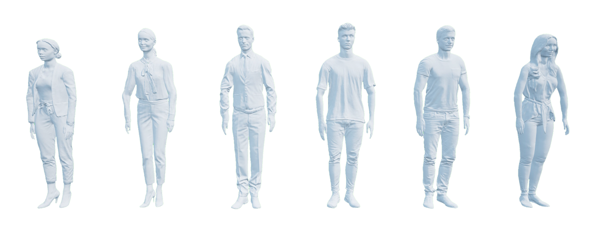

.. _Person_Library:

People
------

.. _personDescription: 

Description
^^^^^^^^^^^

People are considered "actors" in the Virtual Self-Driving Car Studio.  
The person library controls the people placed in the Virtual Self-Driving 
Car Studio workspaces of the Quanser Interactive Labs. 

People actors can be spawned anywhere in the Open Worlds, but to use the
move_to methods to allow the people to self-navigate around the environment,
they must originate and travel to a connected valid nav area.

For the best visual animation, it is recommended that you use the speed
constants defining different gait styles. A character will accurately travel 
at any specified speed up to 6m/s, but the visual animation may give the
impression of "slipping" at certain speeds outside the recommended values.

See the :ref:`personTutorial` to get a better understanding of using people in Quanser 
Interactive Labs.

.. _personLibrary:

Library
^^^^^^^

.. autoclass:: library_qlabs_person.QLabsPerson

.. _personConstants:

Constants
^^^^^^^^^

.. autoattribute:: library_qlabs_person.QLabsPerson.ID_PERSON
.. autoattribute:: library_qlabs_person.QLabsPerson.STANDING
.. autoattribute:: library_qlabs_person.QLabsPerson.WALK
.. autoattribute:: library_qlabs_person.QLabsPerson.JOG
.. autoattribute:: library_qlabs_person.QLabsPerson.RUN

.. _personMemberVars:

Member Variables
^^^^^^^^^^^^^^^^

.. autoattribute:: library_qlabs_person.QLabsPerson.actorNumber

.. _personMethods:

Methods
^^^^^^^

.. automethod:: library_qlabs_person.QLabsPerson.__init__
.. automethod:: library_qlabs_person.QLabsPerson.spawn
.. tip::
    The origin of the person is in the center of the body so by default, it will be spawned 1m 
    above the surface of the target. An additional vertical offset may be required if the surface 
    is sloped to prevent the actor from falling through the world ground surface.
.. tip::
    If you would like to use the `move_to` method, the actor must be spawned in a valid nav area.

.. automethod:: library_qlabs_person.QLabsPerson.spawn_degrees
.. tip::
    The origin of the person is in the center of the body so by default, it will be spawned 1m 
    above the surface of the target. An additional vertical offset may be required if the surface 
    is sloped to prevent the actor from falling through the world ground surface.
.. tip::
    If you would like to use the `move_to` method, the actor must be spawned in a valid nav area.

.. automethod:: library_qlabs_person.QLabsPerson.spawn_id
.. tip::
    The origin of the person is in the center of the body so by default, it will be spawned 1m 
    above the surface of the target. An additional vertical offset may be required if the surface 
    is sloped to prevent the actor from falling through the world ground surface.
.. tip::
    If you would like to use the `move_to` method, the actor must be spawned in a valid nav area.

.. automethod:: library_qlabs_person.QLabsPerson.spawn_id_degrees
.. tip::
    The origin of the person is in the center of the body so by default, it will be spawned 1m 
    above the surface of the target. An additional vertical offset may be required if the surface 
    is sloped to prevent the actor from falling through the world ground surface.
.. tip::
    If you would like to use the `move_to` method, the actor must be spawned in a valid nav area.

.. automethod:: library_qlabs_person.QLabsPerson.move_to
.. automethod:: library_qlabs_person.QLabsPerson.destroy
.. automethod:: library_qlabs_person.QLabsPerson.destroy_all_actors_of_class
.. automethod:: library_qlabs_person.QLabsPerson.ping
.. automethod:: library_qlabs_person.QLabsPerson.get_world_transform
.. automethod:: library_qlabs_person.QLabsPerson.get_world_transform_degrees

.. _personConfig:

Configurations
^^^^^^^^^^^^^^

There are 12 configurations (0-11) for a person generated in QLabs.

.. _personConnect:

Connection Points
^^^^^^^^^^^^^^^^^

.. _personTutorial:

People Tutorial
^^^^^^^^^^^^^^^

.. dropdown:: Example

    .. literalinclude:: ../../../tutorials/person_tutorial.py
        :language: python
        :linenos:

.. **See Also:**
