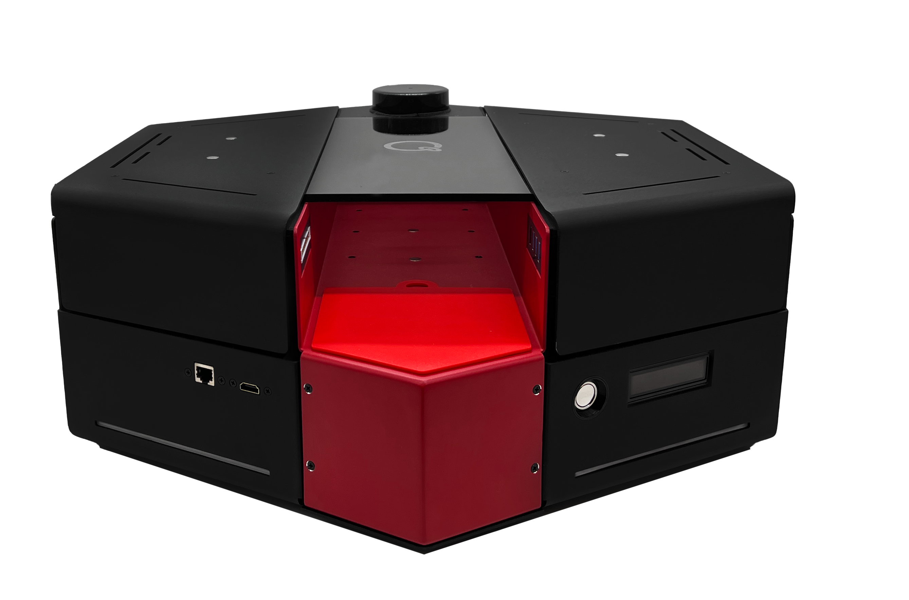
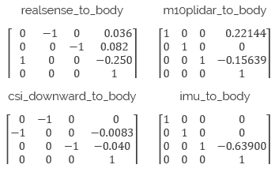

.. _QBotPlatform_Library:

QBot Platform
-------------

.. .. image:: ../pictures/qbotplatform_crop_banner.png
    :scale: 120%
    :align: center

.. _qbotPlatformDescription:

Description
^^^^^^^^^^^

QBot Platforms are considered "actors" in Quanser Interactive Labs. 
The QBot Platform library can be used to acquire sensor data from the 
virtual environment and control the motion of the robot(s).

See the QBot Platform :ref:`qbotPlatformTutorial` to get a better understanding 
of using QBot Platform in Quanser Interactive Labs.

.. _qbotPlatformLibrary:

Library
^^^^^^^

.. autoclass:: qvl.qbot_platform.QLabsQBotPlatform

.. _qbotPlatformConstants:

Constants
^^^^^^^^^

.. autoattribute:: qvl.qbot_platform.QLabsQBotPlatform.ID_QBOT_PLATFORM
.. autoattribute:: qvl.qbot_platform.QLabsQBotPlatform.VIEWPOINT_RGB
.. autoattribute:: qvl.qbot_platform.QLabsQBotPlatform.VIEWPOINT_DEPTH
.. autoattribute:: qvl.qbot_platform.QLabsQBotPlatform.VIEWPOINT_DOWNWARD
.. autoattribute:: qvl.qbot_platform.QLabsQBotPlatform.VIEWPOINT_TRAILING
.. autoattribute:: qvl.qbot_platform.QLabsQBotPlatform.CAMERA_RGB
.. autoattribute:: qvl.qbot_platform.QLabsQBotPlatform.CAMERA_DEPTH
.. autoattribute:: qvl.qbot_platform.QLabsQBotPlatform.CAMERA_DOWNWARD

.. _qbotPlatformMemberVars:

Member Variables
^^^^^^^^^^^^^^^^

.. autoattribute:: qvl.qbot_platform.QLabsQBotPlatform.actorNumber

.. _qbotPlatformMethods:

Methods
^^^^^^^

.. automethod:: qvl.qbot_platform.QLabsQBotPlatform.__init__
.. automethod:: qvl.qbot_platform.QLabsQBotPlatform.spawn
.. automethod:: qvl.qbot_platform.QLabsQBotPlatform.spawn_degrees
.. automethod:: qvl.qbot_platform.QLabsQBotPlatform.spawn_id
.. automethod:: qvl.qbot_platform.QLabsQBotPlatform.spawn_id_degrees
.. automethod:: qvl.qbot_platform.QLabsQBotPlatform.command_and_request_state
.. automethod:: qvl.qbot_platform.QLabsQBotPlatform.get_image
.. automethod:: qvl.qbot_platform.QLabsQBotPlatform.get_lidar
.. automethod:: qvl.qbot_platform.QLabsQBotPlatform.possess

.. _qbotPlatformConfig:

Configurations
^^^^^^^^^^^^^^

There is only one configuration of the QBotPlatform actor.

.. _qbotPlatformConnect:

Connection Points
^^^^^^^^^^^^^^^^^

.. image:: ../pictures/qbotplatform_connection_points.png
    :scale: 50%
    :align: center

.. table::
    :widths: 11, 11, 25, 53
    :align: center

    .. change this and update it
    ====================== ============ ====================================================== ===========
    Reference Frame Number Parent Frame Relative Transform to Parent (Location, Rotation, Deg) Description
    ====================== ============ ====================================================== ===========
    0                                                                                          The base frame is located at ground level, centered between the two rear wheels. This represents the location of the car with no filtering, suspension, or dynamics. Collision detection is connected to this reference frame.
    1                      0            [0,0,0] [0,0,0]                                        The filtered frame is co-located with connection point 0, but it is a filtered position to simulated the suspension and dynamic effects. All the visual elements and sensors of the QCar are connected to this frame.
    2                      
    3                      
    4                      
    5                      
    6                                                                                          
    ====================== ============ ====================================================== ===========

Component Extrinsics
^^^^^^^^^^^^^^^^^^^^
"Extrinsics" refer to the external relationship of an object with respect to a
specific frame of reference (in this case the body center of the QBot Platform).
Sometimes it's important to know specific distances and orientation of
extrinsic components, for instance, this can be use for obstacle detection and
camera calibration.
You will find a list of the important extrinsics below.

Distances From Body Center
""""""""""""""""""""""""""
Distances of the QBot Platform in it's virtual environment are 1 to 1.

..
    .. table::
        :widths: 11, 11, 11, 11
        :align: center

        ========== ====== ====== ======
        Component  x (m)  y (m)  z (m)
        ========== ====== ====== ======
        CG           0.248 -0.074  0.606
        Left Wheel   1.300  0      0.207
        Right Wheel -1.300  0      0.207
        RealSense    1.930  0      0.850
        CSI bottom   0.140  0.438  0.850
        IMU          1.278  0.223  0.792
        M10PLIDAR   -0.108 -0.001  1.696
        ========== ====== ====== ======

Transformation Matrices
"""""""""""""""""""""""

.. .. image:: ../pictures/qbotplatform_bodyframe.png
    :scale:  65%
    :align: center

All transformation matrices are built off of the body frame and camera frames
for the QBot Platform.
.. To read more about this check out our documentation
.. to do: update this
    `here <https://www.quanser.com/products/qbot-platform/>`__ 
.. by clicking on resources button and looking inside the zip folder for
.. User Guides/System Hardware.pdf

.. _qbotPlatformTutorial:

QBot Platform Tutorial
^^^^^^^^^^^^^^^^^^^^^^

.. dropdown:: Example

    Coming Soon!

    .. Raw to download this tutorial: |qbotplatform_tutorial.py|.

    .. .. |qbotplatform_tutorial.py| replace:
        :download:`QBot Platform Tutorial <../../../tutorials/qbotplatform_tutorial.py>`
    
    ..  .. literalinclude:: ../../../tutorials/qbotplatform_tutorial.py
        :language: python
        :linenos:
    

.. **See Also:**
