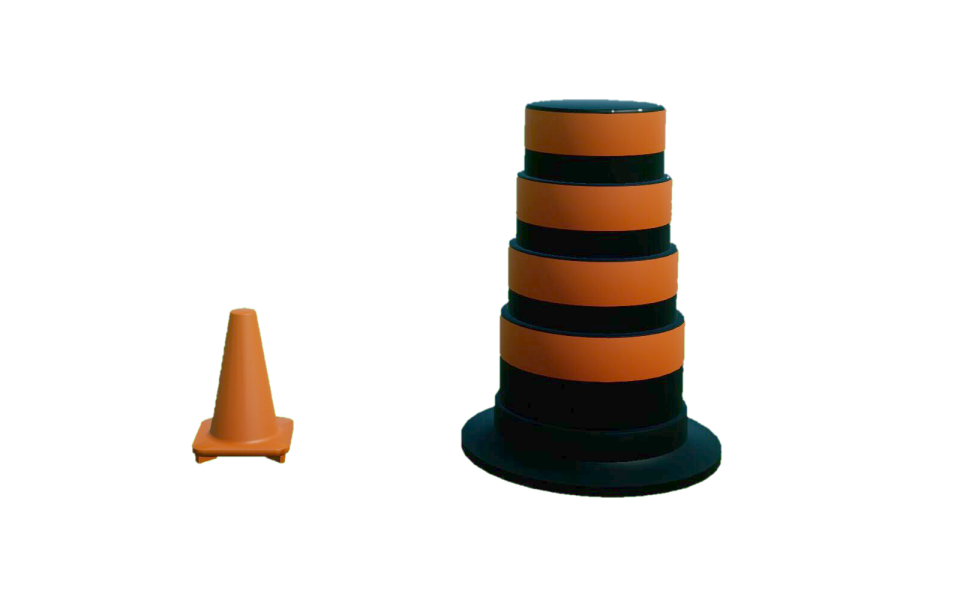
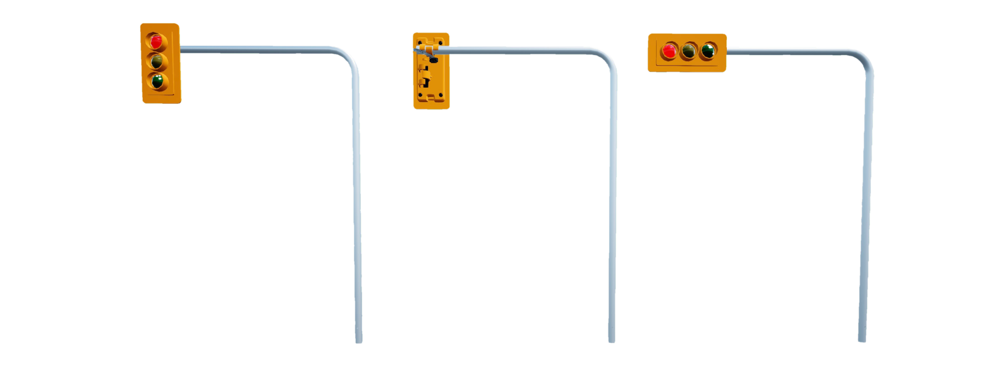

.. _road_signage:

Road Signage
============

Road signage is considered an "actor" in Virtual Self-Driving Car Studio.
The road signage library controls the road signage available to be placed in the QLabs environment.
Road signage can be spawned anywhere in the Open Worlds.

See the :ref:`roadsignageTutorial` to get a better understanding of using road signage in Quanser Interactive Labs.

.. toctree::
    :maxdepth: 2
    :caption: Contents:

    road_signage

----------------------------------------------------------------------------------------------

Crosswalk
---------

.. _crosswalklibrary:

Library
^^^^^^^

.. autoclass:: library_qlabs_crosswalk.QLabsCrosswalk

.. _crosswalkConstants:

Constants
^^^^^^^^^

.. autoattribute:: library_qlabs_crosswalk.QLabsCrosswalk.ID_CROSSWALK

.. _crosswalkVars:

Member Variables
^^^^^^^^^^^^^^^^

.. autoattribute:: library_qlabs_crosswalk.QLabsCrosswalk.actorNumber

.. _crosswalkMethods:

Methods
^^^^^^^

.. automethod:: library_qlabs_crosswalk.QLabsCrosswalk.spawn
.. automethod:: library_qlabs_crosswalk.QLabsCrosswalk.spawn_degrees
.. automethod:: library_qlabs_crosswalk.QLabsCrosswalk.spawn_id
.. automethod:: library_qlabs_crosswalk.QLabsCrosswalk.spawn_id_degrees
.. automethod:: library_qlabs_crosswalk.QLabsCrosswalk.spawn_id_and_parent_with_relative_transform
.. automethod:: library_qlabs_crosswalk.QLabsCrosswalk.spawn_id_and_parent_with_relative_transform_degrees
.. automethod:: library_qlabs_crosswalk.QLabsCrosswalk.destroy
.. automethod:: library_qlabs_crosswalk.QLabsCrosswalk.destroy_all_actors_of_class
.. automethod:: library_qlabs_crosswalk.QLabsCrosswalk.ping
.. automethod:: library_qlabs_crosswalk.QLabsCrosswalk.get_world_transform
.. automethod:: library_qlabs_crosswalk.QLabsCrosswalk.get_world_transform_degrees

.. _crosswalkConfig:

Configurations
^^^^^^^^^^^^^^
There are 3 different configurations (0-2) available for crosswalks generated in QLabs.

.. image:: ../pictures/crosswalk.png 

.. _crosswalkConnect:

Connection Points
^^^^^^^^^^^^^^^^^

There are no connection points for this actor class.

----------------------------------------------------------------------------------

Roundabout Sign
---------------

.. _roundaboutlibrary:

Library
^^^^^^^

.. autoclass:: library_qlabs_roundabout_sign.QLabsRoundaboutSign

.. _roundaboutConstants:

Constants
^^^^^^^^^

.. autoattribute:: library_qlabs_roundabout_sign.QLabsRoundaboutSign.ID_ROUNDABOUT_SIGN

.. _roundaboutVars:

Member Variables
^^^^^^^^^^^^^^^^

.. autoattribute:: library_qlabs_roundabout_sign.QLabsRoundaboutSign.actorNumber

.. _roundaboutMethods:

Methods
^^^^^^^

.. automethod:: library_qlabs_roundabout_sign.QLabsRoundaboutSign.spawn
.. automethod:: library_qlabs_roundabout_sign.QLabsRoundaboutSign.spawn_degrees
.. automethod:: library_qlabs_roundabout_sign.QLabsRoundaboutSign.spawn_id
.. automethod:: library_qlabs_roundabout_sign.QLabsRoundaboutSign.spawn_id_degrees
.. automethod:: library_qlabs_roundabout_sign.QLabsRoundaboutSign.spawn_id_and_parent_with_relative_transform
.. automethod:: library_qlabs_roundabout_sign.QLabsRoundaboutSign.spawn_id_and_parent_with_relative_transform_degrees
.. automethod:: library_qlabs_roundabout_sign.QLabsRoundaboutSign.destroy
.. automethod:: library_qlabs_roundabout_sign.QLabsRoundaboutSign.destroy_all_actors_of_class
.. automethod:: library_qlabs_roundabout_sign.QLabsRoundaboutSign.ping
.. automethod:: library_qlabs_roundabout_sign.QLabsRoundaboutSign.get_world_transform
.. automethod:: library_qlabs_roundabout_sign.QLabsRoundaboutSign.get_world_transform_degrees

.. _roundaboutConfig:

Configurations
^^^^^^^^^^^^^^

There is only one configuration (0) of the roundabout sign actor generated in QLabs.

.. _roundaboutConnect:

Connection Points
^^^^^^^^^^^^^^^^^

There are no connection points for this actor class.

----------------------------------------------------------------------------------

Stop Sign
---------

.. _stopsignlibrary:

Library
^^^^^^^

.. autoclass:: library_qlabs_stop_sign.QLabsStopSign

.. _stopsignConstants:

Constants
^^^^^^^^^

.. autoattribute:: library_qlabs_stop_sign.QLabsStopSign.ID_STOP_SIGN

.. _stopsignVars:

Member Variables
^^^^^^^^^^^^^^^^

.. autoattribute:: library_qlabs_stop_sign.QLabsStopSign.actorNumber

.. _stopsignMethods:

Methods
^^^^^^^

.. automethod:: library_qlabs_stop_sign.QLabsStopSign.spawn
.. automethod:: library_qlabs_stop_sign.QLabsStopSign.spawn_degrees
.. automethod:: library_qlabs_stop_sign.QLabsStopSign.spawn_id
.. automethod:: library_qlabs_stop_sign.QLabsStopSign.spawn_id_degrees
.. automethod:: library_qlabs_stop_sign.QLabsStopSign.spawn_id_and_parent_with_relative_transform
.. automethod:: library_qlabs_stop_sign.QLabsStopSign.spawn_id_and_parent_with_relative_transform_degrees
.. automethod:: library_qlabs_stop_sign.QLabsStopSign.destroy
.. automethod:: library_qlabs_stop_sign.QLabsStopSign.destroy_all_actors_of_class
.. automethod:: library_qlabs_stop_sign.QLabsStopSign.ping
.. automethod:: library_qlabs_stop_sign.QLabsStopSign.get_world_transform
.. automethod:: library_qlabs_stop_sign.QLabsStopSign.get_world_transform_degrees

.. _stopsignConfig:

Configurations
^^^^^^^^^^^^^^

There is only one configuration (0) of the stop sign actor generated in QLabs.

.. _stopsignConnect:

Connection Points
^^^^^^^^^^^^^^^^^

There are no connection points for this actor class.

----------------------------------------------------------------------------------

Yield Sign
----------

.. _yieldsignlibrary:

Library
^^^^^^^

.. autoclass:: library_qlabs_yield_sign.QLabsYieldSign

.. _yieldsignConstants:

Constants
^^^^^^^^^

.. autoattribute:: library_qlabs_yield_sign.QLabsYieldSign.ID_YIELD_SIGN

.. _yieldsignVars:

Member Variables
^^^^^^^^^^^^^^^^

.. autoattribute:: library_qlabs_yield_sign.QLabsYieldSign.actorNumber

.. _yieldsignMethods:

Methods
^^^^^^^

.. automethod:: library_qlabs_yield_sign.QLabsYieldSign.spawn
.. automethod:: library_qlabs_yield_sign.QLabsYieldSign.spawn_degrees
.. automethod:: library_qlabs_yield_sign.QLabsYieldSign.spawn_id
.. automethod:: library_qlabs_yield_sign.QLabsYieldSign.spawn_id_degrees
.. automethod:: library_qlabs_yield_sign.QLabsYieldSign.spawn_id_and_parent_with_relative_transform
.. automethod:: library_qlabs_yield_sign.QLabsYieldSign.spawn_id_and_parent_with_relative_transform_degrees
.. automethod:: library_qlabs_yield_sign.QLabsYieldSign.destroy
.. automethod:: library_qlabs_yield_sign.QLabsYieldSign.destroy_all_actors_of_class
.. automethod:: library_qlabs_yield_sign.QLabsYieldSign.ping
.. automethod:: library_qlabs_yield_sign.QLabsYieldSign.get_world_transform
.. automethod:: library_qlabs_yield_sign.QLabsYieldSign.get_world_transform_degrees

.. _yieldsignConfig:

Configurations
^^^^^^^^^^^^^^

There is only one configuration (0) of the yield sign actor generated in QLabs.

.. _yieldsignConnect:

Connection Points
^^^^^^^^^^^^^^^^^

There are no connection points for this actor class.

----------------------------------------------------------------------------------

Traffic Cone
------------

.. _trafficconelibrary:

Library
^^^^^^^

.. autoclass:: library_qlabs_traffic_cone.QLabsTrafficCone

.. _trafficconeConstants:

Constants
^^^^^^^^^

.. autoattribute:: library_qlabs_traffic_cone.QLabsTrafficCone.ID_TRAFFIC_CONE

.. _trafficconeVars:

Member Variables
^^^^^^^^^^^^^^^^

.. autoattribute:: library_qlabs_traffic_cone.QLabsTrafficCone.actorNumber

.. _trafficconeMethods:

Methods
^^^^^^^

.. automethod:: library_qlabs_traffic_cone.QLabsTrafficCone.spawn
.. automethod:: library_qlabs_traffic_cone.QLabsTrafficCone.spawn_degrees
.. automethod:: library_qlabs_traffic_cone.QLabsTrafficCone.spawn_id
.. automethod:: library_qlabs_traffic_cone.QLabsTrafficCone.spawn_id_degrees
.. automethod:: library_qlabs_traffic_cone.QLabsTrafficCone.spawn_id_and_parent_with_relative_transform
.. automethod:: library_qlabs_traffic_cone.QLabsTrafficCone.spawn_id_and_parent_with_relative_transform_degrees
.. automethod:: library_qlabs_traffic_cone.QLabsTrafficCone.destroy
.. automethod:: library_qlabs_traffic_cone.QLabsTrafficCone.destroy_all_actors_of_class
.. automethod:: library_qlabs_traffic_cone.QLabsTrafficCone.ping
.. automethod:: library_qlabs_traffic_cone.QLabsTrafficCone.get_world_transform
.. automethod:: library_qlabs_traffic_cone.QLabsTrafficCone.get_world_transform_degrees

.. _trafficconeConfig:

Configurations
^^^^^^^^^^^^^^

There are two configurations (0-1) for the traffic cone actor class generated in QLabs.

.. _trafficconeConnect:

Connection Points
^^^^^^^^^^^^^^^^^

There are no connection points for this actor class.

----------------------------------------------------------------------------------

Traffic Light
-------------

.. _trafficlightlibrary:

Library
^^^^^^^

.. autoclass:: library_qlabs_traffic_light.QLabsTrafficLight

.. _trafficlightConstants:

Constants
^^^^^^^^^

.. autoattribute:: library_qlabs_traffic_light.QLabsTrafficLight.ID_TRAFFIC_LIGHT
.. autoattribute:: library_qlabs_traffic_light.QLabsTrafficLight.STATE_RED
.. autoattribute:: library_qlabs_traffic_light.QLabsTrafficLight.STATE_GREEN
.. autoattribute:: library_qlabs_traffic_light.QLabsTrafficLight.STATE_YELLOW

.. _trafficlightVars:

Member Variables
^^^^^^^^^^^^^^^^

.. autoattribute:: library_qlabs_traffic_light.QLabsTrafficLight.actorNumber

.. _trafficlightMethods:

Methods
^^^^^^^

.. automethod:: library_qlabs_traffic_light.QLabsTrafficLight.__init__
.. automethod:: library_qlabs_traffic_light.QLabsTrafficLight.spawn
.. automethod:: library_qlabs_traffic_light.QLabsTrafficLight.spawn_degrees
.. automethod:: library_qlabs_traffic_light.QLabsTrafficLight.spawn_id
.. automethod:: library_qlabs_traffic_light.QLabsTrafficLight.spawn_id_degrees
.. automethod:: library_qlabs_traffic_light.QLabsTrafficLight.spawn_id_and_parent_with_relative_transform
.. automethod:: library_qlabs_traffic_light.QLabsTrafficLight.spawn_id_and_parent_with_relative_transform_degrees
.. automethod:: library_qlabs_traffic_light.QLabsTrafficLight.set_state
.. automethod:: library_qlabs_traffic_light.QLabsTrafficLight.destroy
.. automethod:: library_qlabs_traffic_light.QLabsTrafficLight.destroy_all_actors_of_class
.. automethod:: library_qlabs_traffic_light.QLabsTrafficLight.ping
.. automethod:: library_qlabs_traffic_light.QLabsTrafficLight.get_world_transform
.. automethod:: library_qlabs_traffic_light.QLabsTrafficLight.get_world_transform_degrees

.. _trafficlightConfig:

Configurations
^^^^^^^^^^^^^^

There are three configurations (0-2) for the traffic light actor class generated in QLabs.

.. _trafficlightConnect:

Connection Points
^^^^^^^^^^^^^^^^^

There are no connection points for this actor class.

.. _roadsignageTutorial:

Road Signage Tutorial
^^^^^^^^^^^^^^^^^^^^^

.. dropdown:: Example
    
    .. literalinclude:: ../../../tutorials/road_signage_tutorial.py
        :language: python
        :linenos:
