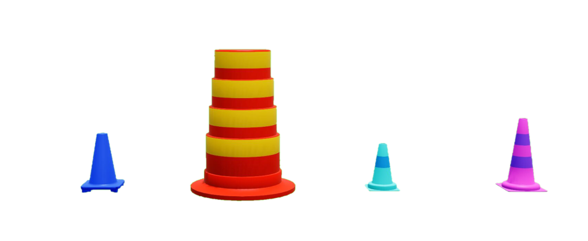

.. _Road_Signage:

************
Road Signage
************

.. _roadsignagedescription:

Road signage is considered an "actor" in Quanser Interactive Labs Open Worlds.
The road signage library controls the road signage available to be placed in
the QLabs environment.
Road signage can be spawned anywhere in the Open Worlds.

See the :ref:`roadsignageTutorial` to get a better understanding of using road
signage in Quanser Interactive Labs.

.. contents:: Table of Contents
    :depth: 1
    :local:
    :backlinks: none

-------------------------------------------------------------------------------

Crosswalk
---------

.. _crosswalklibrary:

Library
^^^^^^^

.. autoclass:: qvl.crosswalk.QLabsCrosswalk

.. _crosswalkConstants:

Constants
^^^^^^^^^

.. autoattribute:: qvl.crosswalk.QLabsCrosswalk.ID_CROSSWALK

.. _crosswalkVars:

Member Variables
^^^^^^^^^^^^^^^^

.. autoattribute:: qvl.crosswalk.QLabsCrosswalk.actorNumber

.. _crosswalkMethods:

Methods
^^^^^^^

.. automethod:: qvl.crosswalk.QLabsCrosswalk.spawn
.. automethod:: qvl.crosswalk.QLabsCrosswalk.spawn_degrees
.. automethod:: qvl.crosswalk.QLabsCrosswalk.spawn_id
.. automethod:: qvl.crosswalk.QLabsCrosswalk.spawn_id_degrees
.. automethod:: qvl.crosswalk.QLabsCrosswalk.spawn_id_and_parent_with_relative_transform
.. automethod:: qvl.crosswalk.QLabsCrosswalk.spawn_id_and_parent_with_relative_transform_degrees
.. automethod:: qvl.crosswalk.QLabsCrosswalk.destroy
.. automethod:: qvl.crosswalk.QLabsCrosswalk.destroy_all_actors_of_class
.. automethod:: qvl.crosswalk.QLabsCrosswalk.ping
.. automethod:: qvl.crosswalk.QLabsCrosswalk.get_world_transform
.. automethod:: qvl.crosswalk.QLabsCrosswalk.get_world_transform_degrees
.. automethod:: qvl.crosswalk.QLabsCrosswalk.parent_with_relative_transform
.. automethod:: qvl.crosswalk.QLabsCrosswalk.parent_with_relative_transform_degrees
.. automethod:: qvl.crosswalk.QLabsCrosswalk.parent_with_current_world_transform
.. automethod:: qvl.crosswalk.QLabsCrosswalk.parent_break

.. _crosswalkConfig:

Configurations
^^^^^^^^^^^^^^
There are 3 different configurations (0-2) available for crosswalks generated
in QLabs.

.. image:: ../pictures/crosswalk.png

.. _crosswalkConnect:

Connection Points
^^^^^^^^^^^^^^^^^

There are no connection points for this actor class.

-------------------------------------------------------------------------------

Roundabout Sign
---------------

.. _roundaboutlibrary:

Library
^^^^^^^

.. autoclass:: qvl.roundabout_sign.QLabsRoundaboutSign

.. _roundaboutConstants:

Constants
^^^^^^^^^

.. autoattribute:: qvl.roundabout_sign.QLabsRoundaboutSign.ID_ROUNDABOUT_SIGN

.. _roundaboutVars:

Member Variables
^^^^^^^^^^^^^^^^

.. autoattribute:: qvl.roundabout_sign.QLabsRoundaboutSign.actorNumber

.. _roundaboutMethods:

Methods
^^^^^^^

.. automethod:: qvl.roundabout_sign.QLabsRoundaboutSign.spawn
.. automethod:: qvl.roundabout_sign.QLabsRoundaboutSign.spawn_degrees
.. automethod:: qvl.roundabout_sign.QLabsRoundaboutSign.spawn_id
.. automethod:: qvl.roundabout_sign.QLabsRoundaboutSign.spawn_id_degrees
.. automethod:: qvl.roundabout_sign.QLabsRoundaboutSign.spawn_id_and_parent_with_relative_transform
.. automethod:: qvl.roundabout_sign.QLabsRoundaboutSign.spawn_id_and_parent_with_relative_transform_degrees
.. automethod:: qvl.roundabout_sign.QLabsRoundaboutSign.destroy
.. automethod:: qvl.roundabout_sign.QLabsRoundaboutSign.destroy_all_actors_of_class
.. automethod:: qvl.roundabout_sign.QLabsRoundaboutSign.ping
.. automethod:: qvl.roundabout_sign.QLabsRoundaboutSign.get_world_transform
.. automethod:: qvl.roundabout_sign.QLabsRoundaboutSign.get_world_transform_degrees
.. automethod:: qvl.roundabout_sign.QLabsRoundaboutSign.parent_with_relative_transform
.. automethod:: qvl.roundabout_sign.QLabsRoundaboutSign.parent_with_relative_transform_degrees
.. automethod:: qvl.roundabout_sign.QLabsRoundaboutSign.parent_with_current_world_transform
.. automethod:: qvl.roundabout_sign.QLabsRoundaboutSign.parent_break

.. _roundaboutConfig:

Configurations
^^^^^^^^^^^^^^

There is only one configuration (0) of the roundabout sign actor generated in
QLabs.

.. image:: ../pictures/roundaboutsign.png

.. _roundaboutConnect:

Connection Points
^^^^^^^^^^^^^^^^^

There are no connection points for this actor class.

-------------------------------------------------------------------------------

Stop Sign
---------

.. _stopsignlibrary:

Library
^^^^^^^

.. autoclass:: qvl.stop_sign.QLabsStopSign

.. _stopsignConstants:

Constants
^^^^^^^^^

.. autoattribute:: qvl.stop_sign.QLabsStopSign.ID_STOP_SIGN

.. _stopsignVars:

Member Variables
^^^^^^^^^^^^^^^^

.. autoattribute:: qvl.stop_sign.QLabsStopSign.actorNumber

.. _stopsignMethods:

Methods
^^^^^^^

.. automethod:: qvl.stop_sign.QLabsStopSign.spawn
.. automethod:: qvl.stop_sign.QLabsStopSign.spawn_degrees
.. automethod:: qvl.stop_sign.QLabsStopSign.spawn_id
.. automethod:: qvl.stop_sign.QLabsStopSign.spawn_id_degrees
.. automethod:: qvl.stop_sign.QLabsStopSign.spawn_id_and_parent_with_relative_transform
.. automethod:: qvl.stop_sign.QLabsStopSign.spawn_id_and_parent_with_relative_transform_degrees
.. automethod:: qvl.stop_sign.QLabsStopSign.destroy
.. automethod:: qvl.stop_sign.QLabsStopSign.destroy_all_actors_of_class
.. automethod:: qvl.stop_sign.QLabsStopSign.ping
.. automethod:: qvl.stop_sign.QLabsStopSign.get_world_transform
.. automethod:: qvl.stop_sign.QLabsStopSign.get_world_transform_degrees
.. automethod:: qvl.stop_sign.QLabsStopSign.parent_with_relative_transform
.. automethod:: qvl.stop_sign.QLabsStopSign.parent_with_relative_transform_degrees
.. automethod:: qvl.stop_sign.QLabsStopSign.parent_with_current_world_transform
.. automethod:: qvl.stop_sign.QLabsStopSign.parent_break

.. _stopsignConfig:

Configurations
^^^^^^^^^^^^^^

There is only one configuration (0) of the stop sign actor generated in QLabs.

.. image:: ../pictures/stopsign.png

.. _stopsignConnect:

Connection Points
^^^^^^^^^^^^^^^^^

There are no connection points for this actor class.

-------------------------------------------------------------------------------

Yield Sign
----------

.. _yieldsignlibrary:

Library
^^^^^^^

.. autoclass:: qvl.yield_sign.QLabsYieldSign

.. _yieldsignConstants:

Constants
^^^^^^^^^

.. autoattribute:: qvl.yield_sign.QLabsYieldSign.ID_YIELD_SIGN

.. _yieldsignVars:

Member Variables
^^^^^^^^^^^^^^^^

.. autoattribute:: qvl.yield_sign.QLabsYieldSign.actorNumber

.. _yieldsignMethods:

Methods
^^^^^^^

.. automethod:: qvl.yield_sign.QLabsYieldSign.spawn
.. automethod:: qvl.yield_sign.QLabsYieldSign.spawn_degrees
.. automethod:: qvl.yield_sign.QLabsYieldSign.spawn_id
.. automethod:: qvl.yield_sign.QLabsYieldSign.spawn_id_degrees
.. automethod:: qvl.yield_sign.QLabsYieldSign.spawn_id_and_parent_with_relative_transform
.. automethod:: qvl.yield_sign.QLabsYieldSign.spawn_id_and_parent_with_relative_transform_degrees
.. automethod:: qvl.yield_sign.QLabsYieldSign.destroy
.. automethod:: qvl.yield_sign.QLabsYieldSign.destroy_all_actors_of_class
.. automethod:: qvl.yield_sign.QLabsYieldSign.ping
.. automethod:: qvl.yield_sign.QLabsYieldSign.get_world_transform
.. automethod:: qvl.yield_sign.QLabsYieldSign.get_world_transform_degrees
.. automethod:: qvl.yield_sign.QLabsYieldSign.parent_with_relative_transform
.. automethod:: qvl.yield_sign.QLabsYieldSign.parent_with_relative_transform_degrees
.. automethod:: qvl.yield_sign.QLabsYieldSign.parent_with_current_world_transform
.. automethod:: qvl.yield_sign.QLabsYieldSign.parent_break

.. _yieldsignConfig:

Configurations
^^^^^^^^^^^^^^

There is only one configuration (0) of the yield sign actor generated in QLabs.

.. image:: ../pictures/yieldsign.png

.. _yieldsignConnect:

Connection Points
^^^^^^^^^^^^^^^^^

There are no connection points for this actor class.

-------------------------------------------------------------------------------

Traffic Cone
------------

.. _trafficconelibrary:

Library
^^^^^^^

.. autoclass:: qvl.traffic_cone.QLabsTrafficCone

.. _trafficconeConstants:

Constants
^^^^^^^^^

.. autoattribute:: qvl.traffic_cone.QLabsTrafficCone.ID_TRAFFIC_CONE

.. _trafficconeVars:

Member Variables
^^^^^^^^^^^^^^^^

.. autoattribute:: qvl.traffic_cone.QLabsTrafficCone.actorNumber

.. _trafficconeMethods:

Methods
^^^^^^^

.. automethod:: qvl.traffic_cone.QLabsTrafficCone.spawn
.. automethod:: qvl.traffic_cone.QLabsTrafficCone.spawn_degrees
.. automethod:: qvl.traffic_cone.QLabsTrafficCone.spawn_id
.. automethod:: qvl.traffic_cone.QLabsTrafficCone.spawn_id_degrees
.. automethod:: qvl.traffic_cone.QLabsTrafficCone.spawn_id_and_parent_with_relative_transform
.. automethod:: qvl.traffic_cone.QLabsTrafficCone.spawn_id_and_parent_with_relative_transform_degrees
.. automethod:: qvl.traffic_cone.QLabsTrafficCone.destroy
.. automethod:: qvl.traffic_cone.QLabsTrafficCone.destroy_all_actors_of_class
.. automethod:: qvl.traffic_cone.QLabsTrafficCone.ping
.. automethod:: qvl.traffic_cone.QLabsTrafficCone.get_world_transform
.. automethod:: qvl.traffic_cone.QLabsTrafficCone.get_world_transform_degrees
.. automethod:: qvl.traffic_cone.QLabsTrafficCone.parent_with_relative_transform
.. automethod:: qvl.traffic_cone.QLabsTrafficCone.parent_with_relative_transform_degrees
.. automethod:: qvl.traffic_cone.QLabsTrafficCone.parent_with_current_world_transform
.. automethod:: qvl.traffic_cone.QLabsTrafficCone.parent_break

.. _trafficconeConfig:

Configurations
^^^^^^^^^^^^^^

There are two configurations (0-1) for the traffic cone actor class generated
in QLabs.

.. _trafficconeConnect:

Connection Points
^^^^^^^^^^^^^^^^^

There are no connection points for this actor class.

-------------------------------------------------------------------------------

Traffic Light
-------------

.. _trafficlightlibrary:

Library
^^^^^^^

.. autoclass:: qvl.traffic_light.QLabsTrafficLight

.. _trafficlightConstants:

Constants
^^^^^^^^^

.. autoattribute:: qvl.traffic_light.QLabsTrafficLight.ID_TRAFFIC_LIGHT
.. autoattribute:: qvl.traffic_light.QLabsTrafficLight.STATE_RED
.. autoattribute:: qvl.traffic_light.QLabsTrafficLight.STATE_GREEN
.. autoattribute:: qvl.traffic_light.QLabsTrafficLight.STATE_YELLOW

.. _trafficlightVars:

Member Variables
^^^^^^^^^^^^^^^^

.. autoattribute:: qvl.traffic_light.QLabsTrafficLight.actorNumber

.. _trafficlightMethods:

Methods
^^^^^^^

.. automethod:: qvl.traffic_light.QLabsTrafficLight.__init__
.. automethod:: qvl.traffic_light.QLabsTrafficLight.spawn
.. automethod:: qvl.traffic_light.QLabsTrafficLight.spawn_degrees
.. automethod:: qvl.traffic_light.QLabsTrafficLight.spawn_id
.. automethod:: qvl.traffic_light.QLabsTrafficLight.spawn_id_degrees
.. automethod:: qvl.traffic_light.QLabsTrafficLight.spawn_id_and_parent_with_relative_transform
.. automethod:: qvl.traffic_light.QLabsTrafficLight.spawn_id_and_parent_with_relative_transform_degrees
.. automethod:: qvl.traffic_light.QLabsTrafficLight.set_state
.. automethod:: qvl.traffic_light.QLabsTrafficLight.destroy
.. automethod:: qvl.traffic_light.QLabsTrafficLight.destroy_all_actors_of_class
.. automethod:: qvl.traffic_light.QLabsTrafficLight.ping
.. automethod:: qvl.traffic_light.QLabsTrafficLight.get_world_transform
.. automethod:: qvl.traffic_light.QLabsTrafficLight.get_world_transform_degrees
.. automethod:: qvl.traffic_light.QLabsTrafficLight.parent_with_relative_transform
.. automethod:: qvl.traffic_light.QLabsTrafficLight.parent_with_relative_transform_degrees
.. automethod:: qvl.traffic_light.QLabsTrafficLight.parent_with_current_world_transform
.. automethod:: qvl.traffic_light.QLabsTrafficLight.parent_break

.. _trafficlightConfig:

Configurations
^^^^^^^^^^^^^^

There are three configurations (0-2) for the traffic light actor class
generated in QLabs.

.. image:: ../pictures/trafficlight.png

.. _trafficlightConnect:

Connection Points
^^^^^^^^^^^^^^^^^

There are no connection points for this actor class.

.. _roadsignageTutorial:

Road Signage Tutorial
^^^^^^^^^^^^^^^^^^^^^

.. dropdown:: Example

    .. literalinclude:: ../../../../tutorials/road_signage_tutorial.py
        :language: python
        :linenos:
