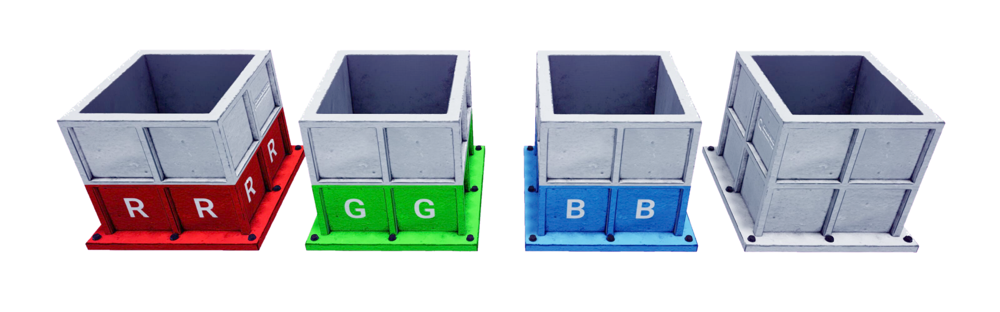

.. _Shredder:

Shredder
--------

.. _shredderDescription:

Description
^^^^^^^^^^^

Shredders are considered an "actor" in Quanser Interactive Labs Open Worlds.
They can be spawned anywhere in the Open Worlds and will delete widgets
when they fall into the shredder. 

Shredders should always use the same scale for x,y,z so they can function properly.

See the :ref:`shredderTutorial` to get a better understanding of using shredders
in Quanser Interactive Labs.

.. _shredderlibrary:

Library
^^^^^^^

.. autoclass:: qvl.shredder.QLabsShredder

.. _shredderConstants:

Constants
^^^^^^^^^

.. autoattribute:: qvl.shredder.QLabsShredder.ID_SHREDDER
.. autoattribute:: qvl.shredder.QLabsShredder.RED
.. autoattribute:: qvl.shredder.QLabsShredder.GREEN
.. autoattribute:: qvl.shredder.QLabsShredder.BLUE
.. autoattribute:: qvl.shredder.QLabsShredder.WHITE

.. _shredderMemberVars:

Member Variables
^^^^^^^^^^^^^^^^

.. autoattribute:: qvl.shredder.QLabsShredder.actorNumber

.. _shredderMethods:

Methods
^^^^^^^

.. automethod:: qvl.shredder.QLabsShredder.__init__
.. automethod:: qvl.shredder.QLabsShredder.spawn
.. automethod:: qvl.shredder.QLabsShredder.spawn_degrees
.. automethod:: qvl.shredder.QLabsShredder.spawn_id
.. automethod:: qvl.shredder.QLabsShredder.spawn_id_degrees
.. automethod:: qvl.shredder.QLabsShredder.spawn_id_and_parent_with_relative_transform
.. automethod:: qvl.shredder.QLabsShredder.spawn_id_and_parent_with_relative_transform_degrees
.. automethod:: qvl.shredder.QLabsShredder.destroy
.. automethod:: qvl.shredder.QLabsShredder.destroy_all_actors_of_class
.. automethod:: qvl.shredder.QLabsShredder.get_world_transform
.. automethod:: qvl.shredder.QLabsShredder.get_world_transform_degrees
.. automethod:: qvl.shredder.QLabsShredder.ping
.. automethod:: qvl.shredder.QLabsShredder.parent_with_relative_transform
.. automethod:: qvl.shredder.QLabsShredder.parent_with_relative_transform_degrees
.. automethod:: qvl.shredder.QLabsShredder.parent_with_current_world_transform
.. automethod:: qvl.shredder.QLabsShredder.parent_break
.. automethod:: qvl.shredder.QLabsShredder.set_custom_properties
.. automethod:: qvl.shredder.QLabsShredder.get_custom_properties

.. _shredderConfig:

Configurations
^^^^^^^^^^^^^^
There are four configurations (0-3) for the shredder actor class.

    * 0 or shredder.RED
    * 1 or shredder.GREEN
    * 2 or shredder.BLUE
    * 3 or shredder.WHITE

.. _shredderConnect:

Connection Points
^^^^^^^^^^^^^^^^^

There are no connection points for this actor class.

-------------------------------------------------------------------------------

.. _shredderTutorial:

Shredder Tutorial
^^^^^^^^^^^^^^^^^^^^^^^

.. tabs::
    .. tab:: Python

        .. dropdown:: Python Tutorial

            Raw to download this tutorial: |shredder_tutorial.py|.

            .. |shredder_tutorial.py| replace::
                :download:`shredder Tutorial (.py) <../../../tutorials/shredder_tutorial.py>`

            .. literalinclude:: ../../../tutorials/shredder_tutorial.py
                :language: python
                :linenos:

    .. tab:: Matlab

        .. dropdown:: Matlab Tutorial

            Raw to download this tutorial: |shredder_tutorial.m|.

            .. |shredder_tutorial.m| replace::
                :download:`Shredder Tutorial (.m) <../../../tutorials/Shredder_tutorial.m>`

            .. literalinclude:: ../../../tutorials/Shredder_tutorial.m
                :language: Matlab
                :linenos:

