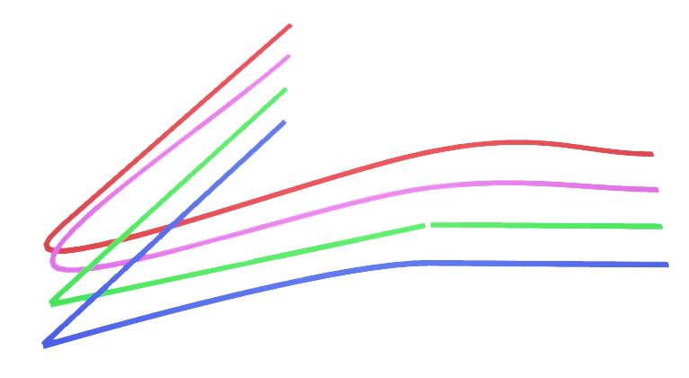

.. _spline_base:

Splines
-------

.. _splineDescription: 

Description
^^^^^^^^^^^

The spline actor can be used to create both curves and straight lines. Line
color can be set for the entire line, and line width can be set on a per-control
point basis. Splines are created by first spawning a spline actor and then adding
control points.  Depending on the configuration used when spawned, you can get
variations on the curve shape or straight lines.

See the :ref:`splineTutorial` to get a better understanding of using people in Quanser 
Interactive Labs.

.. _splinelibrary:

Library
^^^^^^^

.. autoclass:: library_qlabs_spline_line.QLabsSplineLine

.. _splineConstants:

Constants
^^^^^^^^^

.. autoattribute:: library_qlabs_spline_line.QLabsSplineLine.ID_SPLINE_LINE
.. autoattribute:: library_qlabs_spline_line.QLabsSplineLine.LINEAR
.. autoattribute:: library_qlabs_spline_line.QLabsSplineLine.CURVE
.. autoattribute:: library_qlabs_spline_line.QLabsSplineLine.CONSTANT
.. autoattribute:: library_qlabs_spline_line.QLabsSplineLine.CLAMPED_CURVE

.. _splineMemberVars:

Member Variables
^^^^^^^^^^^^^^^^

.. autoattribute:: library_qlabs_spline_line.QLabsSplineLine.actorNumber

.. _splineMethods:

Methods
^^^^^^^

.. automethod:: library_qlabs_spline_line.QLabsSplineLine.__init__
.. automethod:: library_qlabs_spline_line.QLabsSplineLine.spawn
.. automethod:: library_qlabs_spline_line.QLabsSplineLine.spawn_degrees
.. automethod:: library_qlabs_spline_line.QLabsSplineLine.spawn_id
.. automethod:: library_qlabs_spline_line.QLabsSplineLine.spawn_id_degrees
.. automethod:: library_qlabs_spline_line.QLabsSplineLine.spawn_id_and_parent_with_relative_transform
.. automethod:: library_qlabs_spline_line.QLabsSplineLine.spawn_id_and_parent_with_relative_transform_degrees
.. automethod:: library_qlabs_spline_line.QLabsSplineLine.destroy
.. automethod:: library_qlabs_spline_line.QLabsSplineLine.destroy_all_actors_of_class
.. automethod:: library_qlabs_spline_line.QLabsSplineLine.ping
.. automethod:: library_qlabs_spline_line.QLabsSplineLine.get_world_transform
.. automethod:: library_qlabs_spline_line.QLabsSplineLine.get_world_transform_degrees
.. automethod:: library_qlabs_spline_line.QLabsSplineLine.set_points
.. automethod:: library_qlabs_spline_line.QLabsSplineLine.circle_from_center
.. automethod:: library_qlabs_spline_line.QLabsSplineLine.arc_from_center
.. automethod:: library_qlabs_spline_line.QLabsSplineLine.arc_from_center_degrees
.. automethod:: library_qlabs_spline_line.QLabsSplineLine.rounded_rectangle_from_center
.. automethod:: library_qlabs_spline_line.QLabsSplineLine.parent_with_relative_transform
.. automethod:: library_qlabs_spline_line.QLabsSplineLine.parent_with_relative_transform_degrees
.. automethod:: library_qlabs_spline_line.QLabsSplineLine.parent_with_current_world_transform
.. automethod:: library_qlabs_spline_line.QLabsSplineLine.parent_break

.. _splineConfig:

Configurations
^^^^^^^^^^^^^^

Configurations 0 to 3 are shown from top to bottom in the above image using the same set of control points.

.. table::
    :widths: 10, 10, 80
    :align: center

    ============= ============= ===========
    Configuration Mode          Description
    ============= ============= ===========
    0             Linear        The tangent of the curve at each control point is set to match the tangent of the start of each line segment.
    1             Curve         The tangent of the curve at each control point is an average of the two adjacent line segments and matched to the start and end tangents.
    2             Constant      Straight line segments
    3             Clamped Curve As angles become more acute, the curve will transition from a smooth change to a sharp point.
    ============= ============= ===========

.. _splineConnect:

Connection Points
^^^^^^^^^^^^^^^^^

There are no connection points for this actor class.

.. _splineTutorial:

Tutorial
^^^^^^^^

.. dropdown:: Example

