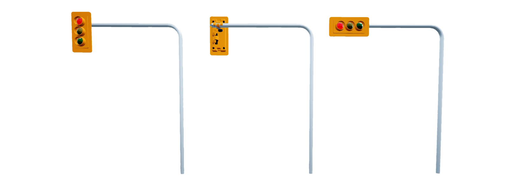

.. _Traffic_Light:

*****************
Traffic Light
*****************

.. _trafficlightdescription:

Description
============

A traffic light is considered an "actor" in Quanser Interactive Labs Open Worlds.
Traffic lights can be spawned anywhere in the Open Worlds.

See the :ref:`trafficlightTutorial` to get a better understanding of using road
signage in Quanser Interactive Labs.

.. _trafficlightlibrary:

Library
=========

.. autoclass:: qvl.traffic_light.QLabsTrafficLight

.. _trafficlightConstants:

Constants
===========

.. autoattribute:: qvl.traffic_light.QLabsTrafficLight.ID_TRAFFIC_LIGHT
.. autoattribute:: qvl.traffic_light.QLabsTrafficLight.STATE_RED
.. autoattribute:: qvl.traffic_light.QLabsTrafficLight.STATE_GREEN
.. autoattribute:: qvl.traffic_light.QLabsTrafficLight.STATE_YELLOW

.. _trafficlightVars:

Member Variables
==================

.. autoattribute:: qvl.traffic_light.QLabsTrafficLight.actorNumber

.. _trafficlightMethods:

Methods
=========

.. automethod:: qvl.traffic_light.QLabsTrafficLight.__init__
.. automethod:: qvl.traffic_light.QLabsTrafficLight.spawn
.. automethod:: qvl.traffic_light.QLabsTrafficLight.spawn_degrees
.. automethod:: qvl.traffic_light.QLabsTrafficLight.spawn_id
.. automethod:: qvl.traffic_light.QLabsTrafficLight.spawn_id_degrees
.. automethod:: qvl.traffic_light.QLabsTrafficLight.spawn_id_and_parent_with_relative_transform
.. automethod:: qvl.traffic_light.QLabsTrafficLight.spawn_id_and_parent_with_relative_transform_degrees
.. automethod:: qvl.traffic_light.QLabsTrafficLight.set_state
.. automethod:: qvl.traffic_light.QLabsTrafficLight.destroy
.. automethod:: qvl.traffic_light.QLabsTrafficLight.destroy_all_actors_of_class
.. automethod:: qvl.traffic_light.QLabsTrafficLight.ping
.. automethod:: qvl.traffic_light.QLabsTrafficLight.get_world_transform
.. automethod:: qvl.traffic_light.QLabsTrafficLight.get_world_transform_degrees
.. automethod:: qvl.traffic_light.QLabsTrafficLight.parent_with_relative_transform
.. automethod:: qvl.traffic_light.QLabsTrafficLight.parent_with_relative_transform_degrees
.. automethod:: qvl.traffic_light.QLabsTrafficLight.parent_with_current_world_transform
.. automethod:: qvl.traffic_light.QLabsTrafficLight.parent_break

.. _trafficlightConfig:

Configurations
===============

There are three configurations (0-2) for the traffic light actor class
generated in QLabs.

.. _trafficlightConnect:

Connection Points
==================

There are no connection points for this actor class.

-------------------------------------------------------------------------------

.. _trafficlightTutorial:

Traffic Light Tutorial
========================

.. tabs::
    .. tab:: Python

        .. dropdown:: Python Tutorial

            Raw to download this tutorial: |road_signage_tutorial.py|.

            .. |road_signage_tutorial.py| replace::
                :download:`Traffic Lights Tutorial (.py) <../../../tutorials/road_signage_tutorial.py>`

            .. literalinclude:: ../../../tutorials/road_signage_tutorial.py
                :language: python
                :linenos:

    .. tab:: Matlab

        .. dropdown:: Matlab Tutorial

            Raw to download this tutorial: |traffic_lights_tutorial.m|.

            .. |traffic_lights_tutorial.m| replace::
                :download:`Traffic Lights Tutorial (.m) <../../../tutorials/traffic_lights_tutorial.m>`

            .. literalinclude:: ../../../tutorials/traffic_lights_tutorial.m
                :language: Matlab
                :linenos:

