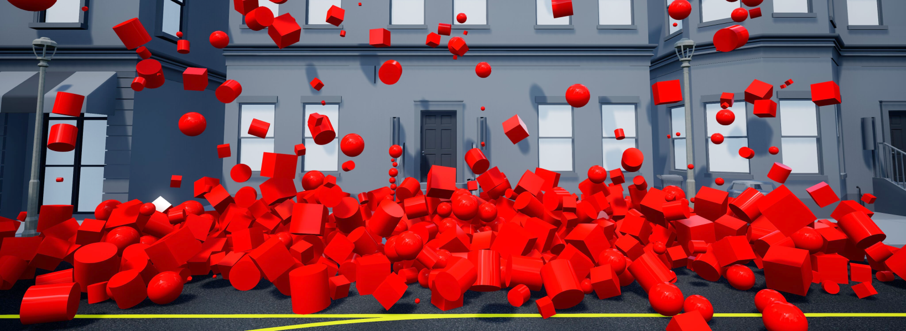

.. _widgets:

Widgets
-------

Widgets work slightly differently then the other objects in the QLabs workspaces.
They are special actors that cannot be addressed after they have been spawned 
therefore they cannot be deleted individually, they do not support parenting
and all actor properties must be set when they are spawned. 
The advantage of widgets is that they are highly efficient dynamic actors so 
it is possible to spawn thousands of widgets while maintaining performance.

In addition to the visible properties of widgets, widget actors can also
individually contain invisible properties such as mass, a numerical ID tag, and a general
purpose properties string.  Some actors that are designed to interact with widgets
include class methods to read these properties.

If you need the ability to make shapes static or the ability to address,
modify, or parent shapes, see :ref:`Basic Shapes` instead.

See the :ref:`widgetTutorial` to get a better understanding of using people in Quanser 
Interactive Labs.

.. _widgetDescription: 

Description
^^^^^^^^^^^

.. _widgetlibrary:

Library
^^^^^^^

.. autoclass:: library_qlabs_widget.QLabsWidget

.. _widgetConstants:

Constants
^^^^^^^^^

.. autoattribute:: library_qlabs_widget.QLabsWidget.CUBE
.. autoattribute:: library_qlabs_widget.QLabsWidget.CYLINDER
.. autoattribute:: library_qlabs_widget.QLabsWidget.SPHERE
.. .. autoattribute:: library_qlabs_widget.QLabsWidget.AUTOCLAVE_CAGE
.. autoattribute:: library_qlabs_widget.QLabsWidget.PLASTIC_BOTTLE
.. autoattribute:: library_qlabs_widget.QLabsWidget.METAL_CAN

.. _widgetMethods:

Methods
^^^^^^^

.. automethod:: library_qlabs_widget.QLabsWidget.__init__
.. automethod:: library_qlabs_widget.QLabsWidget.spawn
.. automethod:: library_qlabs_widget.QLabsWidget.spawn_degrees
.. automethod:: library_qlabs_widget.QLabsWidget.destroy_all_spawned_widgets
.. automethod:: library_qlabs_widget.QLabsWidget.widget_spawn_shadow

.. _widgetConfig:

Configurations
^^^^^^^^^^^^^^

.. image:: ../pictures/widgets.png 

.. _widgetConnect:

Connection Points
^^^^^^^^^^^^^^^^^

There are no connection points for this actor class.

.. _widgetTutorial:

Tutorial
^^^^^^^^

.. dropdown:: Example

    .. literalinclude:: ../../../tutorials/widgets_tutorial.py
        :language: python
        :linenos:
