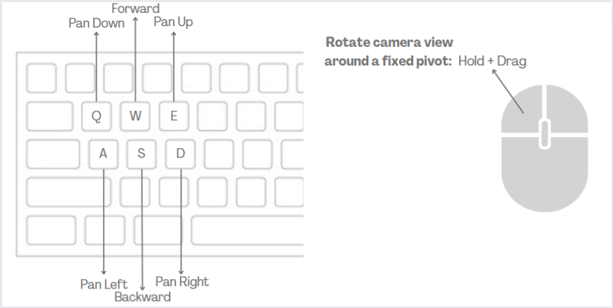
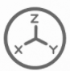
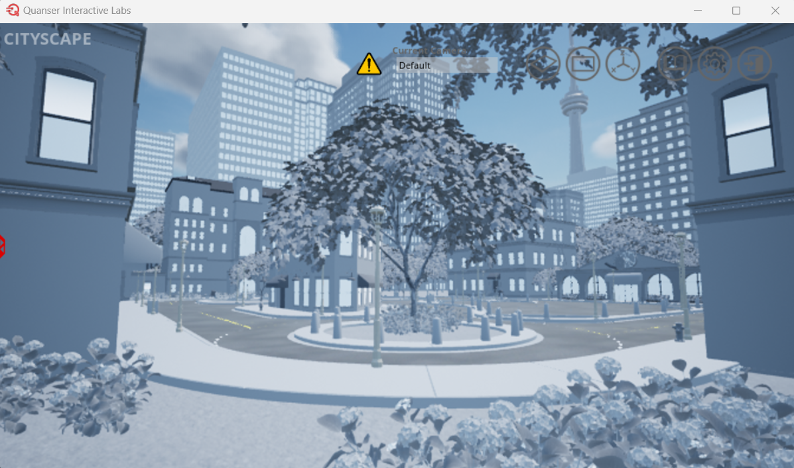
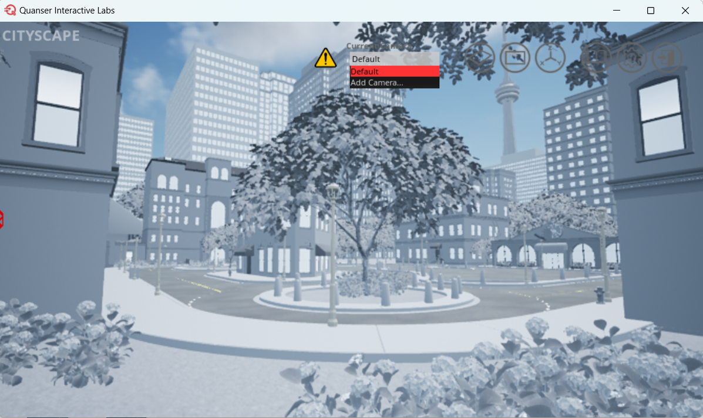
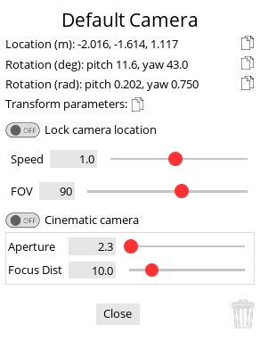

.. _User Interface:

**************
User Interface
**************
Although the Virtual QCar is not meant to be used primarily through the user interface (UI), there 
are several graphical features that this page goes through, such as basic Keyboard Controls. 
See our :ref:`Design Philosophy`` for more information.
This page goes through the basic :ref:`Keyboard Controls` and graphical features available in 
the interface of the QCar Studio Workspaces.

Keyboard Controls
=================

The following keyboard controls can be used to navigate the default camera around the virtual QCar workspace.

Coordinate Helper (Determining Locations)
=========================================

This function helps determine specific locations of interest which can aid in determining where to
spawn objects or place cameras.
In the top right corner of the workspace, click on the coordinate button |coordinatehelper|.
If you toggle the button to enable click placement, it will disable camera motion while you click
to place a point in the workspace.  
The location readout will now display the coordinates of the dropped point in your workspace.
You can copy this location by clicking on the copy button located to the right of the location
readout.

Controlling Cameras in the GUI
==============================
Cameras in the QCar Studio enable the ability to see multiple angles of the workspace and switch between those views easily.
There are many potential applications for cameras, and this section talks about how to initialize and use these cameras effectively.

.. warning:: Only 65,535 new deviceIDs can be created

Controlling Free/Open World Flying Cameras in the GUI
-----------------------------------------------------
By default, when a workspace is opened, the default camera is the initial view of the workspace that will be shown.

    Default QCar Workspace View in Quanser Interactive Labs

Adding Cameras in the GUI
-------------------------

In order to add a new camera to the scene click the drop down under **Current Camera** and click on **Add a Camera**.  
This will add a new camera to the scene and open a window to display the camera options.

Camera Options
^^^^^^^^^^^^^^

There are several different camera options that can be changed. 

* **Camera Location & Rotation** - The camera will initially appear in the location the current scene is showing, however this camera can be moved by using the basic :ref:`keyboard controls` to move to a different location.
* **Field of view (FOV)** - FOV can be changed by sliding the slider or inputting a specific value.
* If the *Cinematic camera* option is toggled to on, then you can also change the **aperture** and the **focal distance** using their respective sliders or inputting specific values.
* **Lock Camera Location** - To fix a camera in a specific location, navigate to that location and simply toggle the *Lock camera location* option.

.. tip:: If you close the window on purpose or by accident, you can find your newly added camera under the drop down menu and can open it again by clicking on the triple bar next to the drop down menu.

You can add as many cameras as you want, as they don't consume resources until you switch to them.

You can also add a camera through creating a python script and checking out the :ref:`Cameras` object documentation.

