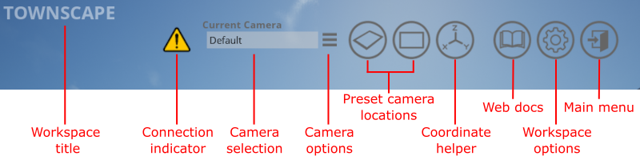
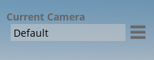
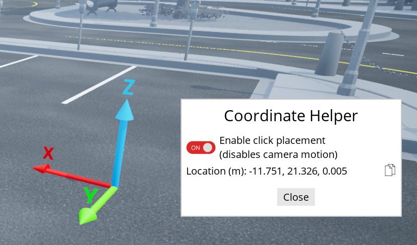
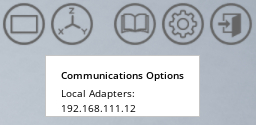
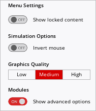
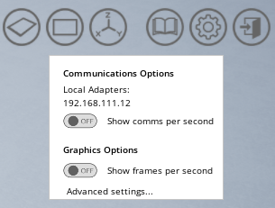
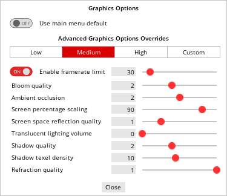

.. _User Interface:

**************
User Interface
**************
The user interface icons along the top of the screen provide camera controls and
information to the user. Creation and control of actors is primarily performed
through API commands (see our :ref:`Design Philosophy` for more information).

    The features of the user interface.

* **Workspace title**
    This is the title of each workspace but it can be customized using the 
    :meth:`set_title_string <qvl.system.QLabsSystem.set_title_string>` method
    in the :ref:`System_Library` library.

* **Connection indicator**
    The yellow exclamation symbol will appear when there is no active external
    connection.  This connections can be a pre-compiled real-time model,
    a user-compiled real-time model, or a script using the QLabs API's.

.. note::
    When opening QLabs for the first time, you may receive a firewall prompt.
    If you plan to control QLabs from a remote device or PC, then you will need
    to allow this connection. If you are controlling QLabs actors from the same
    PC, allowing this connection is optional. QLabs runs a server automatically
    when a Open World is opened which allows multiple connections (scripts or
    real-time models) simultaneously.

* **Camera selection**
    A drop-down dialog listing all the active cameras.  Any actor that has built-in
    cameras such as :ref:`Car_Library` or :ref:`QBotPlatform_Library` will automatically
    add their cameras to the list when they are spawned in the world. User cameras
    can also be manually added here. See :ref:`Adding Cameras in the UI` for more
    information.

* **Camera options**
    Access the camera settings. These include the standard user-camera settings as
    described in :ref:`Camera Options` or device-specific camera options (see
    the relevant device API for more information).

* **Preset camera locations**
    Some open worlds will have preset points of interest. These will move the default
    camera to this location.

* **Coordinate helper**
    Used to help determine coordinate locations in the world. See 
    :ref:`Coordinate Helper` for more details.

* **Web documentation**
    This will link to the current student content. For
    instructor versions of the content, please contact `Quanser Support. <https://www.quanser.com/support/>`__

* **Workspace options**
    View the PC IP address and (in advanced mode) show all the graphics settings.  See
    :ref:`Workspace Options` for more details.

* **Main menu**
    Close all server connections and return to the main menu.
    

Navigation
==========

The following keyboard controls can be used to navigate the default camera and 
user cameras around the open worlds.

.. figure:: pictures/Keyboard_Mouse_Controls.png

The controls follow a "flying" model. Forward, backward, pan left and pan right
are relative to the direction you are currently facing. Pan up and pan down
change your altitude regardless of the camera orientation. Device-specific 
cameras may not allow any motion at all, or may only have a subset of these 
actions available.

Adding Cameras in the UI
========================

In order to add a new camera to the scene click the drop down under
**Current Camera** and click on **Add a Camera**.
This will add a new camera to the scene and open a window to display the camera
options.

.. figure:: pictures/addingACamera.png
    :alt: under the drop down menu you will see the add a camera option
    :align: center

    Drop Down Menu for Adding Cameras in Quanser Interactive Labs

Camera Options
==============

The camera options can be opened by clicking on the three horizontal lines next to the
camera drop down box. There are several different camera options that can be changed.

    Click the three horizontal lines to open the camera options

* **Camera Location & Rotation**
    The camera will initially appear in the location the current scene is
    showing, however this camera can be moved by using the basic
    :ref:`keyboard controls <Navigation>` to move to a different location. The copy icon
    next to each line can be used to copy the coordinates into your code.
* **Lock Camera Location**
    To fix a camera in a specific location, navigate to that location and
    simply toggle the *Lock camera location* option. This will prevent
    manual motion of the camera, but it can still be moved through API
    commands.
* **Speed**
    The speed of the manual camera motion can be increased or decreased by 
    adjusting this slider.
* **Field of view (FOV)**
    FOV can be changed by sliding the slider or inputting a specific value.
* **Cinematic camera**
    This option enables the aperture and focal distance options. Disable this
    option to improve framerate performance.
* **Aperture & Focal Distance**
    If the *Cinematic camera* option is toggled to on, then you can also change
    the **aperture** and the **focal distance** using their respective sliders
    or inputting specific values. To create a greater sense of depth, try setting
    the FOV to 30 degrees, set the aperture at 2, and then adjust
    the focal distance to focus on the object of interest.
* **Destroy camera**
    The trash icon in the lower right of the dialog will delete the current camera.
    The default camera cannot be deleted.

.. figure:: pictures/cameraOptions.png
    :alt: camera options
    :align: center

    The camera options dialog for the default (and custom user) cameras.

.. note::

    You can also add a camera through creating a python script and checking out the
    :ref:`Cameras` object documentation.

Coordinate Helper
=================

This function helps determine specific location coordinates which can aid in
determining where to spawn objects or place cameras. Click on the toolbar 
button to open the coordinate helper dialog.

    Coordinate helper dialog.

* **Enable click placement**
    When you first open the coordinate helper, this option will be enabled by
    default. You can click anywhere in your scene to show the global coordinate
    axes at that location. Camera motion will be disabled until this option is
    disabled or the coordinate helper dialog is closed.

* **Location**
    The current location of the coordinate helper.  Use the copy icon to copy
    the current coordinates onto the clipboard so they can be used in your
    user code.

Workspace Options
=================

Basic Options
^^^^^^^^^^^^^

By default, the workspace options will only show the IP address of your local
network adapters.

    Basic workspace options.

When connecting to QLabs from a PC or device that is remote, you will need
the PC name or the IP address as shown. In the case of multiple network
adapters, you will need to determine which network adapter you are using
for remote communications.

Advanced Options
^^^^^^^^^^^^^^^^

To enable the advanced options, return to the main menu and click on the options
button in the tool bar. Under the modules section, click Show advanced options.

    Main menu options.

Returning to an open world module, when you open the options dialog it will
now show additional options.

    Advanced workspace options.

* **Local adapters**
    Shows the IP address of your local network adapters. When connecting to 
    QLabs from a PC or device that is remote, you will need the PC name or 
    the IP address as shown. In the case of multiple network adapters, you 
    will need to determine which network adapter you are using for remote 
    communications.

* **Show comms per second**
    Adds a CPS indicator to the toolbar. The CPS indicates the number of 
    packets per second that QLabs is processing. If you are performing
    image processing on camera images then the CPS will be tied to the framerate.
    See the QLabs Core Library :ref:`qlabsCoreMethodsAdvanced` for an in-depth overview of the
    communications framework.
    
* **Show frames per second**
    Adds an FPS indicator to the toolbar. This is an indicator of the graphical
    performance of your PC. Adjust the default graphics quality in the main
    menu options or the Advanced Settings in the workspace options to adjust
    the graphical settings to improve the FPS.

* **Advanced settings...**
    Opens the advanced graphical settings for the workspace. See :ref:`Advanced Graphics Settings`
    for more details.

Advanced Graphics Settings
==========================

If you need to adjust the graphical features of the workspace either to
adjust quality or the frames per second, you can use the overall graphics
quality from the main menu for broad changes, but if you want finer
control for your application, you will want to use the Advanced Settings
from the Options dialog.  If it is not visible, see :ref:`Advanced Options`.  

* **Use main menu default**
    Disables the custom options and defers to the low/medium/high setting
    from the main menu options.

* **Low/Medium/High/Custom**
    Sets the sliders to corresponding defaults for each option.

* **Enable framerate limit**
    Even if your PC is capable of running faster, this will limit the framerate
    to the specified value. A framerate limit can be useful to reduce the
    competition with real-time code that is running or to extend your
    PC battery life.

.. note:: If your code is being limited by your communications rate, try
   increasing your framerate limit to see if that improves your the CPS.

* **Bloom quality**
    The quality of the flaring effect around light sources, highly reflective 
    surfaces, or atmospheric effects.  Setting this to 0 will disable the effect.

* **Ambient occlusion**    
    Indirect shadows that occur in corners and intersections of surfaces. Setting
    this to 0 disables the effect.

* **Screen percentage scaling**
    Reducing this from 100% will render the screen at a lower resolution then upscale
    it to the size of your window.

.. tip:: If your application does not require you to see the virtual world as a full
   screen, you can scale your window size down to as small as possible to reduce
   the computational impact on your system and improve the frame rate. Images captured
   from virtual cameras will not be impacted by the window size.

* **Translucent lighting volume**
    Affects the lighting quality in atmospheric and volumetric effects (clouds/smoke).

* **Shadow quality**
    Adjusts how pixelated or soft shadows appear. Shadows tend to have the highest
    impact on FPS performance so if your application isn't highly dependent on shadows
    to infer depth information, try reducing this setting first to improve FPS. Setting 
    this to 0 will disable all direct-light shadows.

* **Shadow texel density**
    Adjusts the relative number of pixels for each shadow.

* **Refraction quality**
    Enables or disables the refraction distortion of materials (typically glass)
    that use this effect. If no refraction materials are in the scene, this will have
    no effect.