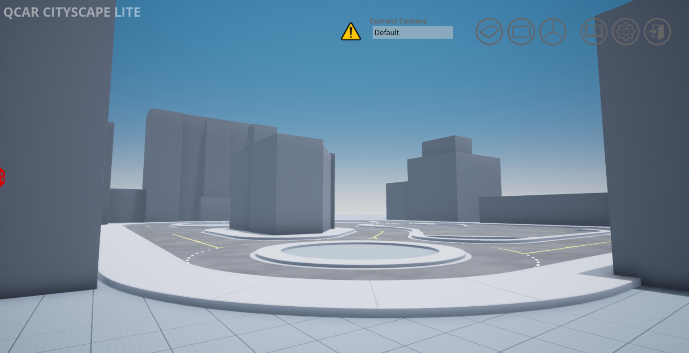

.. _Cityscape_Lite:

**************
Cityscape Lite
**************

Cityscape Lite is a simplified environment for developing and deploying large
scale applications of self-driving.

    

Cityscape Lite World Size
^^^^^^^^^^^^^^^^^^^^^^^^^
The world is 500m x 500m (250m in each direction from the origin) with 
the ground located at 0m elevation.

Cityscape Lite Navigation Area
^^^^^^^^^^^^^^^^^^^^^^^^^^^^^^
The navigation area is the area in which actors supporting path-finding travel can traverse. 
In other words a actor can freely walk around in this area unobstructed by 
barriers that are part of the Open World. 

The outer boundary of the navigation area is 450m x 450m (225m in each 
direction from the origin). The entire area is traversable other than 
the locations of the buildings.

.. image:: ../pictures/cityscape_lite_nav_area.png
    :align: center
    :width: 500

.. note:: 
    The navigation area only applies to traversable actors such as people, 
    animals, etc.

Coordinates of Interest
^^^^^^^^^^^^^^^^^^^^^^^

The following table will provide you with some coordinates of interest in cityscape lite.

.. note:: 
    The z coordinate should be modified depending on the location of the actor origin.

.. table::
    :widths: 25, 11, 11, 11
    :align: center

    ================= ======= ======= =======
    Location          X       Y       Z    
    ================= ======= ======= =======
    Open World Origin 0       0       0
    Car Spawn Spot    -5.906  2.523   0.005
    Road Parking 1    -17.894 -5.965  0.005
    Road Parking 2    -22.989 -1.477  0.005
    Parking Spot 1    -14.474 19.100  0.005
    Parking Spot 2    -17.179 19.105  0.005
    Parking Spot 3    -11.775 19.085  0.005
    Parking Spot 4
    Parking Spot 5
    Parking Spot 6
    ================= ======= ======= =======