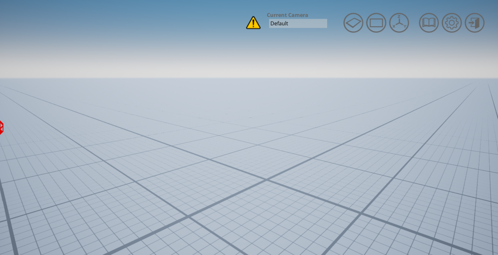

.. _Plane:

*****
Plane
*****

Unlike all of the other workspaces, the Plane is an Open World that allows
users to spawn and test scenarios in an empty environment.

Plane World Size
^^^^^^^^^^^^^^^^

The world is 20,000m x 20,000m (10km in each direction from the origin) with 
the ground located at 0m elevation. Note that placed very far from the origin 
may start to suffer some accuracy issues for their position.

Plane Navigation Area
^^^^^^^^^^^^^^^^^^^^^
The navigation area is the area in which actors supporting path-finding travel can traverse. 
In other words a actor can freely walk around in this area unobstructed by 
barriers that are part of the Open World.

The outer boundary of the navigation area is 600m x 600m (300m in each 
direction from the origin). The entire area is traversable.

.. note:: 
    The navigation area only applies to traversable actors such as people, 
    animals, etc.

Coordinates of Interest
^^^^^^^^^^^^^^^^^^^^^^^

The following table will provide you with some coordinates of interest in the plane.

.. note:: 
    The z coordinate should be modified depending on the location of the actor origin.

.. table::
    :widths: 25, 11, 11, 11
    :align: center

    ================= ======= ======= =======
    Location          X       Y       Z    
    ================= ======= ======= =======
    Open World Origin 0       0       0
    ================= ======= ======= =======