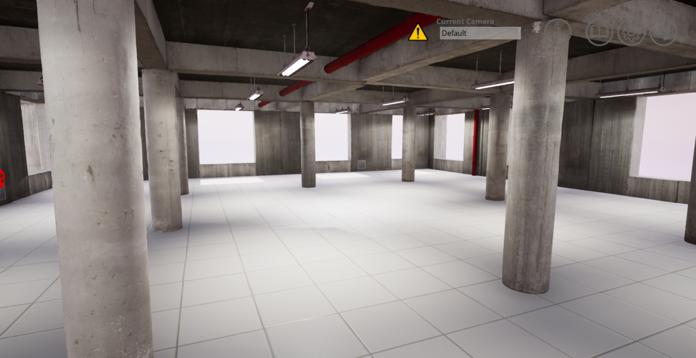
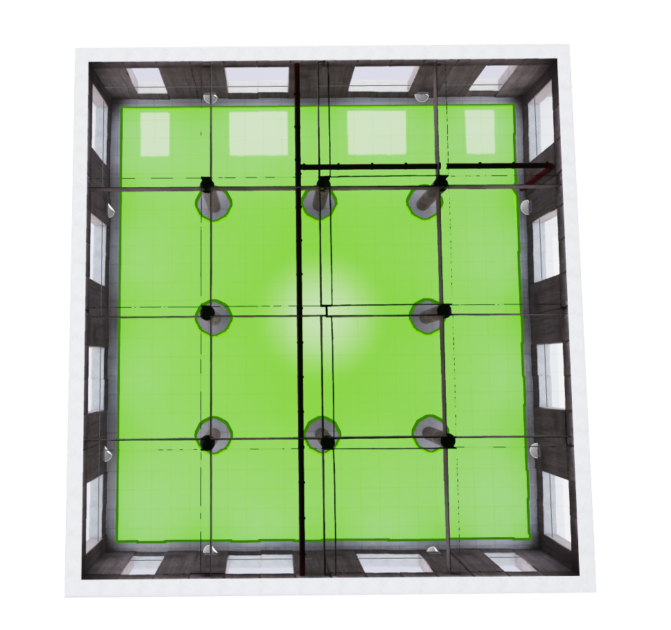

.. _Studio:

******
Studio
******

The Studio is designed to mimic a classroom space. This includes
variations in lighting. QCar models and road signage can be spawned
in the this space at a scale of 0.1 to match the QCar product. All
other products can be spawned at a scale of 1 to match the physical
devices.

    
Studio World Size
^^^^^^^^^^^^^^^^^

The studio is 15m x 14m (+/-7.5m along x, +/-7.0m along y) with 
the ground located at 0m and the ceiling at 2.5m elevation.

Studio Navigation Area
^^^^^^^^^^^^^^^^^^^^^^
The navigation area is the area in which an actor can traverse. 
In other words a actor can freely walk around in this area unobstructed by 
barriers that are part of the Open World.

.. note:: 
    The navigation area only applies to traversable actors such as people, 
    animals, etc.

Studio Coordinates of Interest
^^^^^^^^^^^^^^^^^^^^^^^^^^^^^^

The following table will provide you with some coordinates of interest in the studio workspace.

.. note:: 
    The z coordinate should be modified depending on the location of the actor origin.

.. table::
    :widths: 25, 11, 11, 11
    :align: center

    ================== ======= ======= =======
    Location           X       Y       Z    
    ================== ======= ======= =======
    Center of the room 0       0       0
    Post 1             -3.5    -3.5    0
    Post 2             0       -3.5    0
    Post 3             3.5     -3.5    0
    Post 4             -3.5    0       0
    Post 5             3.5     0       0
    Post 6             -3.5    3.5     0
    Post 7             0       3.5     0
    Post 8             3.5     3.5     0
    Red pipe on wall   -4.3    6.8     0

    ================== ======= ======= =======